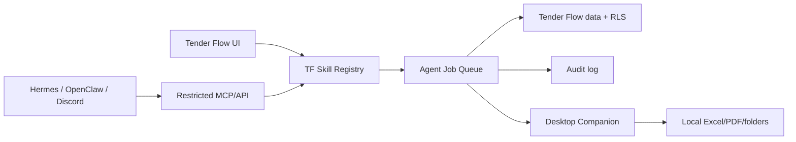

# Tender Flow Agent Skills

Verze dokumentu: 0.1.0
Datum: 2026-05-14
Stav: návrh k iteraci

## Shrnutí

Tento dokument navrhuje agentní vrstvu pro Tender Flow jako katalog malých, opakovatelných skillů. První verze cílí na interní použití přímo v Tender Flow UI, typicky přes tlačítko nebo panel u projektu, VŘ, nabídky, smlouvy nebo dokumentů.

Discord, Hermes Agent a OpenClaw jsou v této fázi jen budoucí runtime alternativy. Nemají být přímou závislostí v první implementaci. Tender Flow má nejdřív získat vlastní skill kontrakt, bezpečnostní pravidla, auditovatelné joby a jasně oddělené cloudové a desktopové schopnosti.

Navržený směr navazuje na aktuální architekturu:

- remote MCP je cloud-safe vrstva nad Tender Flow daty, bez přístupu k lokálním souborům,
- desktop porovnání nabídek už existuje jako lokální IPC/runner workflow,
- lokální Excel, PDF a složkové operace patří do budoucí Desktop Companion vrstvy,
- zápisy do Tender Flow musí používat návrh změny, potvrzení a audit.

## Cíle

- Vytvořit jednotný jazyk pro skilly, které lze spouštět z Tender Flow UI.
- Rozdělit skilly podle bezpečného runtime: cloud, desktop, MCP, externí agent.
- Umožnit postupné přidávání automatizací bez velkých refaktorů aplikace.
- Držet lidské schválení u akcí, které mění data, posílají komunikaci nebo zapisují do souborů.
- Připravit katalog konkrétních stavebních workflow pro další produktové iterace.

## Architektonické Varianty

### TF-native skills

Interní skill vrstva běžící nad daty a službami Tender Flow. Uživatel spustí skill z UI, například z projektu, VŘ, nabídky, smlouvy nebo dokumentového hubu.

Vhodné pro:

- čtení a sumarizaci dat z projektu,
- přípravu návrhů změn,
- doporučení dodavatele,
- validace rozpočtu, nabídky nebo harmonogramu,
- generování rekapitulací pro interní tým.

Požadované vlastnosti:

- skill běží jako auditovaný job,
- vstupy a výstupy mají schema,
- akce nad daty se řídí oprávněním uživatele a organizace,
- zápisy vyžadují potvrzení nebo explicitní UI flow,
- výsledek je uložený k projektu, VŘ nebo dokumentu jako dohledatelný záznam.

### Desktop Companion skills

Lokální skilly pro práci se soubory, které nelze bezpečně nebo pohodlně řešit v remote MCP. Patří sem Excel, PDF, složky, zamčené listy, velké rozpočty, lokální cesty a porovnání dodavatelských souborů.

Vhodné pro:

- porovnání nabídek v lokální složce VŘ,
- doplnění jednotkových cen do zdrojového rozpočtu,
- odemčení nebo normalizaci Excelů,
- čtení PDF nabídek a smluv z lokálních složek,
- sledování složky a opakované přepočítání po změně souboru.

Bezpečnostní pravidlo: remote MCP ani externí agent nesmí dostat přímý filesystem. Vzdálený agent může pouze požádat Tender Flow o spuštění omezeného lokálního workflow, které uživatel potvrdí v desktop aplikaci.

### MCP exposed skills

Skilly vystavené přes MCP pro ChatGPT, Claude Code, Codex nebo jiné klienty musí být read-first a omezené. Zápisové skilly používají třífázový protokol `prepare -> confirm -> execute`, podobně jako současné MCP write tools.

Vhodné pro:

- vyhledání projektu, VŘ, kontaktu nebo smlouvy,
- načtení kontextu pro odpověď,
- přípravu návrhu úkolu nebo poznámky,
- auditovaný návrh změny bez okamžitého provedení.

Nevhodné pro:

- přímé úpravy rozpočtů bez potvrzení,
- mazání dat,
- spouštění lokálních souborových operací,
- automatické posílání e-mailů dodavatelům bez lidského potvrzení.

### External runtime adapter

Hermes Agent a OpenClaw mohou být později použité jako orchestrace nebo komunikační runtime, ale nemají určovat interní model Tender Flow skillů.

Kandidáti:

- [Hermes Agent GitHub](https://github.com/NousResearch/hermes-agent)
- [OpenClaw docs](https://openclawdoc.com/docs/getting-started/what-is-openclaw/)

Pravidlo integrace: externí runtime volá pouze omezené Tender Flow API/MCP nástroje. Skill logika, oprávnění, audit a potvrzování zůstávají na straně Tender Flow.



## Interní Skill Kontrakt

Každý skill má být registrovaný přes jednotný kontrakt. Název typu je návrhový, ne závazná implementace:

```ts
export interface AgentSkillDefinition<Input, Output> {
  id: string;
  name: string;
  description: string;
  version: string;
  inputSchema: unknown;
  outputSchema: unknown;
  requiredPermissions: AgentSkillPermission[];
  riskLevel: "low" | "medium" | "high";
  executionMode: "cloud" | "desktop" | "hybrid" | "mcp-readonly";
  requiresHumanConfirmation: boolean;
}
```

Doporučené doplňkové runtime metadata:

- `entityScope`: projekt, VŘ, nabídka, smlouva, kontakt, dokument nebo organizace,
- `maxFileSizeMb`: limit pro souborové vstupy,
- `allowedMimeTypes`: povolené typy souborů,
- `writesBusinessData`: zda skill mění Tender Flow data,
- `writesLocalFiles`: zda skill zapisuje výstupní soubor,
- `usesExternalModel`: zda se posílá obsah do AI provideru,
- `auditRedactionPolicy`: pravidla pro zkrácení a redakci payloadu.

## Bezpečnostní Guardrails

- **Least privilege**: skill dostane jen data nutná pro konkrétní úlohu.
- **Tenant izolace**: všechny dotazy musí respektovat Supabase RLS a oprávnění uživatele.
- **Žádný service role pro business data**: agentní runtime nesmí obcházet aplikační autorizaci.
- **Human-in-the-loop**: zápisy, odesílání komunikace, výběr dodavatele a změny rozpočtu vyžadují potvrzení.
- **Audit a idempotence**: každý job má auditní záznam, stav, vstupní summary, výstupní summary a idempotency key.
- **Redakce citlivých dat**: logy nesmí obsahovat celé smlouvy, cenové tabulky, tokeny, osobní údaje ani přístupové cesty bez potřeby.
- **Prompt injection ochrana**: obsah PDF/XLSX/e-mailu se bere jako nedůvěryhodná data, ne jako instrukce.
- **Filesystem izolace**: remote MCP a externí agenti nemají přímý přístup k lokálním souborům.
- **Limity velikosti a času**: velké soubory a dlouhé běhy musí mít timeout, progress a možnost zrušení.
- **Nedestruktivní default**: skill má nejdřív vytvořit návrh, report nebo nový výstupní soubor, ne přepsat zdroj.

## Šablona Popisu Skillu

Každý nový skill v katalogu má používat stejnou šablonu:

- **Účel**: jaký problém řeší a pro koho.
- **Vstupy**: data z Tender Flow, soubory, textový pokyn nebo výběr v UI.
- **Výstupy**: report, návrh změny, nový soubor, tabulka, poznámka nebo upozornění.
- **Datové zdroje**: projekty, VŘ, nabídky, smlouvy, kontakty, harmonogram, lokální soubory.
- **Povolené akce**: co skill smí provést bez potvrzení a co jen po potvrzení.
- **Bezpečnostní rizika**: data leakage, prompt injection, chybný zápis, záměna dodavatele, přepsání souboru.
- **Lidské potvrzení**: kdy je povinné.
- **Testovací scénáře**: minimální acceptance testy pro budoucí implementaci.

## Prioritní Skill Katalog

### 1. Porovnání nabídek a doplnění jednotkových cen

- **Účel**: porovnat dodavatelské nabídky proti původnímu rozpočtu a doplnit do rozpočtu nové sloupce s jednotkovými cenami.
- **Vstupy**: rozpočet projektu, vybrané nabídky dodavatelů, mapování položek, případně lokální složka VŘ.
- **Výstupy**: Excel s doplněnými sloupci po dodavatelích, rozdíly vůči rozpočtu, přehled nejlevnějších položek a varování.
- **Datové zdroje**: VŘ, nabídky, dodavatelé, lokální XLSX/PDF.
- **Povolené akce**: vytvořit nový výstupní soubor a report; zápis výsledku do Tender Flow jen po potvrzení.
- **Bezpečnostní rizika**: špatné spárování položek, přepsání původního rozpočtu, import škodlivého vzorce, únik cen.
- **Lidské potvrzení**: povinné před uložením výsledků do projektu nebo změnou vítězné nabídky.
- **Testovací scénáře**: shodné položky, odlišné názvy položek, chybějící položky, rozdílné MJ, nulové ceny, vzorce v buňkách, zamčený list.

### 2. Normalizace rozpočtů od různých dodavatelů

- **Účel**: převést různé formáty dodavatelských Excelů do jednotného interního tvaru.
- **Vstupy**: nabídky ve více XLSX/PDF formátech, volitelné ruční mapování sloupců.
- **Výstupy**: normalizovaná tabulka položek s kódem, názvem, MJ, množstvím, jednotkovou cenou a celkem.
- **Datové zdroje**: lokální soubory, šablony mapování, historická mapování dodavatele.
- **Povolené akce**: vytvořit návrh mapování a nový normalizovaný soubor.
- **Bezpečnostní rizika**: ztráta řádků, špatně rozpoznané měny, ignorované poznámky pod čarou.
- **Lidské potvrzení**: povinné před použitím normalizovaných dat pro vyhodnocení.
- **Testovací scénáře**: různé názvy sloupců, sloučené buňky, více listů, skryté řádky, měna bez DPH/s DPH.

### 3. Kontrola chybějících položek a cenových odchylek

- **Účel**: odhalit, že dodavatel neocenil položku, změnil měrnou jednotku nebo má extrémní cenu.
- **Vstupy**: referenční rozpočet a jedna nebo více nabídek.
- **Výstupy**: seznam chybějících položek, změn MJ, podezřelých jednotkových cen a souhrn rizika nabídky.
- **Datové zdroje**: rozpočty, nabídky, historické ceny, interní indexy.
- **Povolené akce**: vytvořit report a návrh dotazů na dodavatele.
- **Bezpečnostní rizika**: falešně pozitivní odchylky, záměna položek s podobným názvem.
- **Lidské potvrzení**: povinné před odesláním dotazů dodavateli.
- **Testovací scénáře**: položka navíc, položka chybí, stejné položky v jiném pořadí, odchylka nad nastavený limit.

### 4. Doporučení dodavatele

- **Účel**: navrhnout preferovaného dodavatele podle ceny, úplnosti nabídky, termínu, historie a rizik.
- **Vstupy**: nabídky, termíny, hodnocení dodavatelů, historie spolupráce, smluvní rizika.
- **Výstupy**: doporučení s odůvodněním, ranking dodavatelů a seznam otevřených rizik.
- **Datové zdroje**: VŘ, nabídky, kontakty, smlouvy, hodnocení, harmonogram.
- **Povolené akce**: vytvořit doporučení; nenastavovat vítěze bez potvrzení.
- **Bezpečnostní rizika**: bias z historických dat, neúplné nabídky, ignorování obchodního kontextu.
- **Lidské potvrzení**: povinné před označením vítěze nebo vytvořením smluvního navazujícího kroku.
- **Testovací scénáře**: nejlevnější neúplná nabídka, dražší spolehlivý dodavatel, chybějící hodnocení, shodná cena.

### 5. Rekapitulace VŘ pro projektového manažera

- **Účel**: připravit krátký přehled stavu VŘ, nabídek, termínů, rizik a doporučených dalších kroků.
- **Vstupy**: projekt, VŘ, nabídky, harmonogram, poznámky, dokumenty.
- **Výstupy**: textová rekapitulace, seznam rozhodnutí a seznam otevřených úkolů.
- **Datové zdroje**: projektová data, tender plan, pipeline, dokumenty.
- **Povolené akce**: vytvořit report nebo návrh úkolů.
- **Bezpečnostní rizika**: shrnutí neaktuálních dat, zahrnutí citlivých cen do nevhodného kontextu.
- **Lidské potvrzení**: povinné před vytvořením úkolů nebo sdílením mimo interní tým.
- **Testovací scénáře**: VŘ bez nabídek, VŘ po termínu, více kol, neúplný tender plan.

### 6. Příprava dotazů na dodavatele

- **Účel**: vytvořit věcné dotazy k nejasným nebo chybějícím položkám v nabídce.
- **Vstupy**: nabídka, referenční rozpočet, detekovaná rizika, kontaktní osoba dodavatele.
- **Výstupy**: návrh e-mailu nebo seznam dotazů ke kontrole.
- **Datové zdroje**: nabídky, kontakty, chybové reporty, šablony komunikace.
- **Povolené akce**: připravit text; neodesílat bez potvrzení.
- **Bezpečnostní rizika**: nechtěné sdílení interních cen, agresivní nebo nepřesná formulace.
- **Lidské potvrzení**: povinné před odesláním nebo uložením jako oficiální komunikace.
- **Testovací scénáře**: chybějící cena, nejasná MJ, rozpor v termínu, chybějící kontakt.

### 7. Extrakce závazků ze smluv a porovnání proti nabídce

- **Účel**: ověřit, zda smlouva odpovídá vybrané nabídce v ceně, termínu, sankcích, záruce a rozsahu.
- **Vstupy**: smlouva, vybraná nabídka, VŘ, případně objednávka.
- **Výstupy**: tabulka shod a rozdílů, seznam právních/obchodních rizik.
- **Datové zdroje**: smlouvy, nabídky, kontraktové extrakce, dokumenty.
- **Povolené akce**: vytvořit kontrolní report; neupravovat smluvní data bez potvrzení.
- **Bezpečnostní rizika**: OCR chyba, právní interpretace bez lidské kontroly, únik smluvních podmínek.
- **Lidské potvrzení**: povinné před uložením extrahovaných závazků jako závazných dat.
- **Testovací scénáře**: cena bez DPH vs s DPH, odlišný termín, chybějící sankce, skenované PDF.

### 8. Kontrola harmonogramu vůči termínům nabídek a smluv

- **Účel**: zkontrolovat, zda termíny VŘ, nabídky, smlouvy a harmonogram projektu nejsou v konfliktu.
- **Vstupy**: tender plan, harmonogram, nabídky, smlouvy.
- **Výstupy**: seznam kolizí, upozornění na rizikové termíny a návrh úprav.
- **Datové zdroje**: project schedule, tender plan, contracts, bids.
- **Povolené akce**: vytvořit upozornění a návrh změn.
- **Bezpečnostní rizika**: změna termínu bez souhlasu, neúplná data v harmonogramu.
- **Lidské potvrzení**: povinné před změnou termínu nebo vytvořením notifikace pro externí účastníky.
- **Testovací scénáře**: termín nabídky po plánovaném startu prací, smlouva bez termínu, posunutý milník.

### 9. Doporučení subdodavatelů

- **Účel**: doporučit vhodné subdodavatele podle specializace, regionu, historie spolupráce, účasti ve VŘ a kapacity.
- **Vstupy**: poptávaná kategorie, lokalita projektu, databáze kontaktů, historie nabídek.
- **Výstupy**: shortlist subdodavatelů s důvody a riziky.
- **Datové zdroje**: kontakty, mapy, nabídky, hodnocení, projekty.
- **Povolené akce**: vytvořit shortlist; nepřidávat dodavatele do VŘ bez potvrzení.
- **Bezpečnostní rizika**: neaktuální kontakt, preferování historicky známých firem, GDPR při exportu kontaktů.
- **Lidské potvrzení**: povinné před oslovením nebo přidáním do VŘ.
- **Testovací scénáře**: žádný dodavatel v regionu, více specializací, chybějící hodnocení, duplicitní kontakt.

### 10. Podklady pro koordinační poradu

- **Účel**: připravit přehled projektových rozhodnutí, otevřených VŘ, termínů a rizik pro interní poradu.
- **Vstupy**: projekt, pipeline, harmonogram, smlouvy, poznámky, notifikace.
- **Výstupy**: agenda, seznam rozhodnutí, seznam blokátorů a návrh následných úkolů.
- **Datové zdroje**: projektová data, tender plan, schedule, contracts, notifications.
- **Povolené akce**: vytvořit interní report nebo návrh úkolů.
- **Bezpečnostní rizika**: zahrnutí citlivých smluvních detailů pro špatné publikum.
- **Lidské potvrzení**: povinné před sdílením mimo oprávněné uživatele projektu.
- **Testovací scénáře**: projekt bez aktivních VŘ, více kritických termínů, archivované smlouvy, chybějící owner úkolu.

## Implementační Doporučení

1. Začít TF-native registry vrstvou, která umí zobrazit dostupné skilly podle kontextu UI.
2. Každý skill spouštět jako job se stavem `queued`, `running`, `needs_confirmation`, `completed`, `failed` nebo `cancelled`.
3. Pro desktop skilly použít existující platform adapter a IPC vzor podobný porovnání nabídek.
4. Pro cloud skilly používat RLS-aware datové dotazy a žádné lokální cesty.
5. Pro zápisy použít návrh změny s diffem, rizikem a potvrzovacím textem.
6. Výstupy ukládat jako reporty u entity, ne jako skrytou automatickou změnu.
7. Externí runtime připojit až po stabilizaci kontraktu a auditních pravidel.

## Test Plan Pro Budoucí Implementaci

Minimální testy pro první implementační řez:

- parsing Excelu a zachování významu čísel, měn, vzorců a prázdných řádků,
- mapování položek podle kódu, názvu, MJ a fallback podobnosti,
- detekce chybějících položek a položek navíc,
- výpočet jednotkových a celkových rozdílů,
- odmítnutí zápisu bez potvrzení,
- auditní záznam pro úspěšný, chybový a zrušený job,
- redakce velkých a citlivých payloadů v logu,
- ochrana proti instrukcím vloženým v PDF/XLSX obsahu,
- respektování oprávnění uživatele a organizace,
- desktop-only skill není dostupný ve web-only runtime.

Před prvním produkčním releasem agentních skillů ověřit existující testy kolem bid comparison runneru, desktop IPC guardů a MCP guardrails.

## Roadmap

### 0.1 Skill katalog a kontrakt

- Udržovat tento dokument jako produktový katalog.
- Vybrat první 2 až 3 skilly pro implementaci.
- Definovat minimální `AgentSkillDefinition` kontrakt.

### 0.2 TF-native job runner

- Přidat registry skillů, job stav a audit log.
- Připojit první UI vstup z Tender Flow projektu nebo VŘ.
- Implementovat read-only/reportovací skill bez zápisu do business dat.

### 0.3 Desktop Companion

- Převést porovnání nabídek do obecnějšího desktop skill runneru.
- Přidat jednotné limity, progress, cancel a output artifact model.
- Oddělit lokální filesystem od remote MCP.

### 0.4 MCP a externí runtime

- Vystavit vybrané read-only skilly přes MCP.
- Povolit zápisové návrhy jen přes třífázový protokol.
- Připravit adapter pro Hermes/OpenClaw/Discord bez přímého přístupu k interním datům nebo filesystemu.

## Otevřené Otázky

- Které 2 až 3 skilly mají nejvyšší business hodnotu pro první implementaci?
- Má být výstup skillu samostatný artifact, poznámka u entity, nebo obojí?
- Jak detailní má být ruční kontrola mapování položek před výpočtem?
- Má mít organizace možnost povolit/zakázat konkrétní skilly per role?
- Kde bude dlouhodobě uložen audit jobů a výstupních artifactů?
