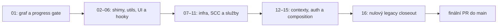

# Plán odstranění legacy architektury

Autoritativní strojově čitelný plán je v
`config/architecture-migration-plan.json`. Obsahuje šestnáct navazujících
smyček, jejich stav, závislosti, exit kritéria, rizika a testovací brány.

Práce probíhá izolovaně od produkční větve:

1. dlouhodobá integrační větev je `new_architekt`,
2. každá smyčka používá vlastní `codex/new-architekt-loop-*` větev,
3. dílčí PR míří do `new_architekt`, nikoli do `main`,
4. finální PR do `main` vznikne až po dosažení nulového legacy stavu.



## Přehled smyček

| Smyčka | Oblast | Stav |
| --- | --- | --- |
| 01 | Grafový report a progress gate | probíhá |
| 02 | Mrtvé shimy a re-exporty | plánováno |
| 03 | Utility do shared a features | plánováno |
| 04 | Malé UI a compatibility komponenty | plánováno |
| 05 | Generické a desktop hooky | plánováno |
| 06 | Query, mutation a pipeline hooky | plánováno |
| 07 | Infra základy | plánováno |
| 08 | Rozpojení session, logger a Supabase SCC | plánováno |
| 09 | Identity, organizace a subscription služby | plánováno |
| 10 | Project a dokumentové služby | plánováno |
| 11 | Import, export, Excel, filesystem a AI nástroje | plánováno |
| 12 | Odstranění UIContext | plánováno |
| 13 | Auth služby a session infrastruktura | plánováno |
| 14 | Rozdělení a odstranění AuthContext | plánováno |
| 15 | FeatureContext a composition root | plánováno |
| 16 | Nulový legacy closeout | plánováno |

## Měření postupu

```bash
npm run architecture:graph
npm run architecture:graph -- --json
npm run check:architecture-graph
```

Report vychází z jediného AST kolektoru a konkrétního modulového resolveru.
Ukazuje source uzly, importní hrany, nevyřešené a nejednoznačné cíle,
fan-in/fan-out, silně souvislé komponenty a dependency-first dávky. Gate odmítá
neúplný graf, každou novou nebo zastaralou přesnou nevyřešenou importní hranu,
nový nebo změněný cyklus a změnu interních legacy hran bez vědomé aktualizace
přesné policy. Diagnostický příkaz report vždy zobrazí; varianta `check` navíc
vynucuje policy nenulovým exit kódem.

Každá dokončená smyčka musí současně snížit odpovídající baseline a změnit stav
plánu. Samotný zelený test bez poklesu měřeného dluhu není dokončením smyčky.

## Konečný exit stav

- adresáře `components/`, `hooks/`, `services/`, `context/` a `utils/` neexistují,
- legacy uzly, modern-to-legacy importy, interní legacy hrany a cykly jsou nula,
- nezůstávají compatibility re-exporty ani zastaralé baseline položky,
- plná testovací sada nemá nové `skip` ani `todo`,
- typecheck, web build, desktop compile, dokumentace a všechny architektonické
  kontroly jsou zelené,
- skutečný Electron smoke pokrývá start, autentizaci, hlavní projektový tok,
  navigaci a dotčené IPC/filesystem scénáře,
- finální bezpečnostní kontrola neobsahuje nevyřešený finding.
