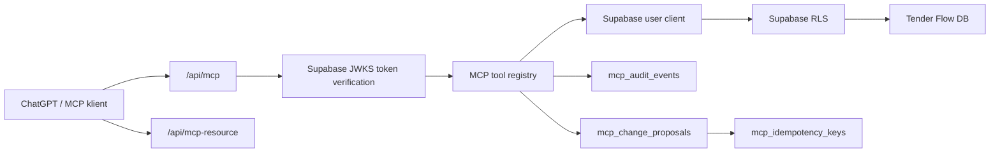

# Tender Flow Remote MCP Server

Verze dokumentu: 0.1.0
Datum: 2026-05-11
Stav: MVP implementováno

## Shrnutí

Tender Flow má vzdálený MCP server určený pro ChatGPT a další AI klienty podporující MCP. Server běží jako součást stejného deploymentu jako webová aplikace a publikuje hlavní endpoint:

```text
https://tenderflow.cz/api/mcp
```

MVP je navržené jako read-first integrace. Čtení dat je dostupné přes nástroje s `readOnlyHint: true`. Zápisy jsou omezené třífázovým protokolem `prepare -> confirm -> execute`, aby AI klient nemohl nechtěně měnit data bez explicitního potvrzení.

## Cíle

- Umožnit připojení Tender Flow k ChatGPT / deep research přes standardní remote MCP.
- Používat existující Supabase Auth, uživatele, organizace a RLS.
- Vystavit bezpečné nástroje pro vyhledání a načtení projektových dat.
- Povolit první úzkou zápisovou operaci bez rizika náhodné destruktivní změny.
- Mít auditní stopu každého MCP tool callu.
- Držet MCP oddělené od lokálních desktop-only operací.

## Co Je Implementováno

### Endpointy

- `/api/mcp`
  Streamable HTTP MCP endpoint pro `initialize`, `tools/list` a `tools/call`.

- `/api/mcp-resource`
  OAuth protected-resource metadata pro klienty, kteří potřebují zjistit authorization server.

- `/.well-known/oauth-protected-resource`
  Well-known varianta stejné protected-resource metadata odpovědi.

- `/oauth/consent`
  Consent obrazovka pro Supabase OAuth 2.1 Server.

### Serverové Moduly

- `server/mcp/tenderFlowMcp.js`
  Registrace MCP nástrojů, tool schémata, audit wrapper, Streamable HTTP handler.

- `server/mcp/supabaseAuth.js`
  Ověření bearer tokenu přes Supabase JWKS, issuer a `client_id`.

- `server/mcp/data.js`
  RLS-aware datové dotazy přes Supabase klienta s uživatelským OAuth tokenem.

- `server/mcp/audit.js`
  Best-effort audit log s redakcí velkých payloadů.

- `server/mcp/rateLimit.js`
  MVP in-memory rate limit per user/client/tool.

- `server/mcp/nodeHandler.js`
  Adaptér mezi Node/Vercel requestem a Web `Request`/`Response`.

### Databázové Tabulky

Migrace: `supabase/migrations/20260511170000_mcp_remote_server_tables.sql`

- `mcp_audit_events`
  Audit tool callů, chyb, request summary a result summary.

- `mcp_change_proposals`
  Stav třífázových zápisů, potvrzovací text, hash execute tokenu, expirace a výsledek.

- `mcp_idempotency_keys`
  Idempotence pro execute volání.

Všechny nové tabulky mají RLS a uživatel vidí pouze vlastní záznamy.

## Architektura



Princip je jednoduchý: MCP server nikdy nepoužívá service role pro business data. Vytvoří Supabase klienta s bearer tokenem uživatele a nechá databázi vynutit RLS. Server tím pádem rozšiřuje existující oprávnění uživatele, ale nemá obcházet tenant izolaci.

## OAuth A Autentizace

MCP endpoint vyžaduje bearer token ze Supabase OAuth 2.1 Serveru.

Ověření tokenu:

- token musí být v `Authorization: Bearer ...`,
- podpis se ověřuje přes Supabase JWKS,
- issuer musí odpovídat `${SUPABASE_URL}/auth/v1`,
- token musí obsahovat `sub` nebo `user_id`,
- token musí obsahovat `client_id`,
- pokud je nastavené `MCP_ALLOWED_CLIENT_IDS`, `client_id` musí být v allowlistu.

Běžný Supabase app session token bez `client_id` se pro MCP odmítá. Je to záměrný guardrail: MCP má používat OAuth klientský grant, ne interní webovou session.

Refresh tokeny se v MCP serveru neukládají ani nepřenášejí do aplikačních tabulek. Refresh řeší OAuth klient a Supabase.

## Consent Flow

Route `/oauth/consent`:

- načte `authorization_id` z query,
- pokud uživatel není přihlášený, `AuthGate` ho pošle na login a zachová návratovou URL,
- po přihlášení načte authorization details přes Supabase OAuth API,
- ukáže klienta, URL klienta, scopes a upozornění na MCP zápisy,
- volá approve nebo deny přes Supabase OAuth API,
- následný redirect provádí podle Supabase odpovědi.

OAuth klientská logika je v `infra/auth/mcpOAuthConsentService.ts`, aby UI vrstva neimportovala Supabase přímo.

## MCP Tools

### Povinné Discovery Tools

| Tool | Typ | Popis |
| --- | --- | --- |
| `search` | read-only | Vyhledá projekty, VŘ a kontakty. Vrací ids pro `fetch`. |
| `fetch` | read-only | Načte detail výsledku ze `search` ve formátu vhodném pro citace. |

### Tender Flow Read-Only Tools

| Tool | Popis |
| --- | --- |
| `tf_list_projects` | Seznam projektů viditelných pro uživatele. |
| `tf_get_project_detail` | Detail projektu včetně VŘ, nabídek, smluv a plánu. |
| `tf_list_tenders` | Seznam VŘ / demand categories. |
| `tf_list_bids` | Seznam nabídek, volitelně podle projektu nebo VŘ. |
| `tf_list_winners` | Seznam vítězných / zasmluvněných nabídek. |
| `tf_list_contracts` | Seznam smluv. |
| `tf_list_contacts` | Seznam kontaktů / subdodavatelů. |
| `tf_list_tender_plan` | Harmonogram / plán VŘ. |
| `tf_list_upcoming_deadlines` | Nadcházející termíny VŘ. |

Všechny read-only tools mají `readOnlyHint: true`, limity výsledků a používají RLS.

### Write Tools

| Tool | Popis |
| --- | --- |
| `tf_prepare_change` | Připraví návrh změny, vrátí diff, riziko a přesný potvrzovací text. |
| `tf_confirm_change` | Vyžaduje přesný potvrzovací text a vrátí jednorázový execute token. |
| `tf_execute_change` | Provede potvrzenou změnu s execute tokenem a idempotency key. |

V MVP je skutečné provedení povolené pouze pro `create_task`. Ostatní typy změn lze připravit jako návrh, ale execute je odmítne.

## Třífázový Zápisový Protokol

1. `tf_prepare_change`
   - nevytváří business data,
   - uloží návrh do `mcp_change_proposals`,
   - vrátí `proposalId`, `confirmationText`, `expiresAt`, `diff` a `riskLevel`.

2. `tf_confirm_change`
   - ověří, že návrh patří stejnému `user_id` a `client_id`,
   - vyžaduje přesnou shodu potvrzovací věty,
   - uloží hash execute tokenu,
   - vrátí jednorázový execute token.

3. `tf_execute_change`
   - ověří token, expiraci, stav návrhu a idempotency key,
   - provede změnu,
   - uloží výsledek a zneplatní token hash.

Tento protokol nenahrazuje uživatelské schválení v UI. Je to minimální serverový guardrail pro AI klienty, kde hrozí náhodná nebo prompt-injection změna.

## Guardrails

- MCP endpoint fail-closed bez bearer tokenu.
- Token se ověřuje přes JWKS a issuer.
- Vyžaduje se `client_id`.
- Volitelný allowlist přes `MCP_ALLOWED_CLIENT_IDS`.
- Business data se čtou přes uživatelský Supabase token a RLS.
- Každý tool má input schema a output schema.
- Read-only tools jsou anotované `readOnlyHint: true`.
- Write tools nejsou read-only a používají třífázový protokol.
- Execute token se ukládá pouze jako hash.
- Execute používá idempotency key.
- Audit log je best-effort a payloady jsou redigované / zkrácené.
- In-memory rate limit chrání před jednoduchým abuse patternem.
- V1 neobsahuje admin, billing ani hard-delete tools.

## Co To Neumí

- Neumí lokální souborové operace, desktop-only akce ani porovnávání lokálních složek. To patří do budoucího desktop companion řešení.
- Neumí hard-delete.
- Neumí admin a billing operace.
- Neprovádí `create_bid`, `update_bid`, `create_contact`, `update_contact`, `create_note`, `update_note` ani `archive_entity`; zatím je jen připraví jako návrh.
- Nemá perzistentní distribuovaný rate limit. Současný limiter je in-memory a na Vercelu se resetuje mezi instancemi.
- Nemá samostatné MCP granty nad rámec Supabase RLS a `client_id` allowlistu.
- Nemá transaction-level RPC pro execute flow. Idempotence je implementovaná na aplikační vrstvě.

## Rizika A Doporučení

### Vercel Serverless Limity

MVP může běžet na Vercelu, protože tools jsou krátké HTTP operace. Pro dlouhé streaming operace, velké exporty nebo lokální souborové práce je vhodnější samostatná služba nebo desktop companion.

### In-Memory Rate Limit

In-memory limit je dobrý pouze jako MVP brzda. Pro produkční multi-instance nasazení přejít na Supabase/Redis rate limit per `user_id + client_id + tool_name`.

### OAuth Client Grants

Aktuálně je hlavní izolace přes Supabase RLS a `client_id`. Pro další verzi doplnit interní tabulku MCP grantů, například povolené tools, projekty, organizace a režim read/write.

### Write Flow Bez DB Transakce

`tf_execute_change` není zatím jedna databázová transakce. Pro širší zápisy je správné přesunout execute do Supabase RPC funkce, která atomicky ověří proposal, idempotency key a provede změnu.

### Prompt Injection

Read tools mohou vracet uživatelský obsah. AI klient nesmí brát obsah z Tender Flow jako instrukce k obejití pravidel. Server guardrails pomáhají u zápisů, ale klientská prompt bezpečnost zůstává důležitá.

### Existing Dependency Audit

`npm audit --omit=dev` hlásí high vulnerability v `xlsx` bez dostupné opravy. Nesouvisí s MCP implementací, ale je to relevantní security backlog.

## Konfigurace Bez `.env`

Produkční konfigurace se nemá opírat o lokální `.env` soubory. `.env.local` může existovat jen pro lokální vývoj na konkrétním stroji a nesmí být zdrojem pravdy ani se nesmí commitovat.

Pro MVP na Vercelu platí:

- Supabase zůstává zdroj identity, OAuth consentu, RLS a datových oprávnění.
- Vercel musí mít pouze runtime/build konfiguraci potřebnou k připojení na Supabase.
- MCP server nesmí používat Supabase service role key.
- Refresh tokeny se neukládají v aplikaci ani v MCP tabulkách.

Není technicky správné říct, že Vercel nebude mít žádnou konfiguraci. Vercel serverless funkce musí znát Supabase project URL a anon key, jinak nemůže ověřit issuer/JWKS a vytvořit user-scoped Supabase klienta. Supabase anon key není service secret, ale stále se má spravovat přes platformní environment variables, ne přes soubor v repozitáři.

Požadované env proměnné:

```text
SUPABASE_URL nebo VITE_SUPABASE_URL
SUPABASE_ANON_KEY nebo VITE_SUPABASE_ANON_KEY
```

Volitelné:

```text
MCP_ALLOWED_CLIENT_IDS=client-id-1,client-id-2
```

Supabase OAuth 2.1 Server musí být zapnutý a musí používat consent endpoint aplikace:

```text
https://tenderflow.cz/oauth/consent
```

### Doporučené Nastavení Pro Vercel

Vercel Project Settings -> Environment Variables:

```text
SUPABASE_URL=https://<project-ref>.supabase.co
SUPABASE_ANON_KEY=<anon-public-key>
VITE_SUPABASE_URL=https://<project-ref>.supabase.co
VITE_SUPABASE_ANON_KEY=<anon-public-key>
MCP_ALLOWED_CLIENT_IDS=<doplnit po registraci OAuth klienta>
```

`VITE_*` hodnoty jsou potřeba pro frontend build. `SUPABASE_*` hodnoty jsou potřeba pro serverovou MCP funkci. Pokud se chce minimalizovat duplicita, je možné upravit build/runtime konfiguraci později, ale pro MVP je explicitní nastavení čitelnější a méně křehké.

### Alternativa Bez Vercel Env

Pokud by cílem bylo nemít MCP konfiguraci ve Vercelu vůbec, správná alternativa je přesunout remote MCP server do Supabase Edge Functions. Tím by konfigurace a secrets žily v Supabase. Nevýhoda: oddělí se to od aktuální Vercel appky a bude potřeba řešit routing, CORS, deployment a observability samostatně.

Pro současné MVP je doporučený postup:

1. web a MCP endpoint běží na Vercelu,
2. žádné `.env` soubory v repozitáři,
3. Vercel Env Vars obsahují jen Supabase URL/anon key a volitelný MCP client allowlist,
4. Supabase řeší OAuth, RLS, data a auditní tabulky.

## Testy A Ověření

Praktický postup zprovoznění je v samostatném runbooku:

```text
docs/mcp-vercel-setup.md
```

Povinné před handoffem:

```bash
npm run test:run
npm run check:boundaries
npm run check:legacy-structure
npm run build
```

Specifické testy:

```bash
npm run test:run -- tests/mcpRemoteServer.test.ts tests/McpOAuthConsentPage.test.tsx
```

Aktuální ověřený stav k 2026-05-11:

- `npm run test:run` prošlo: 233 souborů, 1038 testů.
- `npm run check:boundaries` prošlo.
- `npm run check:legacy-structure` prošlo.
- `npm run build` prošlo.
- `npm audit --omit=dev` neprošlo kvůli existující zranitelnosti v `xlsx`.

## Doporučený Roadmap

### 0.1.x Stabilizace MVP

- Ověřit reálný ChatGPT OAuth connect flow proti produkční Supabase konfiguraci.
- Přidat integration test s reálným MCP `initialize -> tools/list -> tools/call` přes lokální server.
- Doplnit monitoring počtu callů, chyb a 401/403 odpovědí.

### 0.2.0 Produkční Guardrails

- Přidat perzistentní rate limit.
- Přidat `mcp_client_grants` tabulku: klient, org, scopes, povolené tools, read/write režim.
- Rozšířit RLS / RPC tak, aby umělo explicitně zohlednit OAuth `client_id`.
- Přesunout execute flow do atomické Supabase RPC.

### 0.3.0 Širší Zápisy

- Povolit `create_contact`, `update_contact`, `create_note`, `update_note`.
- Povolit `create_bid` a `update_bid` až po doplnění doménových validací.
- Soft-delete/archivaci řešit jen přes samostatné typy a explicitní vysoké riziko.

### 0.4.0 Desktop Companion

- Lokální souborové operace, porovnání složek a desktop-only workflows oddělit od remote MCP.
- Remote MCP zůstane cloud-safe a bez přístupu k lokálnímu filesystemu.

## Version History

| Verze | Datum | Změny |
| --- | --- | --- |
| 0.1.0 | 2026-05-11 | První implementační dokumentace remote MCP MVP: architektura, tools, OAuth, guardrails, rizika a roadmap. |
