# Architektura Tender Flow MCP

Stav: popis aktuální implementace k 2026-08-11
Zdroj pravdy: `server/mcp/tenderFlowMcp.js`, `server/mcp/core/`,
`server/mcp/modules/`, `server/mcp/data.js` a `server/mcp/supabaseAuth.js`

## Kontext a tok požadavku

```mermaid
flowchart LR
  U["Uživatel Tender Flow"] --> C["MCP klient / AI host"]
  C -->|"OAuth 2.1 Bearer token"| H["/api/mcp stateless HTTP"]
  C -->|"dedikovaný OAuth token"| S["stdio bridge"]
  H --> V["JWT, issuer, audience, resource, client a identity scope validace"]
  S --> V
  V --> G["MCP permission resolver + exact backend proof"]
  G --> P["Registrace dostupných tools/resources"]
  P --> R["Rate limit"]
  R --> D["Tender Flow data adaptéry"]
  D --> Q["Supabase Data API / RPC přes trusted MCP backend"]
  Q --> A["NOINHERIT MCP role, pre-request guard, RLS a tenant izolace"]
  A --> B["Projekty, VŘ, nabídky, kontakty, smlouvy a úkoly"]
  P --> L["Redigovaný MCP audit"]
  D --> L
```

Remote vstup je `/api/mcp`. Handler ověří browserový `Origin`, Bearer token a
jeho claims. Registrovanému MCP OAuth klientovi vydá Auth hook JWT s rolí
`tenderflow_mcp_client`. Tato role je `NOINHERIT`, nemá obecná oprávnění
`authenticated` a sama není použitelná jako databázový credential.

Datový adaptér sestaví request-scoped Supabase klienta ze dvou oddělených
credentialů: uživatelský OAuth JWT zůstává pouze v `Authorization`, zatímco
serverový `SUPABASE_MCP_SECRET_KEY` se posílá jako `apikey`. API gateway ověří
serverový klíč, ale do PostgREST `request.headers` jej nepředává. Backend proto
z klíče odvodí SHA-256 proof, jednou jej zaregistruje přes
`register_mcp_backend_proof` dostupné pouze `service_role` a do každého
uživatelského Data API požadavku přidá `x-tenderflow-mcp-proof`. PostgREST
pre-request guard vyžaduje přesnou shodu proofu uloženého v neexponovaném
schématu `mcp_private`. RLS se dál vyhodnocuje podle uživatelského JWT, tedy
přes `auth.uid()`, OAuth `client_id`, tenantovou roli a interní grant. MCP
klient ani AI host nedostane serverový klíč ani proof. Privilegovaný registrační
request neobsahuje uživatelský JWT ani doménová data; uživatelské dotazy
nepoužívají service-role bypass.

Pokus použít samotný OAuth token proti `/rest/v1`, přes Storage nebo Realtime
selže: Data API postrádá přesný backend proof a ostatní subsystémy nemají pro
`tenderflow_mcp_client` žádné grants. Praktický databázový povrch tak vlastní
tool backend, nikoli MCP klient.

## Protokolová vrstva

Server používá SDK v2 a protokol `2026-07-28`:

- stateless request/response bez `Mcp-Session-Id`,
- volitelný `server/discover`,
- routování přes `Mcp-Method` a `Mcp-Name`,
- klientská metadata v `_meta`,
- privátní cache hints pro resources.

SDK dočasně obslouží kompatibilní legacy stateless klienty. Tato kompatibilita
není závazek zachovat staré desktopové rozhraní; podmínky jsou v
[release policy](release-and-deprecation.md).

## Vrstvy

| Vrstva | Odpovědnost |
| --- | --- |
| HTTP/stdio adaptér | transport, status kódy, protected-resource metadata |
| Token validation | podpis JWT, issuer, audience/resource, client allowlist, expirace a standardní identity scopes |
| MCP server factory | capabilities a kompozice doménových modulů bez business handlerů |
| Doménové MCP moduly | schemas a registrace tools/resources pro projekty, VŘ, smlouvy, subdodavatele, úkoly, Outlook a změny |
| Core tool/resource runtime | jednotná permission kontrola, OAuth metadata, audit a rate limit pro všechny moduly |
| Permission resolver | per-request RPC váže `auth.uid()`, JWT klienta, consent, expiraci a revokaci; fail-closed |
| Permission policy | centrální mapování tool → interní permissions a riziko; neodvozuje je z tokenových `tenderflow.*` scopes |
| Data adaptér | omezené selecty, mapování a minimalizace výsledků |
| Supabase | exact-proof pre-request, privátní proof store, izolovaná role, autoritativní RLS/RPC, tenant a projektová oprávnění |
| Audit/rate limit | redigovaný write pre-audit/outcome a distribuovaný PostgreSQL risk bucket |

## Runtime varianty

| Varianta | Implementace | Stav |
| --- | --- | --- |
| Remote HTTP | `mcp-service/` + `server/mcp/` | samostatně nasaditelná MCP 2.0 cesta |
| Veřejná kompatibilní proxy | `api/mcp.js` | zachovává kanonickou OAuth URL a umožňuje rollback |
| Lokální stdio | `scripts/mcp-stdio.js` + stejná factory | pouze dedikovaný MCP OAuth token; stejná DB hranice jako remote |

Remote MCP má vlastní Vercel project root a produkční větev `release`. Webová
aplikace a MCP používají oddělené path filtry, takže změna pouze v MCP runtime
nespouští Vite ani Electron build. Konkrétní tool catalog není součástí UI
aplikace; UI spravuje pouze stabilní skupiny oprávnění.

Electron aplikace lokální MCP server nespouští. Desktop renderer ani preload
nevystavují MCP IPC API a uživatelský session token se kvůli MCP nepředává do
main procesu.

## Doménová modularita

`server/mcp/tenderFlowMcp.js` je pouze composition root. Nástroje a resources
registrují moduly v `server/mcp/modules/`; žádný modul neregistruje tool přímo
na SDK serveru. Dostane úzký runtime z `server/mcp/core/`, který před každým
voláním znovu ověří interní permissions, spotřebuje distribuovaný rate-limit
bucket a provede redigovaný audit. Write moduly navíc nemohou obejít povinný
pre-audit.

Doménové dělení je: discovery, projekty, výběrová řízení, smlouvy,
subdodavatelé, úkoly, Outlook integrace a potvrzované změny. Remote HTTP a stdio
skládají stejné moduly přes tutéž server factory.
