# Architektura Tender Flow MCP

Stav: popis aktuální implementace k 2026-08-09
Zdroj pravdy: `server/mcp/tenderFlowMcp.js`, `server/mcp/data.js`,
`server/mcp/supabaseAuth.js`

## Kontext a tok požadavku

```mermaid
flowchart LR
  U["Uživatel Tender Flow"] --> C["MCP klient / AI host"]
  C -->|"OAuth 2.1 Bearer token"| H["/api/mcp stateless HTTP"]
  C -->|"dedikovaný OAuth token"| S["stdio bridge"]
  H --> V["JWT, issuer, audience, resource, client a identity scope validace"]
  S --> V
  V --> G["MCP permission resolver + backend secret"]
  G --> P["Registrace dostupných tools/resources"]
  P --> R["Rate limit"]
  R --> D["Tender Flow data adaptéry"]
  D --> Q["Supabase Data API / RPC přes trusted MCP backend"]
  Q --> A["NOINHERIT MCP role, pre-request guard, RLS a tenant izolace"]
  A --> B["Projekty, VŘ, nabídky, kontakty, smlouvy a úkoly"]
  P --> L["Redigovaný MCP audit"]
  D --> L
```

Remote vstup je `/api/mcp`. Handler ověří browserový `Origin`, Bearer token a
jeho claims. Registrovanému MCP OAuth klientovi vydá Auth hook JWT s rolí
`tenderflow_mcp_client`. Tato role je `NOINHERIT`, nemá obecná oprávnění
`authenticated` a sama není použitelná jako databázový credential.

Datový adaptér sestaví request-scoped Supabase klienta ze dvou oddělených
credentialů: uživatelský OAuth JWT zůstává pouze v `Authorization`, zatímco
serverový `SUPABASE_MCP_SECRET_KEY` se posílá jako `apikey`. API gateway ověří
serverový klíč a PostgREST pre-request guard jeho přítomnost vyžaduje pro MCP
roli. RLS se dál vyhodnocuje podle uživatelského JWT, tedy přes `auth.uid()`,
OAuth `client_id`, tenantovou roli a interní grant. MCP klient ani AI host
serverový klíč nikdy nedostane. Service-role klíč se v této cestě nepoužívá.

Pokus použít samotný OAuth token proti `/rest/v1`, přes Storage nebo Realtime
selže: Data API postrádá backendový secret a ostatní subsystémy nemají pro
`tenderflow_mcp_client` žádné grants. Praktický databázový povrch tak vlastní
tool backend, nikoli MCP klient.

## Protokolová vrstva

Server používá SDK v2 a protokol `2026-07-28`:

- stateless request/response bez `Mcp-Session-Id`,
- volitelný `server/discover`,
- routování přes `Mcp-Method` a `Mcp-Name`,
- klientská metadata v `_meta`,
- privátní cache hints pro resources.

SDK dočasně obslouží kompatibilní legacy stateless klienty. Tato kompatibilita
není závazek zachovat staré desktopové rozhraní; podmínky jsou v
[release policy](release-and-deprecation.md).

## Vrstvy

| Vrstva | Odpovědnost |
| --- | --- |
| HTTP/stdio adaptér | transport, status kódy, protected-resource metadata |
| Token validation | podpis JWT, issuer, audience/resource, client allowlist, expirace a standardní identity scopes |
| MCP server factory | capabilities, schemas, podmíněná registrace tools/resources |
| Permission resolver | per-request RPC váže `auth.uid()`, JWT klienta, consent, expiraci a revokaci; fail-closed |
| Permission policy | centrální mapování tool → interní permissions a riziko; neodvozuje je z tokenových `tenderflow.*` scopes |
| Data adaptér | omezené selecty, mapování a minimalizace výsledků |
| Supabase | backend-secret pre-request, izolovaná role, autoritativní RLS/RPC, tenant a projektová oprávnění |
| Audit/rate limit | redigovaný write pre-audit/outcome a distribuovaný PostgreSQL risk bucket |

## Runtime varianty

| Varianta | Implementace | Stav |
| --- | --- | --- |
| Remote HTTP | `server/mcp/` + `api/mcp.js` | kanonická MCP 2.0 cesta |
| Lokální stdio | `scripts/mcp-stdio.js` + stejná factory | pouze dedikovaný MCP OAuth token; stejná DB hranice jako remote |
| Desktop | `desktop/main/services/mcpServer.ts` | samostatný legacy server; plánované sjednocení |
