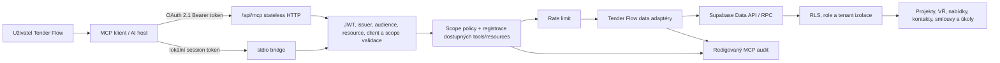

# Architektura Tender Flow MCP

Stav: popis aktuální implementace k 2026-08-09
Zdroj pravdy: `server/mcp/tenderFlowMcp.js`, `server/mcp/data.js`,
`server/mcp/supabaseAuth.js`

## Kontext a tok požadavku

Remote vstup je `/api/mcp`. Handler ověří browserový `Origin`, Bearer token a
jeho claims. Z ověřeného tokenu sestaví request-scoped Supabase klienta; dotazy
proto běží jako přihlášený uživatel a podléhají stejným RLS pravidlům jako
Tender Flow. Service-role klíč není součástí MCP datové cesty.

## Protokolová vrstva

Server používá SDK v2 a protokol `2026-07-28`:

- stateless request/response bez `Mcp-Session-Id`,
- volitelný `server/discover`,
- routování přes `Mcp-Method` a `Mcp-Name`,
- klientská metadata v `_meta`,
- privátní cache hints pro resources.

SDK dočasně obslouží kompatibilní legacy stateless klienty. Tato kompatibilita
není závazek zachovat staré desktopové rozhraní; podmínky jsou v
[release policy](release-and-deprecation.md).

## Vrstvy

| Vrstva | Odpovědnost |
| --- | --- |
| HTTP/stdio adaptér | transport, status kódy, protected-resource metadata |
| Token validation | podpis JWT, issuer, audience/resource, client allowlist, expirace a scopes |
| MCP server factory | capabilities, schemas, podmíněná registrace tools/resources |
| Scope policy | centrální mapování tool → povinné scopes a riziko |
| Data adaptér | omezené selecty, mapování a minimalizace výsledků |
| Supabase | autoritativní RLS/RPC, tenant a projektová oprávnění |
| Audit/rate limit | redigovaná stopa a omezení frekvence volání |

## Runtime varianty

| Varianta | Implementace | Stav |
| --- | --- | --- |
| Remote HTTP | `server/mcp/` + `api/mcp.js` | kanonická MCP 2.0 cesta |
| Lokální stdio | `scripts/mcp-stdio.js` + stejná factory | obecné read-only scopes ve výchozím stavu |
| Desktop | `desktop/main/services/mcpServer.ts` | samostatný legacy server; plánované sjednocení |
