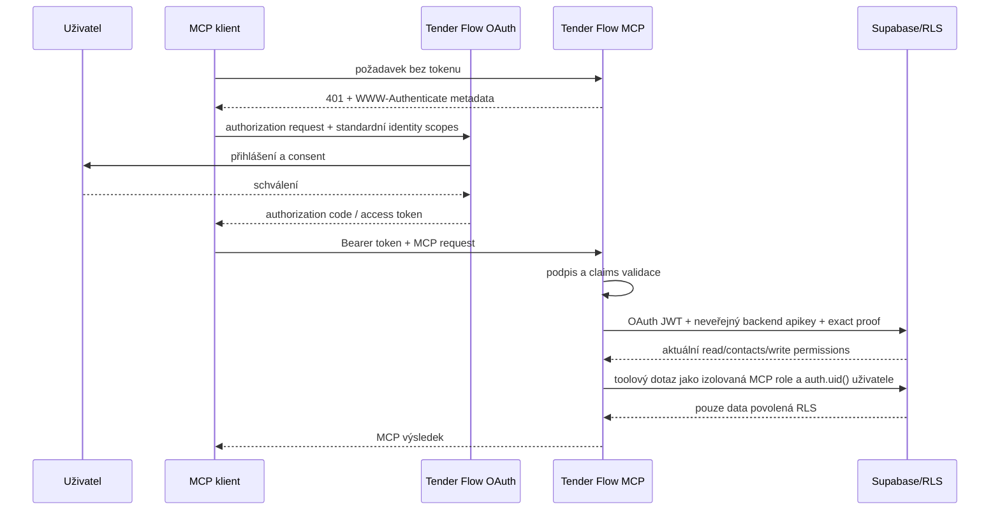

# Autentizace a OAuth

Stav: aktuální kontrakt remote a stdio autentizace k 2026-08-09
Zdroj pravdy: `server/mcp/supabaseAuth.js`, `server/mcp/nodeHandler.js`,
`server/mcp/response.js`

## Remote přihlášení

MCP se přihlašuje jako konkrétní uživatel Tender Flow. Klient získá OAuth
access token navázaný na uživatele, OAuth klienta a kanonický MCP resource.
MCP nepoužívá sdílenou aplikační identitu a nesmí obcházet uživatelská RLS.

Server kontroluje minimálně:

1. podpis JWT proti JWKS Supabase Auth,
2. issuer odpovídající propojenému Supabase projektu,
3. `exp` a standardní časové claims,
4. audience a resource vůči MCP endpointu/allowlistu,
5. `client_id` nebo `azp` vůči `MCP_ALLOWED_CLIENT_IDS`,
6. standardní OAuth identity scopes endpointu,
7. existenci identity uživatele v `sub`.
8. přesnou JWT roli `tenderflow_mcp_client`.

Supabase OAuth access token standardně obsahuje `client_id` a
`aud=authenticated`, nikoli automaticky RFC 8707 resource. Tender Flow proto
používá Custom Access Token Hook a autoritativní tabulku
`mcp_oauth_client_resources`. Kanonickou hodnotu
`app_metadata.mcp_resource=https://www.tenderflow.cz/api/mcp` dostane jen
aktivní OAuth klient explicitně registrovaný pro tento resource; jiné OAuth a
běžné session tokeny zůstanou beze změny. Jde o vazbu dedikovaného klienta na
resource, nikoli o tvrzení, že Supabase zachoval `resource` z jednotlivé
autorizační žádosti. Server navíc stále vyžaduje přesný environment allowlist;
samotný resource claim žádné doménové oprávnění neuděluje.

Tentýž hook nastaví registrovanému MCP klientovi roli
`tenderflow_mcp_client`. Role je `NOLOGIN NOINHERIT`: nezdědí obecná oprávnění
role `authenticated`, nemá přístup ke Storage/Realtime a dostane jen explicitní
tabulky/RPC potřebné aktuálním toolsetem. Každý Data API request této role musí
navíc projít `pgrst.db_pre_request`. Supabase gateway validuje serverový
`sb_secret_…` klíč jako `apikey`, ale PostgREST jej v request headers nevidí.
MCP backend proto odvodí SHA-256 proof, zaregistruje jej přes RPC dostupné pouze
`service_role` a posílá jej odděleně v `x-tenderflow-mcp-proof`. Guard vyžaduje
přesnou shodu s jedinou aktivní hodnotou v neexponovaném `mcp_private`.
Samotný Bearer token proto není použitelný jako obecný Supabase credential.

OAuth `scope` a doménová MCP oprávnění jsou oddělené. Supabase Auth podporuje
standardní scopes (`openid`, `email`, `profile`, případně `phone` a
`offline_access`), nikoli vlastní Tender Flow scopes. Server proto nikdy
neodvozuje přístup k datům z hodnoty `tenderflow.*` vložené do tokenového
`scope`; interní permissions přiděluje až databázový resolver pro konkrétního
uživatele a consentovaného OAuth klienta. Resolver se volá při každém remote
požadavku, kontroluje expiraci i revokaci a při DB chybě odmítne přístup.
OAuth klient může oprávnění pouze použít přes MCP toolset. Výpis a změna
zvýšených grantů vyžadují first-party Tender Flow session bez JWT `client_id`
i `azp`; stejný OAuth bearer si proto nemůže rozšířit vlastní oprávnění.

V produkci musí být `MCP_ALLOWED_CLIENT_IDS` neprázdné. Browserový Origin se
kontroluje přes `MCP_ALLOWED_ORIGINS`; absence Origin u serverového klienta
nenahrazuje tokenovou kontrolu.

## Lokální stdio

`TENDER_FLOW_MCP_ACCESS_TOKEN` musí být dedikovaný Supabase OAuth token s
registrovaným `client_id`, MCP resource claimem a rolí
`tenderflow_mcp_client`. Běžný Tender Flow session token se záměrně odmítne,
protože je určen webové aplikaci a představuje širší credential. Stdio tak
používá stejný autoritativní resolver a stejnou databázovou hranici jako remote
transport. Po nasazení role je nutné staré tokeny zahodit a klienta znovu
připojit, aby Supabase vydal nový JWT. Databázový pre-request guard však staré
tokeny blokuje okamžitě: každý JWT s neprázdným `client_id` nebo `azp` musí
přijít přes MCP backend s přesným proofem odvozeným ze serverového
`SUPABASE_MCP_SECRET_KEY`, i když v něm
ještě zůstala původní role `authenticated`. Storage a publikované Realtime
tabulky mají navíc restriktivní RLS, která takový starší OAuth token odmítne i
mimo PostgREST.

## Zacházení s tokeny

- Tokeny patří pouze do lokálního secret store nebo runtime environmentu.
- `SUPABASE_MCP_SECRET_KEY` patří výhradně do serverového secret store; nesmí
  být předán MCP klientovi, browseru ani Electron rendereru.
- Token nesmí být v Git, dokumentaci, audit payloadu, URL ani chybové zprávě.
- MCP audit ukládá identifikátor uživatele/klienta a redigované souhrny, ne
  Bearer token.
- Při podezření na únik je nutné zneplatnit session/credential, odstranit OAuth
  client z allowlistu a prověřit MCP audit.
