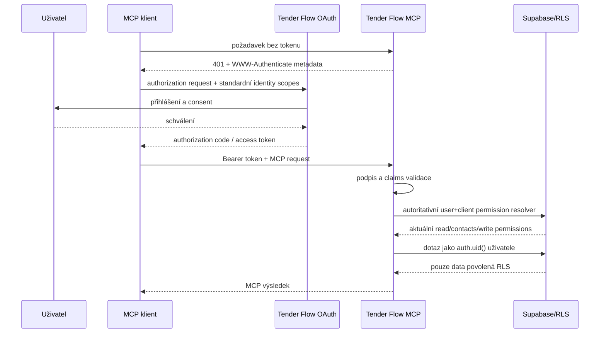

# Autentizace a OAuth

Stav: aktuální kontrakt remote a stdio autentizace k 2026-08-09
Zdroj pravdy: `server/mcp/supabaseAuth.js`, `server/mcp/nodeHandler.js`,
`server/mcp/response.js`

## Remote přihlášení

MCP se přihlašuje jako konkrétní uživatel Tender Flow. Klient získá OAuth
access token navázaný na uživatele, OAuth klienta a kanonický MCP resource.
MCP nepoužívá sdílenou aplikační identitu a nesmí obcházet uživatelská RLS.

Server kontroluje minimálně:

1. podpis JWT proti JWKS Supabase Auth,
2. issuer odpovídající propojenému Supabase projektu,
3. `exp` a standardní časové claims,
4. audience a resource vůči MCP endpointu/allowlistu,
5. `client_id` nebo `azp` vůči `MCP_ALLOWED_CLIENT_IDS`,
6. standardní OAuth identity scopes endpointu,
7. existenci identity uživatele v `sub`.

Supabase OAuth access token standardně obsahuje `client_id` a
`aud=authenticated`, nikoli automaticky RFC 8707 resource. Tender Flow proto
používá Custom Access Token Hook a autoritativní tabulku
`mcp_oauth_client_resources`. Kanonickou hodnotu
`app_metadata.mcp_resource=https://www.tenderflow.cz/api/mcp` dostane jen
aktivní OAuth klient explicitně registrovaný pro tento resource; jiné OAuth a
běžné session tokeny zůstanou beze změny. Jde o vazbu dedikovaného klienta na
resource, nikoli o tvrzení, že Supabase zachoval `resource` z jednotlivé
autorizační žádosti. Server navíc stále vyžaduje přesný environment allowlist;
samotný resource claim žádné doménové oprávnění neuděluje.

OAuth `scope` a doménová MCP oprávnění jsou oddělené. Supabase Auth podporuje
standardní scopes (`openid`, `email`, `profile`, případně `phone` a
`offline_access`), nikoli vlastní Tender Flow scopes. Server proto nikdy
neodvozuje přístup k datům z hodnoty `tenderflow.*` vložené do tokenového
`scope`; interní permissions přiděluje až databázový resolver pro konkrétního
uživatele a consentovaného OAuth klienta. Resolver se volá při každém remote
požadavku, kontroluje expiraci i revokaci a při DB chybě odmítne přístup.
OAuth klient může oprávnění pouze použít přes MCP toolset. Výpis a změna
zvýšených grantů vyžadují first-party Tender Flow session bez JWT `client_id`
i `azp`; stejný OAuth bearer si proto nemůže rozšířit vlastní oprávnění.

V produkci musí být `MCP_ALLOWED_CLIENT_IDS` neprázdné. Browserový Origin se
kontroluje přes `MCP_ALLOWED_ORIGINS`; absence Origin u serverového klienta
nenahrazuje tokenovou kontrolu.

## Lokální stdio

`TENDER_FLOW_MCP_ACCESS_TOKEN` je lokálně předaný Supabase session token.
Normální session token dostane interní oprávnění jen pro obecné čtení, nikoli
kontaktní údaje ani zápis. Standardní OAuth scopes zůstávají identity claims a
nejsou uměle doplňovány. Pokud stdio dostane skutečný OAuth token s
`client_id`, použije stejný autoritativní resolver jako remote transport.
Audit normální session cesty používá pevné
`client_id = local-stdio`; databázová politika tuto výjimku dovolí pouze tokenu
bez `client_id` i `azp`.

## Zacházení s tokeny

- Tokeny patří pouze do lokálního secret store nebo runtime environmentu.
- Token nesmí být v Git, dokumentaci, audit payloadu, URL ani chybové zprávě.
- MCP audit ukládá identifikátor uživatele/klienta a redigované souhrny, ne
  Bearer token.
- Při podezření na únik je nutné zneplatnit session/credential, odstranit OAuth
  client z allowlistu a prověřit MCP audit.
