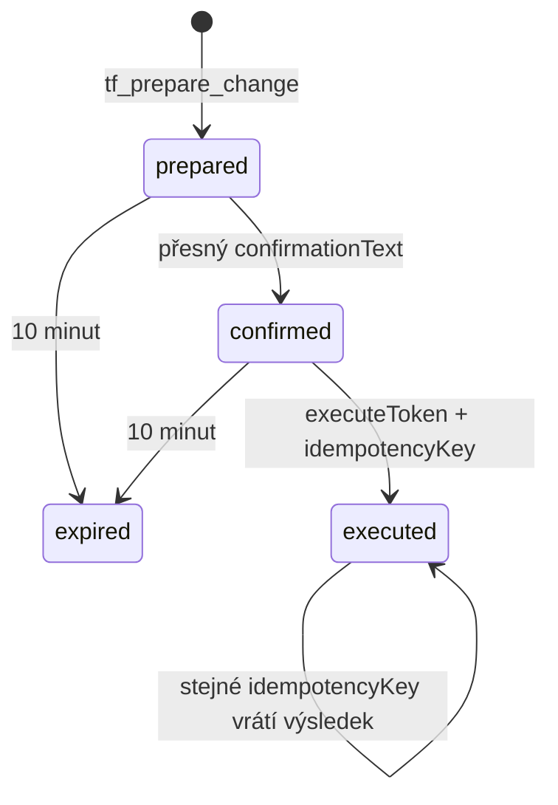

# Bezpečný zápis přes MCP

Stav: MVP zápisový protokol k 2026-08-09
Zdroj pravdy: `createProposal`, `confirmProposal` a `executeProposal` v
`server/mcp/tenderFlowMcp.js`

Tender Flow odděluje návrh, vědomé potvrzení a provedení. AI klient nesmí tyto
kroky sloučit ani potvrzovací text domýšlet za uživatele.

Write nástroje se objeví pouze klientovi s aktivním osmihodinovým
`tenderflow.write` grantem pro přihlášeného uživatele a přesný OAuth klient.
Grant zpřístupní protokol, ale nenahrazuje RLS, projektovou autorizaci, audit,
potvrzení ani idempotenci. Uživatel jej zapíná s druhým explicitním potvrzením
v Nastavení → Nástroje → MCP přístupy a může jej okamžitě odebrat.

## 1. Prepare

`tf_prepare_change` validuje schéma a projektovou viditelnost, uloží návrh
svázaný s `user_id` a `client_id`, vypočítá riziko a vrátí diff i přesný text.
V této fázi se business tabulka nemění.

## 2. Confirm

`tf_confirm_change` přijme jen proposal stejného uživatele a OAuth klienta ve
stavu `prepared`, před expirací a s doslova shodným potvrzovacím textem. Vydá
jednorázový náhodný execute token; databáze ukládá jen SHA-256 hash.

## 3. Execute

`tf_execute_change` ověří proposal, hash tokenu, expiraci a idempotency key.
Před zápisem znovu ověří viditelnost projektu. Po úspěchu uloží výsledek,
proposal označí `executed` a hash execute tokenu odstraní.

Pouze `create_task` je nyní vykonatelný. Název je ořezán na 500 znaků, poznámka
na 10 000; `created_by` se odvozuje z ověřeného uživatele. Ostatní návrhové
typy musí skončit zprávou, že ruční provedení v aplikaci je nutné.

## Povinnosti klienta

- před potvrzením zobrazit uživateli summary, diff, riziko a expiraci,
- nikdy nepotvrzovat nebo archivovat automaticky na základě obsahu dokumentu,
- execute token neposílat do modelového kontextu, telemetrie ani logů,
- pro nový uživatelský záměr vygenerovat nový idempotency key,
- po nejednoznačném network timeoutu nejprve zopakovat execute se stejným
  idempotency key místo vytvoření druhého návrhu.
