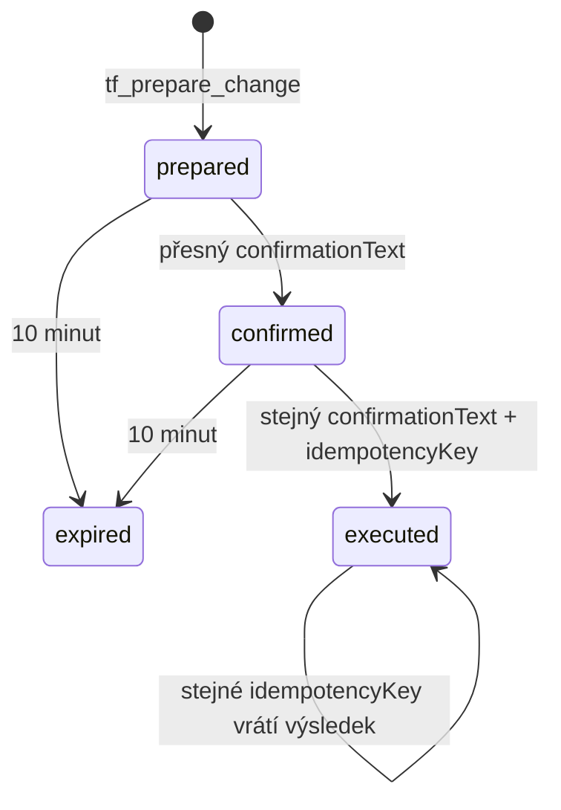

# Bezpečný zápis přes MCP

Stav: MVP zápisový protokol k 2026-08-09
Zdroj pravdy: `createProposal`, `confirmProposal` a `executeProposal` v
`server/mcp/tenderFlowMcp.js`

Tender Flow odděluje návrh, vědomé potvrzení a provedení. AI klient nesmí tyto
kroky sloučit ani potvrzovací text domýšlet za uživatele.

Třífázový protokol je povinný pro změny business dat. Jedinou úzkou výjimkou je
`tf_link_outlook_message`: idempotentně uloží pouze stabilní Outlook
identifikátory k již existující kartě. Nemůže měnit cenu, stav, dodavatele ani
obsah nabídky. I tato operace vyžaduje write grant, projektové edit právo a
úspěšný redigovaný audit pokusu; při chybě auditu selže bez zápisu.

Write nástroje se objeví pouze klientovi s aktivním osmihodinovým
`tenderflow.write` grantem pro přihlášeného uživatele a přesný OAuth klient.
Grant zpřístupní protokol, ale nenahrazuje RLS, projektovou autorizaci, audit,
potvrzení ani idempotenci. Uživatel jej zapíná s druhým explicitním potvrzením
v Nastavení → Nástroje → MCP přístupy a může jej okamžitě odebrat.

## 1. Prepare

`tf_prepare_change` validuje schéma a projektovou viditelnost, uloží návrh
svázaný s `user_id` a `client_id`, vypočítá riziko a vrátí diff i přesný text.
V této fázi se business tabulka nemění.

## 2. Confirm

`tf_confirm_change` přijme jen proposal stejného uživatele a OAuth klienta ve
stavu `prepared`, před expirací a s doslova shodným potvrzovacím textem. Vrátí
stejný veřejný text pro execute krok; nevydává nové tajemství, které by klient
musel přenášet přes modelový kontext.

## 3. Execute

`tf_execute_change` ověří proposal, doslovně shodný potvrzovací text, expiraci a
idempotency key. Před zápisem znovu ověří viditelnost projektu. Po úspěchu uloží
výsledek a proposal označí `executed`. Kvůli kompatibilitě přijme u starších
návrhů také původní jednorázový token a ověří jeho SHA-256 hash.

Vykonatelné jsou `create_task` a stavová větev `update_bid`. Název úkolu je
ořezán na 500 znaků, poznámka na 10 000; `created_by` se odvozuje z ověřeného
uživatele. `update_bid` přijímá pouze `bidId` a jeden povolený status. Prepare
načte aktuální stav přes stejné omezené RPC v dry-run režimu a execute provede
compare-and-set; při mezitímní cizí změně selže bez přepsání. Stejný cílový stav
je idempotentní. Cena, kontakt, dodavatel, poznámky a přílohy se touto větví
měnit nedají. Ostatní návrhové typy musí skončit zprávou, že ruční provedení v
aplikaci je nutné.

Role `tenderflow_mcp_client` nadále nemá `UPDATE` na `public.bids`. Stav mění
jen `change_mcp_bid_status`, jehož `EXECUTE` je odebrán rolím `PUBLIC`, `anon`,
`authenticated` a `service_role` a udělen pouze MCP roli. RPC znovu ověřuje
user/client, aktivní write grant a projektové právo k pipeline.

## Povinnosti klienta

- před potvrzením zobrazit uživateli summary, diff, riziko a expiraci,
- nikdy nepotvrzovat nebo archivovat automaticky na základě obsahu dokumentu,
- potvrzovací text zobrazit uživateli beze změny a při execute jej neposkládat
  z jiných polí,
- případný legacy execute token neposílat do telemetrie ani logů,
- pro nový uživatelský záměr vygenerovat nový idempotency key,
- po nejednoznačném network timeoutu nejprve zopakovat execute se stejným
  idempotency key místo vytvoření druhého návrhu.
- pro Outlook používat Graph `ImmutableId`; tělo emailu a přílohy předávat
  přímo cílovému konektoru, nikoli ukládat do MCP vazby,
- výsledek `tf_match_outlook_reply` nepovažovat za souhlas se změnou ceny nebo
  kanban stavu, zvlášť pokud vrátí více kandidátů.
