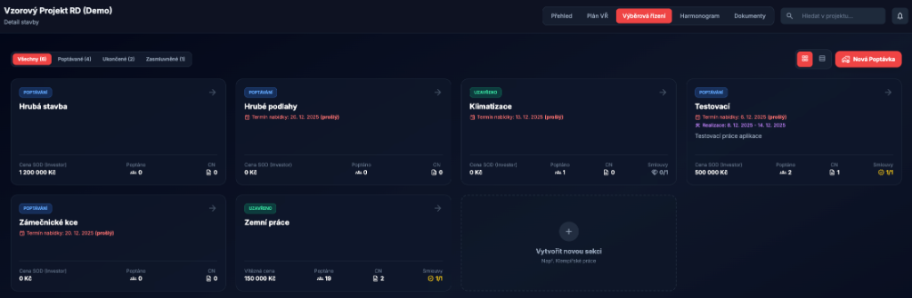
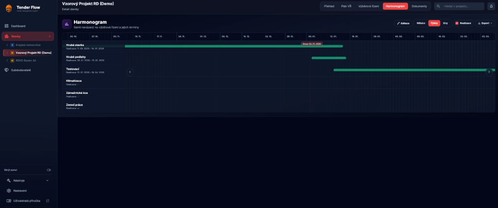
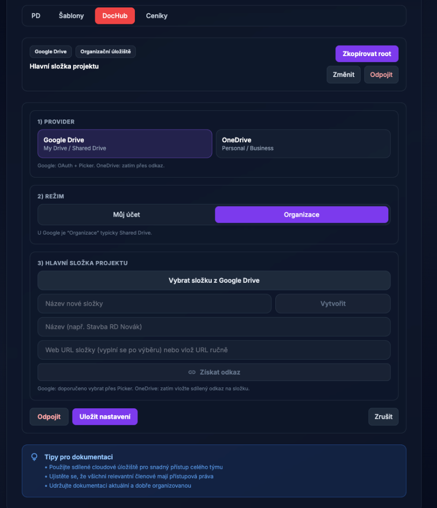
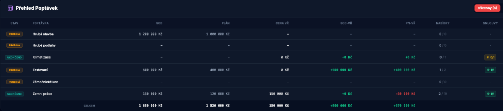

# Tender Flow – Uživatelská příručka

Tato příručka popisuje práci v aplikaci Tender Flow pro řízení staveb, výběrových řízení a subdodavatelů.

Verze příručky: **1.8** • Datum: **2026‑02‑28** • Aplikace: **v1.4.0**

  

---

## 📋 Obsah

- [🎉 Novinky](#novinky-posledni-zmeny)
- [🎯 Účel a role](#ucel-a-role)
- [🔐 Přihlášení a účet](#prihlaseni-a-ucet)
- [🏢 Organizace a předplatné](#organizace-a-predplatne)
- [🧭 Navigace v aplikaci](#navigace-v-aplikaci)
- [📊 Dashboard](#dashboard)
- [🏗️ Detail stavby (záložky)](#detail-stavby-zalozky)
- [📅 Plán VŘ](#plan-vr)
- [📋 Výběrová řízení (Pipeline)](#vyberova-rizeni-pipeline)
- [📜 Smlouvy](#smlouvy)
- [📆 Harmonogram](#harmonogram)
- [📁 Dokumenty a šablony](#dokumenty-a-sablony)
- [👥 Subdodavatelé (Kontakty)](#subdodavatele-kontakty)
- [🏠 Správa staveb](#sprava-staveb)
- [📈 Přehled staveb (analytika)](#prehled-staveb-analytika)
- [⚙️ Nastavení aplikace](#nastaveni-aplikace)
- [📊 Excel nástroje](#excel-nastroje)
- [🔗 URL Zkracovač](#url-zkracovac)
- [💻 Tender Flow Desktop](#tender-flow-desktop)
- [🛡️ Administrace systému](#administrace-systemu)
- [📝 Registrace a whitelist](#registrace-a-whitelist)
- [📧 Seznam povolených emailů](#seznam-povolenych-emailu-whitelist)
- [👤 Správa uživatelů a rolí](#sprava-uzivatelu-a-roli)
- [🏢 Organizace (členství a role)](#organizace-clenstvi-a-role)
- [🛰️ Incident logy (Admin)](#incident-logy-admin)
- [🔄 Import a synchronizace kontaktů](#import-a-synchronizace-kontaktu)
- [🤖 AI funkce](#ai-funkce)
- [⚖️ Licence, práva a ochrana dat](#licence-prava-a-ochrana-dat)
- [❓ Časté otázky](#caste-otazky)

---

## 🎉 Novinky (poslední změny)

📱 v1.4.0 📖 Verze příručky 1.8

Verzi aplikace najdete vlevo dole v sidebaru.

### v1.4.0

- **Desktop aktualizace přes GitHub Releases**: Windows běží v auto-update režimu, macOS (Apple Silicon) v manuálním režimu instalace.
- **Administrace rozšířena o Incident logy**: dohledání chyb podle incident ID, uživatele a času + mazání starých logů dle retence.
- **Správa uživatelů rozšířena**: Admin může nastavit typ přihlášení (Auto/Email/Google/Microsoft/GitHub/SAML) a ručně přepsat úroveň předplatného konkrétního uživatele.
- **Organizace v Nastavení**: přehled členů, schvalování žádostí, změny rolí člen/admin a předání vlastnictví organizace.
- **Smlouvy**: formulář smlouvy obsahuje pole **IČ dodavatele** a kontextovou nabídku přímo nad řádky smluv.
- **Výběrová řízení (email nevybraným)**: zlepšené sestavení BCC adres (odstranění duplicit, kompatibilnější oddělovač adres).
- **Stabilita**: opravy načítání přehledů a ukládání základních údajů v detailu stavby.

### v1.3.2

- **Uživatelská příručka doplněna**: rozšířené a sjednocené popisy hlavních modulů včetně administrace, AI funkcí a desktop sekce.
- **Obsah příručky upraven**: opravené interní odkazy a aktualizované metainformace verze/datum.
- **Release poznámky sjednocené**: doplněna sada release notes pro aktuální patch release.

### v1.3.1

- **Smlouvy (projektová záložka)**: kompletní modul pro evidenci smluv, dodatků a čerpání v rámci konkrétní stavby.
- **Zpracování dokumentů ke smlouvám**: možnost předvyplnit data ze souboru (např. PDF) a následně je potvrdit/upravit.
- **Stabilita oprávnění a předplatného**: vylepšení vyhodnocování dostupných funkcí a konzistence přístupů napříč organizacemi.
- **Desktop UX**: uživatelská příručka se v desktop verzi otevírá přímo v aplikaci.

### v1.2.3

- **Emailové šablony (Resend)**: aktualizace šablon a konfigurace odesílání.
- **Reset hesla**: opravy routingu a celého flow obnovy hesla.

### v1.2.1

- **OCR vylepšení**: přesnější rozpoznávání textu.
- **Build/desktop stabilita**: technické úpravy build procesu Electron aplikace.

### v0.9.6 v08

- **AI Key Policy**: AI klíče se používají pouze server-side přes Supabase Secrets (nikdy ne přes klienta nebo databázové úložiště klíčů).
- **AI Testování**: Nástroj pro administrátory běží v server-only režimu a ověřuje funkčnost přes backend.
- **Excel Indexer**: Nový pokročilý nástroj pro dvou-fázové zpracování Excel rozpočtů s automatickým indexováním a doplněním popisů.
- **Index Matcher**: Zjednodušená verze Indexer pro rychlé doplnění popisů podle indexu.
- **URL Zkracovač**: Nový nástroj pro vytváření zkrácených odkazů s vlastními aliasy (tenderflow.cz/s/alias).
- **Desktop aplikace**: Nativní Electron aplikace pro Windows a macOS s rozšířenými funkcemi (Touch ID, nativní souborový systém, lokální Excel nástroje).
- **Mailto IPC Bridge**: Spolehlivější otevírání emailových klientů v desktop verzi pomocí IPC komunikace.

### v0.9.5

- **AI prompty**: Možnost přizpůsobení systémových AI promptů pro grafy a reporty (admin).
- **DocHub integrace**: Vylepšená práce s lokálními složkami v Tender Flow Desktop.
- **Stabilita**: Různá vylepšení stability a opravy chyb.

### v0.9.4-260104

- **Harmonogram**: Přidána záložka „Harmonogram“ v detailu stavby (Gantt) včetně exportů (XLSX/PDF).
- **Organizace (tenant)**: Uživatel je automaticky přiřazen do organizace; pro osobní emaily se vytváří osobní organizace.
- **Statusy kontaktů**: Statusy jsou nyní oddělené po organizacích (každá organizace má své nastavení).
- **Administrace**: Admin je nejvyšší role (sjednocení oprávnění pro správu uživatelů/registrací).

### v0.9.4-260102

- **Dokumenty / Ceníky**: Přidána nová podsekce „Ceníky“ pro správu odkazů na projektové ceníky a rychlou integraci s odpovídající složkou v DocHubu.
- **Perzistence dat**: Implementováno ukládání odkazů na dokumentaci a ceníky přímo do databáze projektu.

### v0.9.3-260101

- **Hlavní stránka / DEMO**: pro ceník a možnost „DEMO“ bylo vytvořeno demo s provizorními (generovanými) daty pro možnost seznámení se s aplikací.
- **Funkčnost (AI)**: úprava AI backendové části pro lepší a rychlejší fungování; implementace cache AI, aby nedocházelo k neustálému volání a přegenerování reportů.
- **Dashboard / Stavba (UX)**: vylepšený přehled poptávek pro rychlejší práci; nově je možné prokliknout se z přehledu přímo do kanbanu dané poptávky.
- **Dashboard / Stavba (UX)**: UX vylepšení obsahuje také pop‑okna v designu aplikace.

### v0.9.2

- **Sidebar**: přidána možnost tlačítkem schovat postranní panel a získat tak větší plochu a lepší čitelnost.
- **Hlavní stránka**: vytvořena nová landing page se základními informacemi o aplikaci.
- **Routy přihlášení/registrace**: přihlášení a vytvoření účtu jsou na samostatných routách `tenderflow.cz/login` a `tenderflow.cz/register`.

### v0.9.1

- **Subdodavatelé**: možnost přidávat další specializace bez nutnosti zdvojovat dodavatele v databázi.
- **Kontakty**: k jednomu subdodavateli lze evidovat více kontaktů (posiluje potřebu mít jen jednoho dodavatele).
- **Databáze**: provedena úprava databáze v návaznosti na změny dle updatu.
- **Import kontaktů**: import/synchronizace slučuje záznamy podle názvu firmy (case-insensitive) a doplňuje specializace i kontakty bez duplicit.

### v0.9.0

- **Whitelist (registrace)**: registrace není povolena všem uživatelům, ale jen těm, kteří jsou na whitelistu (prozatímní řešení pro postupnou integraci).
- **Poznámka**: whitelist dočasně nahrazuje možnost vlastního mailového hostingu, která bude potřeba dále implementovat.
- **Role**: systém obsahuje kritickou roli **admin** pro možnost nastavení dodatečných rolí; každý tenant má svého „administrátora“.
- **Seznam rolí v tomto updatu**: Přípravář • Hlavní stavbyvedoucí • Stavbyvedoucí • Technik.
- **Práva dle rolí**: každá role určuje, k čemu má uživatel přístup a jaké akce může provádět; nejvyšší práva má aktuálně **Přípravář** (hlavní uživatel a zadavatel dat).
- **Databáze**: proběhla úprava databáze, tabulek a správy dat, aby vyhovovala nově aplikovaným procesům a funkcím.

### v0.8.0

- **Dashboard**: srdcem aplikace je přístup ke všem stavbám uživatele a rychlému přehledu základních informací; možnost přepínání staveb přes rozevírací menu.
- **Subdodavatelé**: přidán nový stav „nedoporučuji“ pro možnost varování kolegů před použitím problémového subdodavatele.
- **Správa staveb**:
  - ve vašich seznamech staveb nyní vidíte i sdílení,
  - archivace stavby: při archivaci se stavba přesune do archivu (pole `archiv`), odebere se z bočního panelu Stavby,
  - archivované stavby lze vrátit zpět tlačítkem pro obnovu,
  - sdílení zůstává stejné; je vidět seznam sdílených osob a lze je odebrat,
  - propsání stavby jinému uživateli může trvat několik minut.
- **Stavby (sidebar)**: nově lze stavby přesouvat a měnit jejich pořadí; funkce je experimentální (může být odebrána).
- **Přehled stavby**:
  - přepracovaný vzhled (jednodušší a přehlednější),
  - panelové zobrazení poptávek nahrazeno tabulkovým zobrazením,
  - přidána tabulka s bilancí výběrů a přehledem stavu,
  - filtrování přehledu: všechny | poptávané | ukončené | zasmluvněné,
  - probíhá testování logiky (mohou se objevovat dodatečné opravy výjimek funkčnosti).
- **Plán VŘ** (nový modul):
  - možnost vytvořit výběrové řízení a přidat mu průběh (od–do),
  - po vytvoření se vygeneruje tlačítko „Vytvořit“ a stav VŘ „čeká na vytvoření“,
  - stiskem „Vytvořit“ dojde k vytvoření výběru ve Výběrových řízeních a stav se přepne na „probíhá“,
  - stav vždy reflektuje průběh daného výběrového řízení.
- **Výběrová řízení (dříve pipelines)**:
  - přejmenování pro intuitivnější navigaci,
  - možnost vytvářet vlastní šablony poptávky do emailu,
  - filtrování dle stavu,
  - karta poptávky obsahuje cenu SOD v základu; pokud má výběr vítěze, přepíše se na cenu vítěznou,
  - karta nabídky zaznamenává až 3 kola VŘ; do aktuální ceny se počítá aktivně vybrané kolo,
  - karta subdodavatele zobrazuje všechny jeho ceny z jednotlivých kol (případně poznámku),
  - přesunutím karty na vítězné pole se zobrazí ikona poháru (vítěz),
  - pro vítěze se zobrazuje ikona smlouvy: šedo‑bílá → blikající odškrtnutí (smlouva vyřízena),
  - stav smluv se zobrazuje také na kartě VŘ (např. 0/2 = dva vítězové, nula smluv),
  - po aktivaci všech smluv se zobrazí plaketka s odškrtnutím (hotovo),
  - uzavření výběru probíhá na kartě daného výběru,
  - export do Excelu a PDF (formát dokumentu se bude dále ladit),
  - email nevybraným: otevře výchozí emailový klient se zprávou pro všechny relevantní subdodavatele; odesílání je přes skrytého příjemce (BCC).
- **Přehled staveb**:
  - rozevírací menu pro možnost přepnutí stavby,
  - pilotní analýza pomocí umělé inteligence (TenderFlow AI),
  - export analýzy do PDF (časové razítko a možnost sdílení),
  - analýza vychází z dostupných dat (množství informací, spuštěná VŘ, stav rozpracovanosti).

## Účel a role

Tender Flow je centrální místo pro evidenci staveb a řízení výběrových řízení: od plánování poptávek, přes oslovení subdodavatelů, až po vyhodnocení nabídek a evidenci vítěze.

Pozn.: odeslání emailu probíhá přes váš výchozí emailový klient (funkce používá `mailto:`).

## Přihlášení a účet

1. Zadejte email a heslo.
2. Klikněte na **Přihlásit**.
3. Odhlášení najdete dole v levém panelu (ikonka `logout`).

> 💡 **Tip:** Uložte si přihlášení pro rychlejší přístup příště.

## Organizace a předplatné

Tender Flow funguje jako multi-tenant aplikace: každý uživatel patří do **organizace** (tenant) a data jsou mezi organizacemi oddělená.

- **Firemní email**: typicky se přidáte do organizace podle domény (nebo se pro doménu vytvoří nová organizace).
- **Osobní email (např. Gmail/Seznam)**: vytvoří se osobní organizace pro vaše použití.

Organizace ovlivňuje zejména:

- **Předplatné** (dostupnost vybraných funkcí v menu).
- **Statusy kontaktů** (každá organizace má vlastní seznam a barvy).

Tip: pokud některou část aplikace nevidíte (např. Import kontaktů, Přehled staveb, Excel nástroje), je pravděpodobně skrytá kvůli nastavení předplatného / oprávnění.

### Organizace (členství a role)

V **Nastavení → Organizace** můžete spravovat členství v organizaci:

- **Členové organizace**: přehled členů a jejich rolí (vlastník/admin/člen).
- **Žádosti o vstup** (vlastník): schvalování a zamítání čekajících žádostí.
- **Ruční přidání uživatele** (vlastník): přidání uživatele podle emailu (musí být registrovaný).
- **Změna role člena** (vlastník): přepínání mezi rolí admin a člen.
- **Předání vlastnictví organizace** (vlastník): bezpečný převod ownershipu na jiného člena.

## Navigace v aplikaci

V levém panelu (sidebar) přepínáte hlavní části aplikace a vybíráte konkrétní stavbu.

- **📊 Dashboard** – přehled vybrané stavby a export.
- **🏗️ Stavby** – seznam staveb (projekty).
- **👥 Subdodavatelé** – databáze kontaktů.
- **🔧 Nástroje** – skupina doplňků (např. Správa staveb, Přehled staveb, Import kontaktů, Excel nástroje; dle předplatného).
- **⚙️ Nastavení** – profil, vzhled, statusy kontaktů, administrace (dle oprávnění).

## Dashboard

Dashboard zobrazuje přehled jedné vybrané stavby. V hlavičce můžete přepnout stavbu a vyexportovat XLSX.

### 🎯 Co dashboard zobrazuje:
- Přehled poptávek a jejich stav
- Klíčové metriky stavby
- Rychlý přístup k nejčastějším akcím
- Možnost exportu dat do Excelu

Po kliknutí na stavbu v sidebaru se otevře detail se záložkami:

- **📊 Přehled** – rozpočty, stav, metriky.
- **📅 Plán VŘ** – plánování výběrových řízení.
- **📋 Výběrová řízení** – pipeline poptávek a nabídek.
- **📜 Smlouvy** – evidence smluv, dodatků a čerpání.
- **📆 Harmonogram** – Gantt navázaný na termíny výběrových řízení.
- **📁 Dokumenty** – odkazy na dokumentaci a šablony poptávek.

## 📅 Plán VŘ

Plán VŘ slouží k naplánování VŘ v čase a (dle potřeby) k jejich převodu do poptávek.

> 🖼️ **Ukázka:** Plán výběrových řízení

## 📋 Výběrová řízení (Pipeline)

Výběrová řízení jsou organizovaná po **poptávkách** (kategorie prací). Nabídky subdodavatelů přesouváte mezi sloupci (drag & drop).

> 🖼️ **Ukázka:** Kanban board výběrových řízení

### Stavy nabídky (sloupce)

- **Oslovení** – připraven k oslovení (může se zobrazit „Generovat poptávku“).
- **Odesláno** – poptávka odeslána, čeká se na reakci.
- **Cenová nabídka** – dorazila nabídka.
- **Užší výběr** – shortlist.
- **Jednání o SOD** – finalisté / jednání.
- **Odmítnuto** – neúspěšní.

### Karta nabídky

Na kartě nabídky evidujete cenu, tagy, poznámky a případně generujete poptávkový email.

---

## 📜 Smlouvy

Záložka **Smlouvy** slouží pro finanční a smluvní řízení konkrétní stavby.

- **📊 Přehled** – souhrn KPI (počty smluv, hodnota, čerpání, retence).
- **📄 Smlouvy** – seznam smluv, vytváření/editace, vazba na dodavatele, stav a hodnotu.
- **✏️ Dodatky** – změny smluv (cenové i termínové) navázané na vybranou smlouvu.
- **💰 Čerpání** – evidence průvodek/čerpání a kontrola zůstatku vůči aktuální hodnotě smlouvy.

> 💡 **Tip:** Při zakládání lze data ze smluvních dokumentů předvyplnit automaticky a před uložením je ručně potvrdit.

## 📆 Harmonogram

Harmonogram je Ganttův přehled termínů, který se automaticky naplňuje z dat v projektu.

- **Jak se plní**: doplňte termíny v **Plán VŘ** (od–do) nebo termín v detailu **Výběrových řízení** (deadline).
- **Zobrazení**: přepínání měřítka **Měsíce / Týdny / Dny**, volitelně přepínač **Realizace**.
- **Editace**: tlačítko **Editace** umožní upravit termíny přímo v harmonogramu.
- **Export**: menu **Export** nabízí `XLSX`, `PDF` a `XLSX s grafem`.

---

## 📁 Dokumenty a šablony

V záložce **Dokumenty** najdete podzáložky:

- **📂 PD** – odkaz na projektovou dokumentaci (Drive/SharePoint apod.).
- **📝 Šablony** – šablona poptávky a šablona „email nevybraným" (lze použít interní editor šablon, nebo externí odkaz/soubor).
- **📦 DocHub** – napojení na strukturu složek projektu (pokud je povoleno).
- **💵 Ceníky** – odkaz na projektové ceníky + rychlý odkaz na složku `Ceníky` v DocHubu (pokud je připojen).

V praxi zde typicky nastavíte:

- odkaz na dokumentaci stavby (Drive/SharePoint apod.),
- šablony emailů (poptávka / nevybraní),
- ceníky a související složky.

### DocHub: Tender Flow Desktop (lokální disk)

Pro lokální práci se složkami použijte provider **Tender Flow Desktop**.

**Nastavení v aplikaci:**
1. Projekt → **Dokumenty** → **DocHub**.
2. Provider: **Tender Flow Desktop**.
3. Vyberte nebo zadejte cestu ke kořenové složce projektu.
4. Klikněte **Připojit** a poté **Synchronizovat**.

## 👥 Subdodavatelé (Kontakty)

Databáze kontaktů pro přidávání do poptávek. Podporuje filtry, výběr více řádků a hromadné akce (např. doplnění regionu pomocí AI – pokud je povoleno).

- **👤 Více kontaktů na firmu**: u jedné firmy můžete evidovat více kontaktních osob (jméno, pozice, telefon, email).
- **🏷️ Více specializací**: specializace jsou seznam (používá se pro filtrování i výběr do poptávek).

> 🖼️ **Ukázka:** Databáze subdodavatelů

---

## 🏠 Správa staveb

Slouží pro vytváření staveb, změny statusu, archivaci a sdílení (dle oprávnění).

Sdílení podporuje dvě úrovně oprávnění: **✏️ Úpravy** a **👁️ Pouze čtení**.

## 📈 Přehled staveb (analytika)

Manažerské souhrny napříč stavbami: metriky, grafy a volitelně AI analýza.

> 🖼️ **Ukázka:** Přehled poptávek

---

## ⚙️ Nastavení aplikace

- **👤 Profil** – zobrazované jméno, vzhled (tmavý režim, primární barva, pozadí), statusy kontaktů a biometrické přihlášení v desktop aplikaci.
- **🏢 Organizace** – členové, žádosti o vstup, role a předání vlastnictví (dle oprávnění).
- **📥 Import kontaktů** – synchronizace z URL / ruční upload (může být v sekci **Nástroje** dle předplatného).
- **🔓 Excel Unlocker PRO** – odemknutí `.xlsx` lokálně v prohlížeči (soubor se nikam neodesílá; dle předplatného).
- **🔀 Excel Merger PRO** – slučování Excel listů; v desktop verzi nativní, ve web verzi externí aplikace (dle předplatného).
- **📊 Excel Indexer** – dvou-fázová indexace a zpracování rozpočtů s automatickým doplněním popisů.
- **🔍 Index Matcher** – rychlé doplnění popisů podle indexu (zjednodušená verze Indexer).
- **🔗 URL Zkracovač** – vytváření zkrácených odkazů s vlastními aliasy (dle předplatného).
- **🛡️ Administrace systému (Admin)** – registrace, whitelist, uživatelé, role/oprávnění, přihlášení, předplatné, AI a incident logy.

## 📊 Excel nástroje

Tender Flow nabízí sadu nástrojů pro práci s Excel soubory.

### 🔓 Excel Unlocker PRO

Nástroj pro odemknutí ochrany `.xlsx` souborů. Funguje lokálně v prohlížeči – soubor se nikam neodesílá.

**Použití:**
1. Otevřete **Nastavení → Excel Unlocker PRO**
2. Klikněte "Vybrat soubor" a nahrajte chráněný Excel
3. Klikněte "Odemknout"
4. Stáhněte odemčený soubor

**Umístění:** Nastavení → Excel Unlocker PRO (dle předplatného)

---

### 🔀 Excel Merger PRO

Nástroj pro slučování více listů z různých Excel souborů do jednoho souboru.

- **💻 Desktop verze**: Nativní zpracování pomocí lokálních Python skriptů
- **🌐 Web verze**: Externí aplikace v iframe (vyžaduje konfiguraci adminem)

**Umístění:** Nastavení → Excel Merger PRO (dle předplatného)

---

### 📊 Excel Indexer

Excel Indexer je pokročilý nástroj pro automatické indexování a zpracování velkých Excel rozpočtů. Nástroj pracuje ve **dvou fázích**.

#### Fáze 1: Vložení sloupce Oddíly

V první fázi nástroj:
1. Hledá značky "D" ve sloupci F (markerColumn)
2. Přečte oddíl ze sloupce G (sectionColumn)
3. Vloží nový sloupec B s názvem "Oddíly"
4. Vyplní tento sloupec názvem oddílu pro všechny řádky do další značky

**Nastavení sloupců:**
- **Marker Column** (F): Sloupec kde se hledají značky "D"
- **Section Column** (G): Sloupec odkud se čte název oddílu

**Výstup fáze 1:**
- Soubor s vloženým sloupcem "Oddíly"
- Posun ostatních sloupců doprava o 1

#### Fáze 2: Doplnění popisů

Ve druhé fázi nástroj:
1. Používá výstup z Fáze 1
2. Hledá kódy položek ve sloupci G (po posunu, původně F)
3. Páruje kódy s indexem položek (nahrán z Excelu)
4. Doplňuje popisy do sloupce C (po posunu, původně B)

**Nastavení sloupců:**
- **Code Column** (G): Sloupec s kódy položek (po vložení Oddílů)
- **Desc Column** (C): Sloupec kam se doplní popisy (po vložení Oddílů)

**Volitelné funkce:**
- **📋 Rekapitulace**: Vytvoření rekapitulačního listu s přehledy

#### Jak použít Excel Indexer

1. **Příprava indexu**:
   - Připravte Excel soubor s indexem (2 sloupce: Kód, Popis)
   - V Excel Indexer klikněte "Nahrát index z Excelu"
   - Vyberte váš indexový soubor

2. **Nahrání rozpočtu**:
   - Klikněte "Vybrat soubor rozpočtu"
   - Vyberte váš Excel rozpočet

3. **Fáze 1 - Oddíly**:
   - Zkontrolujte nastavení sloupců (F pro značky, G pro oddíly)
   - Klikněte "Zpracovat Fázi 1"
   - Stáhněte výstup nebo přejděte k Fázi 2

4. **Fáze 2 - Popisy**:
   - Automaticky použije výstup z Fáze 1
   - Zkontrolujte nastavení sloupců (G pro kódy, C pro popisy)
   - Zapněte "Vytvořit rekapitulaci" pokud chcete
   - Klikněte "Zpracovat Fázi 2"
   - Stáhněte finální soubor

**Umístění:** Nastavení → Excel Indexer

---

### 🔍 Index Matcher

Index Matcher je zjednodušená verze Excel Indexer pro rychlé doplnění popisů podle indexu.

#### Funkce

- **📥 Import indexu**: Načtení slovníku kód→popis z Excel souboru
- **💾 Uložení indexu**: Index se ukládá lokálně pro opakované použití
- **⚡ Automatické párování**: Doplnění popisů do sloupce B podle kódů ve sloupci F

#### Jak použít

1. **Nahrání indexu** (jednou):
   - Klikněte "Nahrát index z Excelu"
   - Vyberte soubor s 2 sloupci: Kód | Popis
   - Index se uloží pro příští použití

2. **Zpracování rozpočtu**:
   - Klikněte "Vybrat soubor rozpočtu"
   - Vyberte Excel soubor s kódy ve sloupci F
   - Klikněte "Zpracovat rozpočet"
   - Stáhněte soubor s doplněnými popisy

> 💡 **Tip:** Pro komplexnější zpracování s oddíly a rekapitulací použijte Excel Indexer.

**Umístění:** Nastavení → Index Matcher (pokud je dostupný dle předplatného)

## 🔗 URL Zkracovač

Nástroj pro vytváření zkrácených odkazů s vlastními aliasy. Zkrácené odkazy mají formát `tenderflow.cz/s/váš-alias`.

### Funkce

- **🏷️ Vlastní aliasy**: Vytvořte snadno zapamatovatelné zkratky
- **📈 Statistiky**: Sledování počtu kliknutí
- **📋 Správa odkazů**: Přehled všech vašich zkrácených odkazů
- **📋 Kopírování**: Rychlé zkopírování odkazu do schránky
- **🗑️ Mazání**: Odstranění nepotřebných odkazů

### Jak vytvořit zkrácený odkaz

1. Otevřete **Nastavení → URL Zkracovač**
2. Do pole "URL adresa" vložte dlouhý odkaz
3. Do pole "Vlastní alias" zadejte požadovanou zkratku (např. `projekt-abc`)
4. Klikněte **Zkrátit**
5. Zkrácený odkaz se objeví v seznamu a můžete jej zkopírovat

**Příklad:**
- **Původní URL**: `https://drive.google.com/drive/folders/1aB2cD3eF4gH5iJ6kL7mN8oP9qR0sT`
- **Alias**: `projekt-abc`
- **Zkrácený odkaz**: `tenderflow.cz/s/projekt-abc`

### Správa odkazů

V seznamu zkrácených odkazů vidíte:
- **🏷️ Alias**: Vaše zkratka
- **🎯 Cílová URL**: Původní dlouhý odkaz
- **👁️ Kliknutí**: Počet použití odkazu
- **📅 Vytvořeno**: Datum vytvoření

**Akce:**
- 📋 **Kopírovat**: Zkopíruje zkrácený odkaz do schránky
- 🗑️ **Smazat**: Odstraní zkrácený odkaz

**Umístění:** Nastavení → URL Zkracovač (dle předplatného)

## 💻 Tender Flow Desktop

Tender Flow Desktop je nativní desktopová aplikace postavená na Electronu. Nabízí rozšířené funkce oproti webové verzi.

### Výhody desktop verze

| Funkce | 💻 Desktop | 🌐 Web |
|--------|------------|--------|
| Přístup k souborům | Nativní | Omezené |
| Excel nástroje | Lokální Python | HTTP API |
| Úložiště tokenů | OS Keychain (bezpečnější) | localStorage |
| Auto-update | Windows: ✅ • macOS arm64: manuálně | ❌ |
| Folder watcher | ✅ | ❌ |
| Biometrické přihlášení | ✅ (Touch ID/Windows Hello) | ❌ |
| Mailto odkazy | IPC Bridge (spolehlivější) | Prohlížeč |

### Instalace

#### Windows
1. Stáhněte instalační soubor `Tender-Flow-Setup-x.x.x.exe`
2. Spusťte instalátor
3. Aplikace se nainstaluje do `C:\Program Files\Tender Flow`
4. Desktop ikona se vytvoří automaticky

#### macOS
1. Stáhněte soubor `Tender-Flow-x.x.x.dmg`
2. Otevřete DMG soubor
3. Přetáhněte Tender Flow do složky Applications
4. Spusťte aplikaci (možná budete muset povolit v System Preferences → Security)

### Spuštění

- **Windows**: Klikněte na ikonu "Tender Flow Desktop" na ploše
- **macOS**: Otevřete Tender Flow z Launchpadu nebo složky Applications

### Auto-update

Aktualizace jsou rozdělené podle platformy:

- **Windows**: automatická kontrola při spuštění a periodicky během běhu, stažení aktualizace v aplikaci a restart pro instalaci.
- **macOS (Apple Silicon)**: aktualizace probíhá manuálně stažením nové verze z release artefaktu (`.dmg`).

### Biometrické přihlášení

Desktop aplikace podporuje biometrické přihlášení:
- **macOS**: Touch ID (na zařízeních s Touch Bar nebo Touch ID)
- **Windows**: Windows Hello (otisk prstu, obličej)

**Aktivace:**
1. Přihlaste se poprvé emailem a heslem
2. Aktivujte biometrické přihlášení v **Nastavení → Profil**.
3. Při příštím spuštění můžete použít biometriku

### Nativní souborové operace

Desktop verze nabízí přímou práci se soubory:
- **📂 DocHub**: Přímý přístup k lokálním složkám
- **➕ Vytváření složek**: Okamžité bez externího serveru
- **📁 Otevírání složek**: Nativní průzkumník souborů

### Excel nástroje

Desktop verze používá lokální Python skripty:
- **⚡ Rychlejší zpracování**: Bez HTTP požadavků
- **📦 Větší soubory**: Bez omezení velikosti uploadu
- **🌐 Offline použití**: Funguje bez internetového připojení

**Prerekvizity:**
- Python 3.x
- `openpyxl` knihovna: `pip install openpyxl`

### Ukončení aplikace

Při kliknutí na "Odhlásit" v desktop verzi máte dvě možnosti:

1. **Ukončit aplikaci (Ponechat přihlášení)**:
   - Aplikace se zavře
   - Přihlášení zůstane uloženo pro Touch ID
   - Při příštím spuštění se přihlásíte biometrikou

2. **Odhlásit se (Vyžadovat heslo příště)**:
   - Kompletní odhlášení
   - Při příštím spuštění budete muset zadat email a heslo

**Umístění ke stažení:** Kontaktujte administrátora pro přístup k desktop verzi

## 🛡️ Administrace systému

Administrace je dostupná jen vybraným účtům. V aplikaci rozlišujeme:

- **🛡️ Admin** – správa registrací, whitelistů, uživatelů, rolí/oprávnění, typů přihlášení, předplatného, AI nastavení a incident logů.

> 💡 **Tip:** Pokud v Nastavení nevidíte sekce „Administrace systému", nemáte potřebná oprávnění.

## 📝 Registrace a whitelist

V sekci **Nastavení registrací** (Admin) určíte, kdo se může do Tender Flow registrovat:

- **🌐 Povolit registrace všem** – pokud je zapnuto, registrace nejsou omezené doménami.
- **📧 Whitelist domén** – registrace povolené jen pro vybrané domény (např. `@firma.cz`).
- **📋 Vyžadovat whitelist emailů** – registrace pouze pro emaily explicitně uvedené v seznamu.

## 📧 Seznam povolených emailů (Whitelist)

Pokud je zapnuté „Vyžadovat whitelist emailů", mohou se registrovat pouze emaily uvedené v tomto seznamu.

1. Otevřete **Nastavení → Administrace systému**.
2. V sekci „Seznam povolených emailů" přidejte email, jméno a poznámku.
3. U záznamu lze přepínat aktivní/neaktivní stav.

## 👤 Správa uživatelů a rolí

Sekce Správa uživatelů je určená pro **Admina**. Umožňuje:

- **👥 Spravovat role uživatelů** (přiřazení role),
- **🔐 Nastavit typ přihlášení uživatele** (Auto/Email/Google/Microsoft/GitHub/SAML),
- **💳 Přepsat úroveň předplatného uživatele** (manuální override nad úrovní organizace),
- **✏️ Definovat oprávnění rolí** (permissions).

## 🏢 Organizace (členství a role)

Sekce **Nastavení → Organizace** je určená pro správu členů v rámci konkrétní organizace.

- **Seznam členů**: rychlý přehled role vlastníka, adminů a členů.
- **Žádosti o vstup**: schvalování/zamítání žádostí uživatelů o připojení do organizace.
- **Ruční přidání člena**: přidání registrovaného uživatele podle emailu.
- **Role v organizaci**: změna role člena mezi `admin` a `member`.
- **Předání ownershipu**: možnost předat roli vlastníka jinému členovi.

> 💡 **Tip:** Uživatel může požádat o vstup do organizace ze svého profilu; žádost potvrdí vlastník organizace.

## 🛰️ Incident logy (Admin)

V **Nastavení → Administrace → Incidenty** můžete analyzovat a čistit provozní incidenty.

- **Filtrování incidentů** podle Incident ID, User ID a časového intervalu.
- **Detail incidentu** s možností kopie JSON detailu do schránky.
- **Čištění starých logů** dle zadané retenční doby (v dnech).

Incident logy slouží pro diagnostiku stability a bezpečnosti provozu; nejsou určeny jako náhrada auditního logu obchodních operací.

## 🔄 Import a synchronizace kontaktů

Kontakty lze nahrát jednorázově z CSV nebo synchronizovat z URL (např. export z Google Sheets).

Očekávaný formát (typicky): `Firma, Jméno, Specializace, Telefon, Email, IČO, Region`

Poznámky k importu:

- Slučuje se podle názvu firmy (case-insensitive).
- Import doplní specializace (sloučí do seznamu) a kontaktní osoby (bez duplicit podle jména/emailu/telefonu).
- Primární kontakt (první v seznamu) se používá pro kompatibilitu i pro akce, které potřebují email.

## 🤖 AI funkce

Aplikace Tender Flow nabízí pokročilé funkce umělé inteligence pro automatizaci a analýzu.

### Základní AI funkce

- **🗺️ Doplnění regionů u kontaktů**: Hromadné doplnění regionů na základě adresy pomocí AI
- **📊 AI analýza v přehledech**: Automatická analýza projekty s grafy a reporty (dle nastavení)

### Správa AI klíčů (Admin)

Administrátoři spravují AI klíče výhradně na backendu přes Supabase Secrets.

**Umístění:** Supabase Dashboard → Project Settings → Edge Functions Secrets

#### Bezpečnostní pravidla klíčů

1. Klíče se čtou pouze na serveru (`Deno.env`) ve functions (`ai-agent`, `ai-proxy`, `ai-voice`).
2. Klíče se nikdy neposílají z klienta a neukládají se do databáze ani `localStorage`.
3. Klíče ani jejich části se nezobrazují v UI a nelogují se.

> ⚠️ **DŮLEŽITÉ**: Pokud klíč chybí, AI endpoint vrátí řízenou konfigurační chybu. Nejprve nastavte secret a znovu nasaďte function.

#### Přizpůsobení AI promptů

Admin může upravit systémové prompty pro ovlivnění chování AI:

1. **Prompt pro grafy**:
   - Definuje jak AI analyzuje data
   - Určuje jaké grafy se mají generovat
   - Jaké otázky má AI zodpovědět

2. **Prompt pro reporty**:
   - Určuje strukturu AI reportů
   - Nastavuje tón a styl reportování
   - Definuje klíčové oblasti analýzy

Po úpravě klikněte **Uložit prompty**.

### AI testování (Admin)

Nástroj pro ověření AI odpovědí v server-only režimu.

**Umístění**: Nastavení → Administrace systému → AI Testování

#### Funkce

- **Výběr poskytovatele**: OpenRouter, Gemini nebo Mistral
- **Testovací chat**: Otestujte AI odpovědi v reálném čase
- **Diagnostika**: Serverové testy přes `ai-proxy`
- **Historie**: Zobrazení testovací konverzace

#### Použití

1. Vyberte poskytovatele
2. Napište testovací zprávu
3. Klikněte **Odeslat**
4. AI odpoví přes server s klíčem ze Supabase Secrets

## Časté otázky

### Neotevře se emailový klient

Zkontrolujte výchozí emailový klient v systému. Funkce „Generovat poptávku“ používá `mailto:`.

### Některé volby nevidím

Některé sekce jsou dostupné jen pro administrátory nebo jsou skryté dle předplatného.

### Excel Merger PRO píše „Funkce není dostupná“

Excel Merger PRO vyžaduje, aby Admin nastavil URL externí aplikace v **Nastavení → Administrace → Registrace**.

### Kde si mohu stáhnout desktop aplikaci?

Desktop verzi Tender Flow si můžete stáhnout po kontaktování administrátora. Desktop aplikace nabízí rozšířené funkce jako Touch ID, nativní přístup k souborům a lokální Excel nástroje.

### Proč se mi na macOS neinstaluje update automaticky?

V aktuální verzi je auto-update aktivní pro Windows. Na macOS (Apple Silicon) se aktualizace instalují manuálně přes nový `.dmg` balíček.

---

## Licence, práva a ochrana dat

Aplikace Tender Flow je chráněna autorským právem a souvisejícími předpisy. Uživatel získává nevýhradní licenci k používání aplikace pouze v rozsahu potřebném pro její řádné užívání v rámci sjednaného tarifu.

Bez předchozího výslovného písemného souhlasu vlastníka není dovoleno aplikaci ani její části:

- upravovat, kopírovat nebo jinak zpracovávat,
- distribuovat třetím osobám,
- poskytovat jako součást jiných produktů nebo služeb,
- využívat ke komerčním účelům nad rámec udělené licence.

Veškerá autorská, majetková a další práva k dalšímu vývoji, úpravám, rozšiřování, distribuci a monetizaci aplikace Tender Flow jsou vyhrazena vlastníkovi.

Provozovatel neprovádí obsahovou kontrolu uživatelských dat ani jejich zpřístupňování třetím osobám bez právního důvodu. Pro zajištění stability, bezpečnosti a funkčnosti aplikace se zpracovávají pouze nezbytné technické provozní a incident logy určené k diagnostice a řešení chyb.

Podrobnosti ke zpracování osobních údajů jsou uvedeny v dokumentu „Zásady ochrany osobních údajů“.

**Autor a vlastník:** Martin Kalkuš (martinkalkus82@gmail.com), provozovatel služby `tenderflow.cz`.

© 2025 Martin Kalkuš. Všechna práva vyhrazena.

---
