# Tender Flow – Uživatelská příručka

Tato příručka popisuje práci v aplikaci Tender Flow pro řízení staveb, výběrových řízení a subdodavatelů.

Verze příručky: **2.2** • Datum: **2026‑04‑07** • Aplikace: **v1.5.2**

  

---

## 📋 Obsah

- [🚀 Rychlý start](#rychly-start)
- [🎯 Účel a role](#ucel-a-role)
- [🔐 Přihlášení a účet](#prihlaseni-a-ucet)
- [🏢 Organizace a předplatné](#organizace-a-predplatne)
- [🧭 Navigace v aplikaci](#navigace-v-aplikaci)
- [📊 Dashboard](#dashboard)
- [🏗️ Detail stavby](#detail-stavby)
- [👥 Subdodavatelé (Kontakty)](#subdodavatele-kontakty)
- [🏠 Správa staveb](#sprava-staveb)
- [📈 Přehled staveb (analytika)](#prehled-staveb-analytika)
- [🔧 Nástroje](#nastroje)
- [💻 Tender Flow Desktop](#tender-flow-desktop)
- [⚙️ Nastavení aplikace](#nastaveni-aplikace)
- [🛡️ Administrace systému](#administrace-systemu)
- [❓ Časté otázky](#caste-otazky)
- [🎉 Novinky (changelog)](#novinky-changelog)
- [⚖️ Právní dokumenty](#pravni-dokumenty)

---

## 🚀 Rychlý start

Tato sekce vás provede základním workflow aplikace Tender Flow – od přihlášení po vyhodnocení nabídek.

1. **Přihlaste se** emailem a heslem (nebo biometrikou v desktop verzi).
2. **Zorientujte se** – v levém sidebaru najdete Dashboard, Stavby, Subdodavatele, Nástroje a Nastavení.
3. **Vytvořte stavbu** – v sekci **Správa staveb** klikněte na tlačítko pro vytvoření nové stavby a vyplňte základní údaje (název, lokalita, investor).
4. **Přidejte kontakty** – v sekci **Subdodavatelé** založte firmy a kontaktní osoby, které budete oslovovat.
5. **Naplánujte výběrová řízení** – v detailu stavby otevřete záložku **Plán VŘ** a přidejte položky s termíny.
6. **Spusťte pipeline** – ze záložky **Výběrová řízení** přidávejte nabídky, přesouvejte karty mezi stavy a vyhodnocujte.
7. **Vyhodnoťte nabídky** – porovnejte ceny z jednotlivých kol, přesuňte vítěze do stavu SOD.
8. **Založte smlouvu** – na záložce **Smlouvy** evidujte smluvní podmínky, dodatky a čerpání.

---

## 🎯 Účel a role

Tender Flow je centrální místo pro evidenci staveb a řízení výběrových řízení: od plánování poptávek, přes oslovení subdodavatelů, až po vyhodnocení nabídek, evidenci vítěze a správu smluv.

**Komu je aplikace určena:**
- **Přípraváři** – hlavní uživatelé, zadávají poptávky, vyhodnocují nabídky, připravují podklady.
- **Stavbyvedoucí** – sledují stav výběrových řízení, harmonogram a smlouvy na svých stavbách.
- **Vedení / management** – využívá přehledy, AI analýzy a exporty pro rozhodování.

**Hlavní workflow:**

Plán VŘ → Vytvoření poptávky → Oslovení subdodavatelů → Sběr nabídek → Vyhodnocení → Výběr vítěze → Smlouva → Realizace

Pozn.: odeslání emailu probíhá přes váš výchozí emailový klient (funkce používá `mailto:`).

---

## 🔐 Přihlášení a účet

1. Zadejte email a heslo.
2. Klikněte na **Přihlásit**.
3. Odhlášení najdete dole v levém panelu (ikonka `logout`).

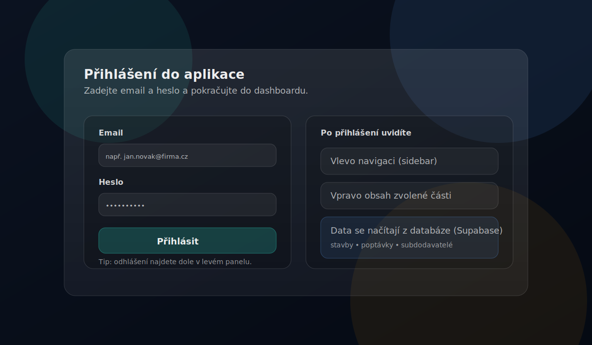

> 💡 **Tip:** Uložte si přihlášení pro rychlejší přístup příště. V desktop verzi můžete aktivovat biometrické přihlášení (Touch ID / Windows Hello) – viz sekce Tender Flow Desktop.

---

## 🏢 Organizace a předplatné

Tender Flow funguje jako multi-tenant aplikace: každý uživatel patří do **organizace** (tenant) a data jsou mezi organizacemi oddělená.

- **Firemní email**: typicky se přidáte do organizace podle domény (nebo se pro doménu vytvoří nová organizace).
- **Osobní email (např. Gmail/Seznam)**: vytvoří se osobní organizace pro vaše použití.

Organizace ovlivňuje zejména:

- **Předplatné** (dostupnost vybraných funkcí v menu).
- **Statusy kontaktů** (každá organizace má vlastní seznam a barvy).

> 💡 **Tip:** Pokud některou část aplikace nevidíte (např. Import kontaktů, Přehled staveb, Excel nástroje), je pravděpodobně skrytá kvůli nastavení předplatného / oprávnění.

### Tarify a dostupnost funkcí

| Funkce | Free | PRO | Enterprise |
|--------|:----:|:---:|:----------:|
| Dashboard, Stavby, Kontakty | ✅ | ✅ | ✅ |
| URL Zkracovač | ✅ | ✅ | ✅ |
| Výběrová řízení (Pipeline) | – | ✅ | ✅ |
| AI přehledy | – | ✅ | ✅ |
| Harmonogram | – | ✅ | ✅ |
| Excel nástroje | – | ✅ | ✅ |
| Import kontaktů | – | ✅ | ✅ |
| Export PDF / XLSX | – | ✅ | ✅ |
| Záloha dat (osobní) | – | ✅ | ✅ |
| Smlouvy | – | – | ✅ |
| DocHub | – | – | ✅ |
| Dynamické šablony | – | – | ✅ |
| Záloha dat (organizace) | – | – | ✅ |

### Členství a role v organizaci

V **Nastavení → Organizace** můžete spravovat členství v organizaci:

- **Členové organizace**: přehled členů a jejich rolí (vlastník/admin/člen).
- **Žádosti o vstup** (vlastník): schvalování a zamítání čekajících žádostí.
- **Ruční přidání uživatele** (vlastník): přidání uživatele podle emailu (musí být registrovaný).
- **Změna role člena** (vlastník): přepínání mezi rolí admin a člen.
- **Předání vlastnictví organizace** (vlastník): bezpečný převod ownershipu na jiného člena.

> 💡 **Tip:** Uživatel může požádat o vstup do organizace ze svého profilu; žádost potvrdí vlastník organizace.

---

## 🧭 Navigace v aplikaci

V levém panelu (sidebar) přepínáte hlavní části aplikace a vybíráte konkrétní stavbu.

- **📊 Dashboard** – přehled vybrané stavby a export.
- **🏗️ Stavby** – seznam staveb (projekty).
- **👥 Subdodavatelé** – databáze kontaktů.
- **🔧 Nástroje** – skupina doplňků (např. Správa staveb, Přehled staveb, Import kontaktů, Excel nástroje; dle předplatného).
- **⚙️ Nastavení** – profil, vzhled, statusy kontaktů, administrace (dle oprávnění).

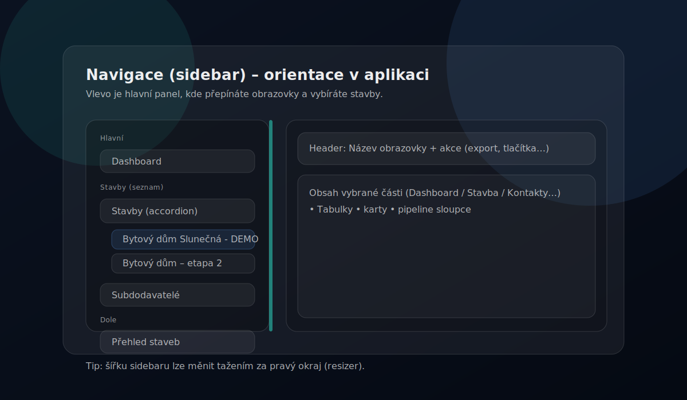

---

## 📊 Dashboard

Dashboard zobrazuje přehled jedné vybrané stavby. V hlavičce můžete přepnout stavbu a vyexportovat XLSX.

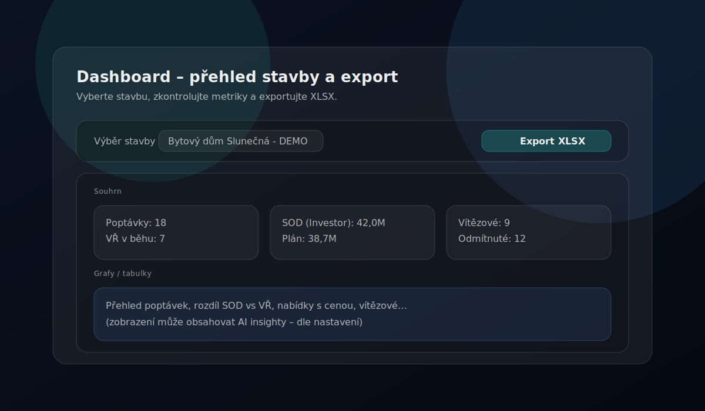

### Co dashboard zobrazuje

- Přehled poptávek a jejich stav
- Klíčové metriky stavby
- Rychlý přístup k nejčastějším akcím
- Možnost exportu dat do Excelu

Po kliknutí na stavbu v sidebaru se otevře detail se záložkami – viz následující sekce.

---

## 🏗️ Detail stavby

Po výběru stavby v sidebaru se otevře detail se šesti záložkami:

- **📊 Přehled** – rozpočty, stav, metriky.
- **📅 Plán VŘ** – plánování výběrových řízení.
- **📋 Výběrová řízení** – pipeline poptávek a nabídek.
- **📜 Smlouvy** – evidence smluv, dodatků a čerpání.
- **📆 Harmonogram** – Gantt navázaný na termíny výběrových řízení.
- **📁 Dokumenty** – odkazy na dokumentaci a šablony poptávek.

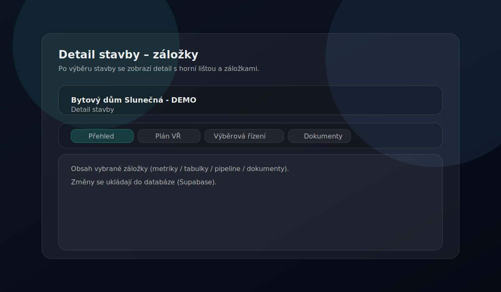

### 📊 Přehled

Záložka **Přehled** shrnuje klíčové údaje o stavbě na jednom místě:

- **Základní údaje**: název, lokalita, datum dokončení, investor, technický dozor, stavbyvedoucí.
- **Finance**: plánované náklady, aktuální stav rozpočtu.
- **Odkazy na dokumenty**: rychlý přístup k projektové dokumentaci.
- **Přehled poptávek**: tabulka s bilancí výběrů a přehledem stavu kategorií.
- **Proklik do pipeline**: z přehledu se můžete dostat přímo do kanbanu dané poptávky.

### 📅 Plán VŘ

Plán VŘ slouží k naplánování výběrových řízení v čase a (dle potřeby) k jejich převodu do poptávek.

- Vytvořte položku a nastavte termín (od–do).
- Po vytvoření se nabídne tlačítko „Vytvořit" pro převod do pipeline.
- Stav položky reflektuje průběh daného výběrového řízení (čeká na vytvoření / probíhá / ukončeno).

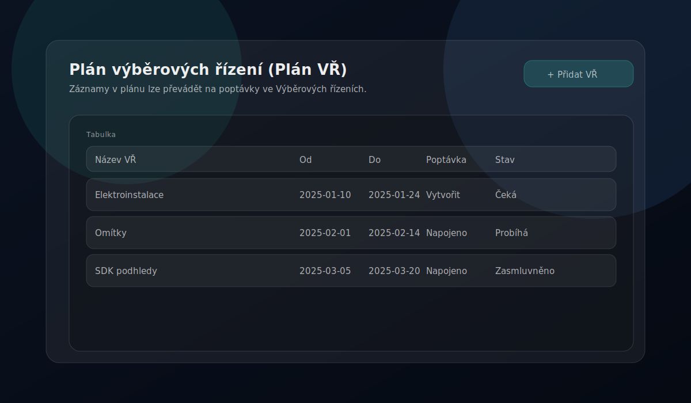

### 📋 Výběrová řízení (Pipeline)

Výběrová řízení jsou organizovaná po **poptávkách** (kategorie prací). Nabídky subdodavatelů přesouváte mezi sloupci (drag & drop).

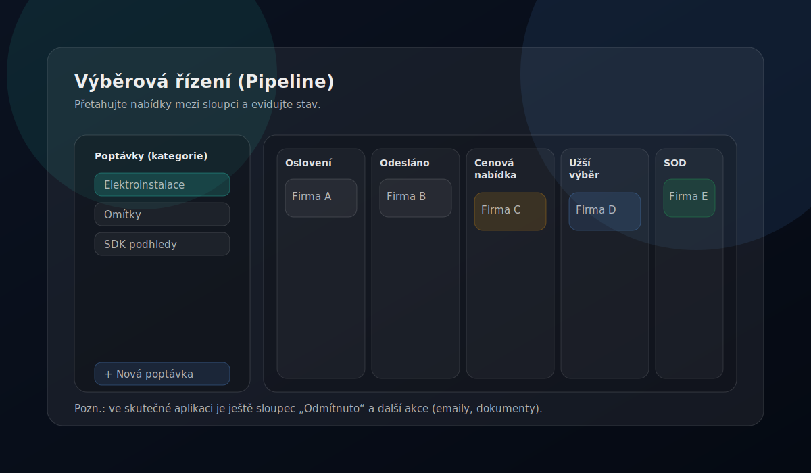

#### Stavy nabídky (sloupce)

| Sloupec | Význam |
|---------|--------|
| **Oslovení** | Připraven k oslovení (může se zobrazit „Generovat poptávku") |
| **Odesláno** | Poptávka odeslána, čeká se na reakci |
| **Cenová nabídka** | Dorazila nabídka od subdodavatele |
| **Užší výběr** | Shortlist kandidátů |
| **Jednání o SOD** | Finalisté / jednání o smlouvě |
| **Odmítnuto** | Neúspěšní subdodavatelé |

#### Karta nabídky

Na kartě nabídky evidujete cenu, tagy, poznámky a případně generujete poptávkový email.

- Karta zaznamenává až **3 kola VŘ** – do aktuální ceny se počítá aktivně vybrané kolo.
- Přesunutím karty na vítězné pole se zobrazí ikona poháru (vítěz).
- Pro vítěze se zobrazuje ikona smlouvy: šedo-bílá → blikající odškrtnutí (smlouva vyřízena).
- Stav smluv se zobrazuje také na kartě VŘ (např. 0/2 = dva vítězové, nula smluv).
- Po aktivaci všech smluv se zobrazí plaketka s odškrtnutím (hotovo).

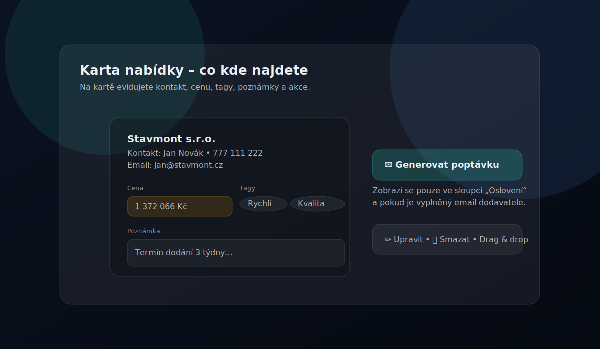

#### Další funkce pipeline

- **Filtrování** dle stavu poptávky (otevřené / uzavřené / zasmluvněné).
- **Export** do Excelu a PDF.
- **Email nevybraným**: otevře výchozí emailový klient se zprávou pro všechny relevantní subdodavatele (BCC).
- **Generování poptávky**: vytvoří email s údaji o poptávce pro vybraného subdodavatele.

### 📜 Smlouvy

Záložka **Smlouvy** slouží pro finanční a smluvní řízení konkrétní stavby.

- **📊 Přehled** – souhrn KPI (počty smluv, hodnota, čerpání, retence).
- **📄 Smlouvy** – seznam smluv, vytváření/editace, vazba na dodavatele, stav a hodnotu.
- **✏️ Dodatky** – změny smluv (cenové i termínové) navázané na vybranou smlouvu.
- **💰 Čerpání** – evidence průvodek/čerpání a kontrola zůstatku vůči aktuální hodnotě smlouvy.

> 💡 **Tip:** Při zakládání smlouvy lze data ze smluvních dokumentů předvyplnit automaticky (např. z PDF) a před uložením je ručně potvrdit.

#### Smluvní protokoly

Z modulu smluv můžete generovat formální protokoly ke stavebnímu řízení. K dispozici jsou dva typy:

**Předání díla SUB** (`sub_work_handover`)
- Protokol pro předání a převzetí díla subdodavatele.
- Obsahuje pole: stavební akce, předmět díla, termíny přejímky (smluvní/skutečný), soupis vad a nedodělků, smluvní pokuty, záruční doba, podpisy za zhotovitele i subdodavatele.
- Výstup: Excel (`.xlsx`) a PDF.

**Předání staveniště** (`site_handover`)
- Protokol pro předání staveniště mezi objednatelem a zhotovitelem.
- Obsahuje pole: název a číslo stavby, místo, smlouva o dílo, termíny zahájení/dokončení, předaná dokumentace, soupis vad, dohoda o vyklizení, záruční doba, podpisy.
- Výstup: Excel (`.xlsx`).

**Jak generovat protokol:**
1. Na záložce **Smlouvy** vyberte smlouvu.
2. Klikněte na akci generování protokolu.
3. Údaje se předvyplní z dat smlouvy a projektu (dodavatel, IČ, cena, termíny).
4. Zkontrolujte a doplňte pole označená jako povinná.
5. Klikněte na generování – soubor se stáhne.

### 📆 Harmonogram

Harmonogram je Ganttův přehled termínů, který se automaticky naplňuje z dat v projektu.

- **Jak se plní**: doplňte termíny v **Plán VŘ** (od–do) nebo termín v detailu **Výběrových řízení** (deadline).
- **Zobrazení**: přepínání měřítka **Měsíce / Týdny / Dny**, volitelně přepínač **Realizace**.
- **Editace**: tlačítko **Editace** umožní upravit termíny přímo v harmonogramu.
- **Export**: menu **Export** nabízí `XLSX`, `PDF` a `XLSX s grafem`.

### 📁 Dokumenty a šablony

V záložce **Dokumenty** najdete podzáložky:

- **📂 PD** – odkaz na projektovou dokumentaci (Drive/SharePoint apod.).
- **📝 Šablony** – šablona poptávky a šablona „email nevybraným" (lze použít interní editor šablon, nebo externí odkaz/soubor).
- **📦 DocHub** – napojení na strukturu složek projektu (pokud je povoleno).
- **💵 Ceníky** – odkaz na projektové ceníky + rychlý odkaz na složku `Ceníky` v DocHubu (pokud je připojen).

V praxi zde typicky nastavíte:

- odkaz na dokumentaci stavby (Drive/SharePoint apod.),
- šablony emailů (poptávka / nevybraní),
- ceníky a související složky.

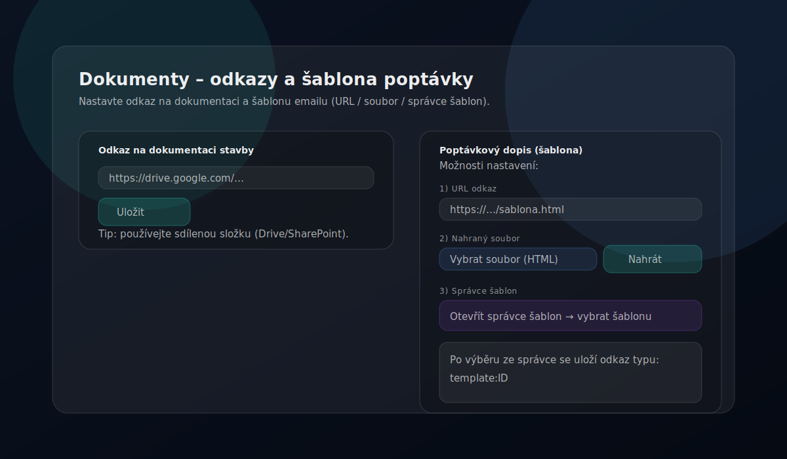

#### DocHub: správa složek projektu

DocHub je modul pro organizaci projektových složek v cloudovém nebo lokálním úložišti. Podporuje Google Drive, OneDrive a lokální/síťový disk (v desktop verzi).

**Standardní struktura složek** (vytvořená automaticky):
- PD (Projektová dokumentace)
- Poptávky / Nabídky
- Smlouvy
- Realizace
- Archiv
- Ceníky
- Složky dodavatelů (strukturované dle subdodavatele)

**Nastavení DocHub:**
1. Projekt → **Dokumenty** → **DocHub**.
2. Vyberte providera (Google Drive / OneDrive / Tender Flow Desktop).
3. Zadejte nebo vyberte kořenovou složku.
4. Klikněte **Připojit složku** a poté **Synchronizovat**.

**DocHub v desktop verzi (lokální disk):**
- Provider: **Tender Flow Desktop**
- Podporuje libovolný disk (C:\, D:\, E:\, …) i síťové/sdílené disky
- Klikněte na **Procházet** pro výběr složky přes nativní dialog, nebo zadejte cestu ručně (např. `D:\Projekty\Stavba` nebo `\\server\share\projekt`)

> 💡 **Tip:** Složka nemusí být na systémovém disku ani ve složce OneDrive — můžete vybrat jakoukoliv dostupnou složku, včetně externích nebo síťových disků.

---

## 👥 Subdodavatelé (Kontakty)

Databáze kontaktů pro přidávání do poptávek. Podporuje filtry, výběr více řádků a hromadné akce (např. doplnění regionu pomocí AI – pokud je povoleno).

- **Více kontaktů na firmu**: u jedné firmy můžete evidovat více kontaktních osob (jméno, pozice, telefon, email).
- **Více specializací**: specializace jsou seznam (používá se pro filtrování i výběr do poptávek).
- **Hodnocení dodavatelů**: možnost přiřadit rating a stav (např. doporučuji / nedoporučuji).
- **IČ a automatické doplnění**: po zadání IČ se mohou automaticky doplnit údaje o firmě.
- **Hromadná úprava specializací**: vyberte více kontaktů zaškrtnutím a klikněte na tlačítko „Upravit specializace". Můžete specializace hromadně **přidat** (ke stávajícím), **odebrat** nebo **nahradit** (přepsat). K dispozici je rychlý výběr z existujících specializací i ruční zadání nových.

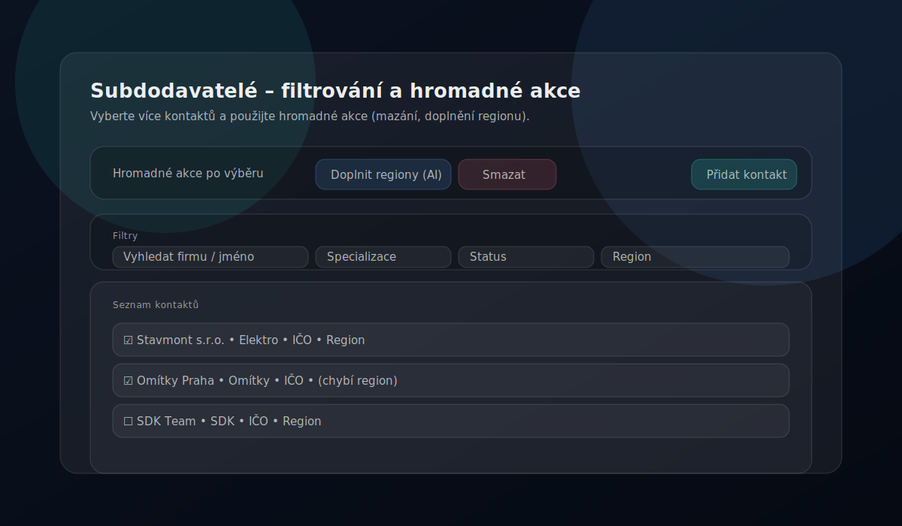

---

## 🏠 Správa staveb

Slouží pro vytváření staveb, změny statusu, archivaci a sdílení (dle oprávnění).

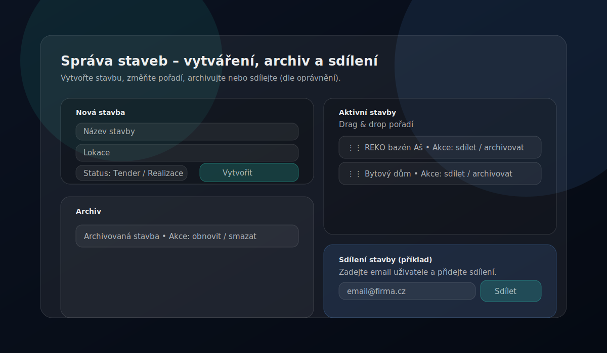

- **Vytvoření stavby**: název, lokalita, investor, fáze (soutěž / realizace).
- **Archivace**: stavba se přesune do archivu, odebere se ze sidebaru. Lze vrátit zpět.
- **Klonování**: převod soutěžní stavby na realizační.
- **Smazání**: trvalé odstranění stavby (dle oprávnění).

### Sdílení a oprávnění

Stavbu můžete sdílet s dalšími uživateli. Sdílení podporuje dvě úrovně oprávnění:

| Oprávnění | Co umožňuje |
|-----------|-------------|
| **✏️ Úpravy** | Čtení i zápis – uživatel může měnit data stavby, přidávat nabídky, upravovat smlouvy |
| **👁️ Pouze čtení** | Uživatel vidí data, ale nemůže je měnit |

- Sdílení nastavuje **vlastník stavby** v sekci Správa staveb.
- V seznamu staveb vidíte, komu je stavba sdílena.
- Sdílené osoby lze kdykoliv odebrat.
- Propsání stavby jinému uživateli může trvat několik minut.

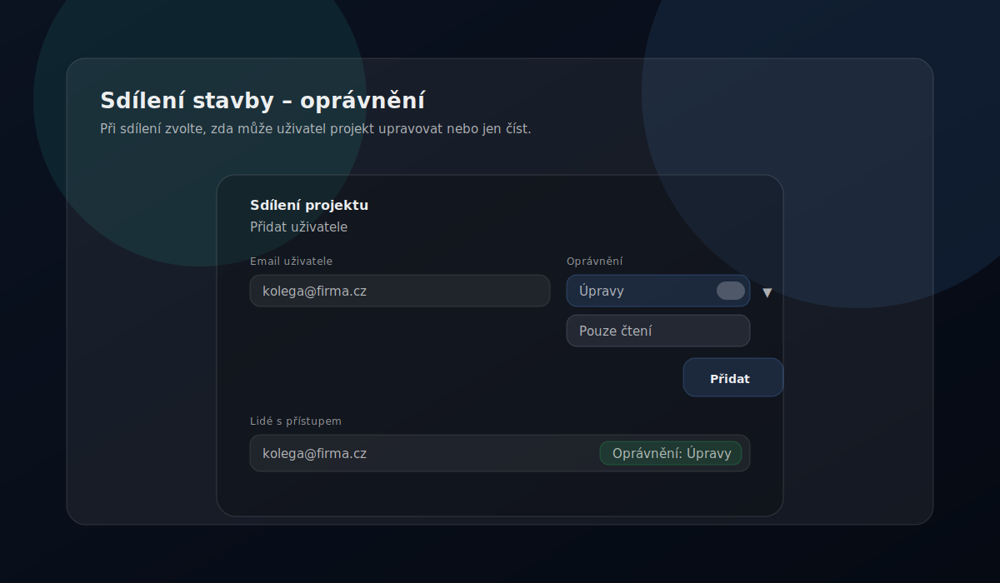

---

## 📈 Přehled staveb (analytika)

Manažerské souhrny napříč stavbami: metriky, grafy a volitelně AI analýza.

- Rozevírací menu pro možnost přepnutí stavby.
- **Filtr fáze stavby**: přepínáte mezi **Vše**, **Soutěž**, **Realizace** a **Archiv** — statistiky a grafy se přepočítají podle vybrané fáze.
- AI analýza vychází z dostupných dat (množství informací, spuštěná VŘ, stav rozpracovanosti).
- Export analýzy do PDF (časové razítko a možnost sdílení).

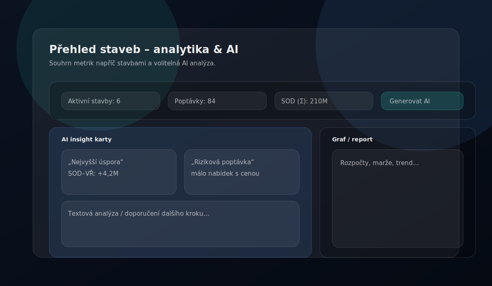

---

## 🔧 Nástroje

Tender Flow nabízí sadu nástrojů dostupných v sidebaru pod položkou **Nástroje** (případně v **Nastavení**, dle předplatného).

### 📊 Excel nástroje

#### Excel Unlocker PRO

Nástroj pro odemknutí ochrany `.xlsx` souborů. Funguje lokálně v prohlížeči – soubor se nikam neodesílá.

**Použití:**
1. Otevřete **Nastavení → Excel Unlocker PRO**
2. Klikněte "Vybrat soubor" a nahrajte chráněný Excel
3. Klikněte "Odemknout"
4. Stáhněte odemčený soubor

**Umístění:** Nastavení → Excel Unlocker PRO (PRO+)

#### Excel Merger PRO

Nástroj pro slučování více listů z různých Excel souborů do jednoho souboru.

- **Desktop verze**: nativní zpracování pomocí lokálních Python skriptů (rychlejší, bez omezení velikosti).
- **Web verze**: externí aplikace v iframe (vyžaduje konfiguraci adminem).

**Umístění:** Nastavení → Excel Merger PRO (PRO+)

#### Excel Indexer

Pokročilý nástroj pro automatické indexování a zpracování velkých Excel rozpočtů. Pracuje ve **dvou fázích**.

**Fáze 1: Vložení sloupce Oddíly**

1. Hledá značky "D" ve sloupci F (markerColumn).
2. Přečte oddíl ze sloupce G (sectionColumn).
3. Vloží nový sloupec B s názvem "Oddíly".
4. Vyplní tento sloupec názvem oddílu pro všechny řádky do další značky.

**Fáze 2: Doplnění popisů**

1. Používá výstup z Fáze 1.
2. Hledá kódy položek ve sloupci G (po posunu).
3. Páruje kódy s indexem položek (nahrán z Excelu).
4. Doplňuje popisy do sloupce C.

**Volitelné:** Vytvoření rekapitulačního listu s přehledy.

**Jak použít:**
1. Připravte Excel soubor s indexem (2 sloupce: Kód, Popis) a nahrajte jej.
2. Nahrajte Excel rozpočet.
3. Spusťte Fázi 1 (Oddíly) – zkontrolujte nastavení sloupců.
4. Spusťte Fázi 2 (Popisy) – volitelně zapněte rekapitulaci.
5. Stáhněte finální soubor.

**Umístění:** Nastavení → Excel Indexer (PRO+)

#### Index Matcher

Zjednodušená verze Excel Indexer pro rychlé doplnění popisů podle indexu.

- **Import indexu**: načtení slovníku kód→popis z Excel souboru (ukládá se lokálně).
- **Automatické párování**: doplnění popisů do sloupce B podle kódů ve sloupci F.

**Jak použít:**
1. Nahrajte index (jednou) – soubor s 2 sloupci: Kód | Popis.
2. Nahrajte rozpočet s kódy ve sloupci F.
3. Klikněte "Zpracovat rozpočet" a stáhněte výsledek.

> 💡 **Tip:** Pro komplexnější zpracování s oddíly a rekapitulací použijte Excel Indexer.

**Umístění:** Nastavení → Index Matcher (PRO+)

### 🔗 URL Zkracovač

Nástroj pro vytváření zkrácených odkazů s vlastními aliasy. Zkrácené odkazy mají formát `tenderflow.cz/s/váš-alias`.

**Jak vytvořit zkrácený odkaz:**
1. Otevřete **Nastavení → URL Zkracovač**
2. Do pole "URL adresa" vložte dlouhý odkaz
3. Do pole "Vlastní alias" zadejte požadovanou zkratku (např. `projekt-abc`)
4. Klikněte **Zkrátit**
5. Zkrácený odkaz se objeví v seznamu a můžete jej zkopírovat

**Příklad:**
- **Původní URL**: `https://drive.google.com/drive/folders/1aB2cD3eF4gH5iJ6kL7mN8oP9qR0sT`
- **Alias**: `projekt-abc`
- **Zkrácený odkaz**: `tenderflow.cz/s/projekt-abc`

**Správa odkazů:** v seznamu vidíte alias, cílovou URL, počet kliknutí a datum vytvoření. Odkazy lze kopírovat do schránky a mazat.

**Umístění:** Nastavení → URL Zkracovač (Free+)

### 🔄 Import a synchronizace kontaktů

Kontakty lze nahrát jednorázově z CSV nebo synchronizovat z URL (např. export z Google Sheets).

Očekávaný formát (typicky): `Firma, Jméno, Specializace, Telefon, Email, IČO, Region`

Poznámky k importu:

- Slučuje se podle názvu firmy (case-insensitive).
- Import doplní specializace (sloučí do seznamu) a kontaktní osoby (bez duplicit podle jména/emailu/telefonu).
- Primární kontakt (první v seznamu) se používá pro kompatibilitu i pro akce, které potřebují email.

**Umístění:** Nastavení → Import kontaktů (PRO+)

### 💾 Záloha a obnova dat

Tender Flow umožňuje zálohovat a obnovit vaše data. Funkce je dostupná od tarifu **PRO**.

#### Šifrování záloh

Všechny zálohy vytvořené v desktop aplikaci jsou **automaticky šifrovány** algoritmem AES-256-GCM. Šifrovací klíč je uložen v zabezpečeném úložišti operačního systému (Windows DPAPI / macOS Keychain). Šifrované soubory mají příponu `.enc.json` a nelze je přečíst bez příslušného klíče. Starší nešifrované zálohy (`.json`) zůstávají čitelné — systém je při obnově automaticky rozpozná.

> **Upozornění:** Při reinstalaci aplikace nebo přeinstalaci systému může dojít ke ztrátě šifrovacího klíče. V takovém případě nelze starší šifrované zálohy dešifrovat. Doporučujeme pravidelně ověřovat funkčnost záloh.

#### Záloha uživatelských dat

Záloha obsahuje všechny projekty, poptávkové kategorie, nabídky, subdodavatele, smlouvy a harmonogramy, které vlastníte v rámci aktuální organizace.

**Desktop aplikace:**
- Zálohy se ukládají lokálně do složky `backup` vedle instalace aplikace.
- Soubory jsou šifrovány (AES-256-GCM) s příponou `.enc.json`.
- Možnost zapnout **automatickou denní zálohu** (toggle v nastavení) – záloha proběhne 1× denně.
- Zálohy starší 7 dní se automaticky mažou.
- Tlačítkem **Otevřít složku záloh** zobrazíte složku v průzkumníku.

**Web verze:**
- Záloha se stáhne jako JSON soubor do složky pro stahování prohlížeče (bez šifrování).

**Postup:**
1. Otevřete **Nastavení → Záloha a obnova**
2. Klikněte **Zálohovat moje data**
3. Desktop: šifrovaný soubor se uloží do instalační složky; Web: soubor se stáhne

#### Záloha kontaktů

Kromě kompletní zálohy lze samostatně zálohovat **pouze kontakty** (subdodavatele a jejich statusy). To je užitečné pro rychlý export adresáře bez zbytku dat.

- Klikněte **Zálohovat kontakty** v sekci Záloha a obnova.
- Desktop: soubor se uloží šifrovaně do složky `backup`.
- Web: soubor se stáhne jako JSON.
- Záloha kontaktů je pouze pro export — obnovu kontaktů proveďte přes kompletní zálohu (uživatelskou nebo organizace).

#### Záloha organizace

Administrátor organizace s tarifem **Enterprise** může zálohovat data celé organizace (všech členů).

- Klikněte **Zálohovat organizaci** v sekci Záloha a obnova.
- Záloha obsahuje projekty, kontakty a smlouvy všech členů organizace.

#### Obnova dat ze zálohy

Obnova přepíše **pouze záznamy, kde jste vlastníkem**. Data ostatních uživatelů v organizaci zůstanou nedotčena. Celá obnova probíhá v jedné transakci — pokud dojde k chybě, žádná data se nezmění.

**Desktop:**
1. V sekci **Lokální zálohy** klikněte **Obnovit** u vybrané zálohy (dostupné pro uživatelské a organizační zálohy).
2. Zkontrolujte náhled (počty záznamů).
3. Klikněte **Potvrdit obnovu**.

**Web:**
1. Klikněte **Nahrát soubor zálohy (.json)**.
2. Vyberte dříve stažený soubor zálohy.
3. Zkontrolujte náhled a potvrďte obnovu.

**Umístění:** Nastavení → Záloha a obnova (PRO+)

---

## 💻 Tender Flow Desktop

Tender Flow Desktop je nativní desktopová aplikace postavená na Electronu. Nabízí rozšířené funkce oproti webové verzi.

### Výhody desktop verze

| Funkce | 💻 Desktop | 🌐 Web |
|--------|------------|--------|
| Přístup k souborům | Nativní | Omezené |
| Excel nástroje | Lokální Python | HTTP API |
| Úložiště tokenů | OS Keychain (bezpečnější) | localStorage |
| Auto-update | Windows: ✅ • macOS arm64: manuálně | ❌ |
| Folder watcher | ✅ | ❌ |
| Biometrické přihlášení | ✅ (Touch ID/Windows Hello) | ❌ |
| Mailto odkazy | IPC Bridge (spolehlivější) | Prohlížeč |
| Záloha (auto, šifrovaná) | ✅ (denní, AES-256-GCM) | ❌ |

### Instalace

#### Windows
1. Stáhněte instalační soubor `Tender-Flow-Setup-x.x.x.exe`
2. Spusťte instalátor
3. Aplikace se nainstaluje do `C:\Program Files\Tender Flow`
4. Desktop ikona se vytvoří automaticky

#### macOS
1. Stáhněte soubor `Tender-Flow-x.x.x.dmg`
2. Otevřete DMG soubor
3. Přetáhněte Tender Flow do složky Applications
4. Spusťte aplikaci (možná budete muset povolit v System Preferences → Security)

### Spuštění

- **Windows**: klikněte na ikonu "Tender Flow Desktop" na ploše.
- **macOS**: otevřete Tender Flow z Launchpadu nebo složky Applications.

### Auto-update

- **Windows**: automatická kontrola při spuštění a periodicky během běhu, stažení aktualizace v aplikaci a restart pro instalaci.
- **macOS (Apple Silicon)**: aktualizace probíhá manuálně stažením nové verze z release artefaktu (`.dmg`).

### Biometrické přihlášení

Desktop aplikace podporuje biometrické přihlášení:
- **macOS**: Touch ID (na zařízeních s Touch Bar nebo Touch ID)
- **Windows**: Windows Hello (otisk prstu, obličej)

**Aktivace:**
1. Přihlaste se poprvé emailem a heslem.
2. Aktivujte biometrické přihlášení v **Nastavení → Profil**.
3. Při příštím spuštění můžete použít biometriku.

### Nativní souborové operace

- **DocHub**: přímý přístup k lokálním složkám.
- **Vytváření složek**: okamžité bez externího serveru.
- **Otevírání složek**: nativní průzkumník souborů.

### Excel nástroje v desktop verzi

Desktop verze používá lokální Python skripty:
- **Rychlejší zpracování**: bez HTTP požadavků.
- **Větší soubory**: bez omezení velikosti uploadu.
- **Offline použití**: funguje bez internetového připojení.

**Prerekvizity:** Python 3.x a knihovna `openpyxl` (`pip install openpyxl`).

### Ukončení aplikace

Při kliknutí na "Odhlásit" v desktop verzi máte dvě možnosti:

1. **Ukončit aplikaci (Ponechat přihlášení)** – aplikace se zavře, přihlášení zůstane pro biometriku.
2. **Odhlásit se (Vyžadovat heslo příště)** – kompletní odhlášení.

**Umístění ke stažení:** kontaktujte administrátora pro přístup k desktop verzi.

---

## ⚙️ Nastavení aplikace

V sekci **Nastavení** najdete konfiguraci profilu, vzhledu a dalších preferencí.

### Profil

- **Zobrazované jméno**: jak vás vidí ostatní v organizaci.
- **Biometrické přihlášení**: aktivace Touch ID / Windows Hello (pouze desktop).
- **Změna hesla**: možnost změnit přihlašovací heslo.

### Vzhled

- **Tmavý režim**: přepnutí mezi světlým a tmavým motivem.
- **Primární barva**: volba akcentové barvy aplikace.
- **Pozadí**: výběr pozadí pracovní plochy.

### Statusy kontaktů

Každá organizace má vlastní seznam stavů pro kontakty (subdodavatele):

- Přidávejte, upravujte a odebírejte vlastní stavy.
- Každému stavu přiřaďte barvu.
- Stavy se používají pro filtrování a vizuální rozlišení v databázi kontaktů.

### Organizace

Správa členství v organizaci – viz sekce **Organizace a předplatné → Členství a role**.

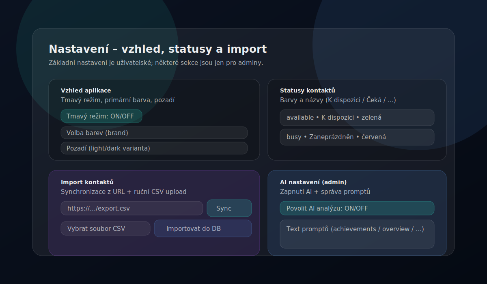

---

## 🛡️ Administrace systému

Administrace je dostupná jen účtům s rolí **Admin**. Obsahuje správu registrací, uživatelů, rolí, předplatného a diagnostiky.

> 💡 **Tip:** Pokud v Nastavení nevidíte sekce „Administrace systému", nemáte potřebná oprávnění.

### Registrace a whitelist

V sekci **Nastavení registrací** (Admin) určíte, kdo se může do Tender Flow registrovat:

- **Povolit registrace všem** – pokud je zapnuto, registrace nejsou omezené doménami.
- **Whitelist domén** – registrace povolené jen pro vybrané domény (např. `@firma.cz`).
- **Vyžadovat whitelist emailů** – registrace pouze pro emaily explicitně uvedené v seznamu.

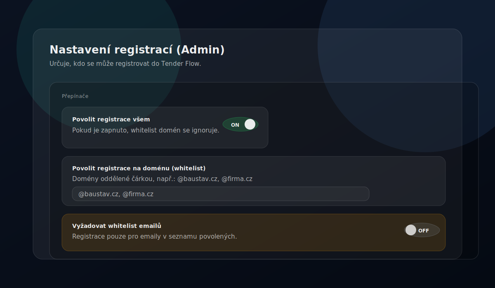

### Seznam povolených emailů (Whitelist)

Pokud je zapnuté „Vyžadovat whitelist emailů", mohou se registrovat pouze emaily uvedené v tomto seznamu.

1. Otevřete **Nastavení → Administrace systému**.
2. V sekci „Seznam povolených emailů" přidejte email, jméno a poznámku.
3. U záznamu lze přepínat aktivní/neaktivní stav.

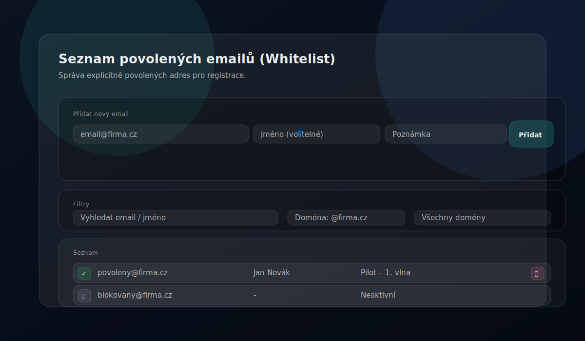

### Správa uživatelů a rolí

Sekce Správa uživatelů je určená pro **Admina**. Umožňuje:

- **Spravovat role uživatelů** (přiřazení role).
- **Nastavit typ přihlášení uživatele** (Auto/Email/Google/Microsoft/GitHub/SAML).
- **Přepsat úroveň předplatného uživatele** (manuální override nad úrovní organizace).
- **Definovat oprávnění rolí** (permissions).

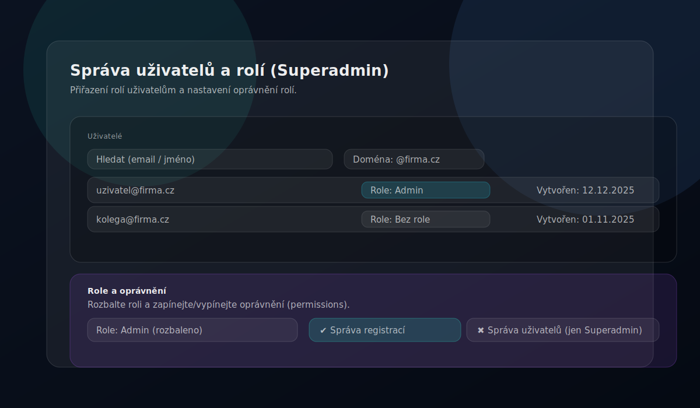

### Incident logy (Admin)

V **Nastavení → Administrace → Incidenty** můžete analyzovat a čistit provozní incidenty.

- **Filtrování incidentů** podle Incident ID, User ID a časového intervalu.
- **Detail incidentu** s možností kopie JSON detailu do schránky.
- **Čištění starých logů** dle zadané retenční doby (v dnech).

Incident logy slouží pro diagnostiku stability a bezpečnosti provozu; nejsou určeny jako náhrada auditního logu obchodních operací.

---

## ❓ Časté otázky

### Neotevře se emailový klient

Zkontrolujte výchozí emailový klient v systému. Funkce „Generovat poptávku" a „Email nevybraným" používají `mailto:`.

### Některé volby nevidím

Některé sekce jsou dostupné jen pro administrátory nebo jsou skryté dle předplatného. Podívejte se do tabulky tarifů v sekci **Organizace a předplatné**.

### Excel Merger PRO píše „Funkce není dostupná"

Excel Merger PRO ve web verzi vyžaduje, aby Admin nastavil URL externí aplikace v **Nastavení → Administrace → Registrace**.

### Kde si mohu stáhnout desktop aplikaci?

Desktop verzi Tender Flow si můžete stáhnout po kontaktování administrátora. Desktop aplikace nabízí rozšířené funkce jako Touch ID, nativní přístup k souborům a lokální Excel nástroje.

### Proč se mi na macOS neinstaluje update automaticky?

V aktuální verzi je auto-update aktivní pro Windows. Na macOS (Apple Silicon) se aktualizace instalují manuálně přes nový `.dmg` balíček.

### Jak sdílet stavbu s kolegou?

V sekci **Správa staveb** otevřete detail stavby a v sekci sdílení přidejte uživatele. Můžete nastavit oprávnění: Úpravy nebo Pouze čtení.

### Jak generovat smluvní protokol?

Na záložce **Smlouvy** v detailu stavby vyberte smlouvu a klikněte na akci generování protokolu. Údaje se předvyplní z dat smlouvy – zkontrolujte, doplňte povinná pole a stáhněte výsledný soubor (Excel nebo PDF).

### DocHub synchronizace nefunguje

Ověřte, že máte vybraného správného providera (Google Drive / OneDrive / Tender Flow Desktop) a že kořenová složka je přístupná. V desktop verzi zkontrolujte, že cesta ke složce existuje. Zkuste odpojit a znovu připojit složku.

### Jak obnovit data ze zálohy?

V **Nastavení → Záloha a obnova**: na desktopu vyberte zálohu ze seznamu lokálních záloh a klikněte Obnovit. Na webu nahrajte dříve stažený JSON soubor. Obnova přepíše pouze vaše záznamy. Šifrované zálohy (`.enc.json`) se při obnově automaticky dešifrují.

### Jak funguje automatická záloha v desktop verzi?

V **Nastavení → Záloha a obnova** zapněte toggle „Automatická záloha". Záloha proběhne automaticky 1× denně a je šifrována (AES-256-GCM). Zálohy starší 7 dní se automaticky mažou. Složku se zálohami otevřete tlačítkem „Otevřít složku záloh".

### Jak zálohovat pouze kontakty?

V **Nastavení → Záloha a obnova** klikněte tlačítko **Zálohovat kontakty**. Exportují se pouze subdodavatelé a jejich statusy. Na desktopu se soubor uloží šifrovaně do složky `backup`, na webu se stáhne jako JSON. Obnova kontaktů ze samostatné zálohy není podporována — použijte kompletní zálohu.

### Jsou zálohy šifrovány?

V desktop verzi ano — všechny nové zálohy jsou automaticky šifrovány algoritmem AES-256-GCM. Šifrovací klíč je chráněn operačním systémem (Windows DPAPI / macOS Keychain). Webové zálohy (stažené přes prohlížeč) šifrovány nejsou.

---

## 🎉 Novinky (changelog)

📱 v1.5.2 📖 Verze příručky 2.2

Verzi aplikace najdete vlevo dole v sidebaru.

### v1.5.2

- **Import wizard kontaktů**: nový průvodce pro hromadný import kontaktů a subdodavatelů s náhledem, mapováním sloupců a vyloučením řádků.
- **Hromadná úprava specializací**: specializace subdodavatelů lze upravovat hromadně přímo v přehledu kontaktů.
- **Dodatky a vlastní náklady**: vylepšené formuláře pro dodatky a adresy stavby, včetně podpory vlastních nákladů u dodatků.
- **Šifrované zálohy**: zálohy v desktop verzi jsou šifrovány algoritmem AES-256-GCM. Desktop ukládá zálohy automaticky s denní frekvencí. Nové tlačítko pro zálohu kontaktů.
- **Systém nápovědy**: interaktivní nápověda s kontextovými bublinami, klávesová zkratka pro vyhledávání, onboarding pro nové uživatele.
- **Automatické složky dokumentů**: DocHub v desktop verzi umí vytvořit standardizovanou strukturu složek pro dokumenty stavby jedním kliknutím.
- **Přepracovaná příručka**: kompletně přepsaná uživatelská příručka s aktuálním popisem všech modulů.
- **Opravy UX tabulek**: opraveno scrollování a překryvy v tabulkách pipeline, harmonogramu a plánu VŘ.

### v1.5.1

- **Záloha a obnova dat**: nová funkce pro zálohování a obnovu uživatelských dat (PRO+) a dat celé organizace (Enterprise+). Desktop: lokální zálohy s automatickou denní frekvencí a 7denní retencí. Web: stažení/nahrání zálohy přes prohlížeč. Obnova přepisuje pouze vlastní záznamy — bezpečné pro multi-tenant prostředí.
- **Šifrování záloh**: zálohy v desktop verzi jsou automaticky šifrovány algoritmem AES-256-GCM. Šifrovací klíč je chráněn OS (Windows DPAPI / macOS Keychain). Starší nešifrované zálohy zůstávají čitelné.
- **Záloha kontaktů**: nové tlačítko „Zálohovat kontakty" pro samostatný export subdodavatelů a jejich statusů. Funguje na desktopu (šifrovaně) i na webu (stažení JSON).

### v1.4.3

- **Oprava právních odkazů v desktopu**: odkazy na právní dokumenty nyní fungují správně i v desktop verzi.
- **Stabilita desktop releasu**: opraven workflow pro publikaci desktop buildů.
- **Windows Hello**: opravy typů pro biometrické přihlášení.

### v1.4.2

- **GDPR retence dat**: automatická retence provozních logů i CRM dat dle nastavené doby uchovávání.
- **Compliance kontroly**: ověření souladu s EU předpisy, provázání ROPA s retenčními politikami.
- **Souhlas s podmínkami**: uživatel musí aktivně potvrdit aktuální znění podmínek užívání.

### v1.4.1

- **OpenAI provider**: v nastavení AI přibyla možnost výběru OpenAI jako poskytovatele.
- **Generátor smluvních protokolů**: nový nástroj pro generování protokolů ke smlouvám.
- **Tenant logo**: organizace si může nastavit vlastní logo.
- **DPA stránka a retence**: přidána veřejná stránka zpracovatelské doložky a nastavení retenčních politik.
- **Bezpečnost**: CSP builder pro desktop, rozšíření CSP o Stripe domény, RLS pro interní billing tabulky.

### v1.4.0

- **Desktop aktualizace přes GitHub Releases**: Windows auto-update, macOS manuální režim.
- **Administrace rozšířena o Incident logy**: dohledání chyb podle incident ID, uživatele a času.
- **Správa uživatelů rozšířena**: typ přihlášení a přepis předplatného.
- **Organizace v Nastavení**: přehled členů, schvalování žádostí, změny rolí a předání vlastnictví.
- **Smlouvy**: pole IČ dodavatele a kontextová nabídka nad řádky smluv.
- **Email nevybraným**: zlepšené sestavení BCC adres.

### v1.3.2

- Rozšířené popisy hlavních modulů v příručce včetně administrace, AI a desktop sekce.

### v1.3.1

- **Smlouvy**: kompletní modul pro evidenci smluv, dodatků a čerpání.
- **Zpracování dokumentů ke smlouvám**: předvyplnění dat ze souboru.
- **Desktop UX**: uživatelská příručka se otevírá přímo v aplikaci.

### v1.2.3

- Aktualizace emailových šablon a opravy flow obnovy hesla.

### v1.2.1

- OCR vylepšení a stabilita desktop buildu.

### v0.9.6

- AI Key Policy (server-only), Excel Indexer, Index Matcher, URL Zkracovač, Desktop aplikace, Mailto IPC Bridge.

### v0.9.5

- AI prompty, DocHub integrace pro lokální složky, stabilita.

### v0.9.4

- Harmonogram (Gantt + exporty), Organizace (tenant), Statusy kontaktů, Dokumenty / Ceníky.

### v0.9.3

- Demo pro prezentaci, AI cache, vylepšený přehled poptávek, UX pop-okna.

### v0.9.2

- Skrývání sidebaru, nová landing page, samostatné routy přihlášení/registrace.

### v0.9.1

- Více specializací na subdodavatele, více kontaktů na firmu, import/synchronizace kontaktů.

### v0.9.0

- Whitelist registrací, role (admin, přípravář, stavbyvedoucí, technik), oprávnění dle rolí.

### v0.8.0

- Dashboard, stav „nedoporučuji" u subdodavatelů, archivace staveb, Plán VŘ, Výběrová řízení (kanban, kola VŘ, export, email nevybraným), Přehled staveb s AI analýzou.

---

## ⚖️ Právní dokumenty

Níže je uvedeno plné znění základních právních dokumentů služby Tender Flow. Dokumenty jsou dostupné také samostatně na webu:

- [Podmínky užívání](https://www.tenderflow.cz/terms)
- [Zásady ochrany osobních údajů](https://www.tenderflow.cz/privacy)
- [Zásady používání cookies](https://www.tenderflow.cz/cookies)
- [Zpracovatelská doložka (DPA)](https://www.tenderflow.cz/dpa)
- [Provozovatel a kontaktní údaje](https://www.tenderflow.cz/imprint)

### Podmínky užívání

Tyto podmínky upravují přístup ke službě Tender Flow, její používání a základní pravidla smluvního vztahu mezi provozovatelem a uživatelem.

#### 1. Provozovatel

Provozovatelem služby je Martin Kalkuš, IČO: 74907026. Kontaktní e-mail: martinkalkus [zavináč] icloud [tečka] com.

#### 2. Vymezení služby a smluvního vztahu

Tender Flow je softwarová služba poskytovaná formou SaaS, dostupná zejména jako webová a případně desktopová aplikace. Služba slouží především ke správě výběrových řízení, projektových podkladů, dokumentů, nabídek, interní spolupráce a souvisejících procesů.

Smluvní vztah vzniká okamžikem registrace, objednání placeného tarifu nebo jiným způsobem, kterým uživatel začne službu oprávněně používat. Tyto podmínky se vztahují na každého uživatele služby, včetně osob, které přistupují do účtu jménem firmy nebo jiné organizace.

Služba může být využívána jak podnikateli a právnickými osobami (`B2B`), tak spotřebiteli (`B2C`). Pokud je uživatel spotřebitelem, použijí se vedle těchto podmínek také kogentní ustanovení právních předpisů na ochranu spotřebitele; tato práva nelze těmito podmínkami vyloučit ani omezit.

#### 3. Registrace, účet a přístupové údaje

Registrací uživatel potvrzuje, že poskytované údaje jsou pravdivé a aktuální. Uživatel odpovídá za to, že k účtu budou přistupovat pouze oprávněné osoby, a že rozsah jejich oprávnění odpovídá jejich roli.

Uživatel je povinen chránit přihlašovací údaje, používat dostatečně bezpečné heslo a bez zbytečného odkladu oznámit podezření na neoprávněný přístup, zneužití účtu nebo bezpečnostní incident.

#### 4. Tarify, cena a platební podmínky

Rozsah funkcí se může lišit podle zvoleného tarifu, individuální nabídky nebo aktuálně dostupných modulů. Aktuální ceny jsou uvedeny na webu, v aplikaci nebo v individuální nabídce schválené uživatelem.

Není-li výslovně uvedeno jinak, jsou ceny uváděny bez DPH. Uživatel souhlasí s tím, že služba může být účtována opakovaně po sjednaných fakturačních obdobích, případně na základě vystavené faktury nebo objednávky.

#### 5. Uživatelská data a odpovědnost uživatele

Uživatel nese odpovědnost za obsah dat, která do služby vloží, zpřístupní nebo prostřednictvím služby zpracovává. Uživatel je dále odpovědný za to, že má k těmto datům potřebná oprávnění a že jejich použití neporušuje právní předpisy ani práva třetích osob.

Provozovatel neprovádí průběžnou obsahovou kontrolu uživatelských dat. Je však oprávněn přijmout přiměřená opatření, pokud je to nutné z důvodu bezpečnosti služby, splnění právní povinnosti nebo ochrany vlastních práv.

#### 6. Zakázané užití služby

Uživatel nesmí službu používat způsobem, který by ohrožoval její bezpečnost, dostupnost nebo integritu, obcházel technická omezení, narušoval práva třetích osob nebo byl v rozporu s právními předpisy.

- šířit prostřednictvím služby škodlivý kód nebo nevyžádaný obsah,
- pokoušet se o neoprávněný přístup k účtům, datům nebo infrastruktuře,
- zpřístupňovat službu třetím osobám mimo sjednaný rozsah oprávnění,
- používat službu k porušování mlčenlivosti, autorských práv nebo GDPR.

#### 7. Dostupnost, údržba a změny služby

Provozovatel usiluje o vysokou dostupnost služby. V rámci údržby může dojít k dočasnému omezení dostupnosti. Provozovatel je oprávněn službu průběžně měnit, rozvíjet, aktualizovat nebo upravovat její jednotlivé funkce, pokud tím podstatně nesnižuje sjednanou hodnotu služby bez rozumného důvodu.

Pokud to bude možné, budou plánované odstávky nebo významné změny komunikovány předem vhodným způsobem, zejména v aplikaci nebo e-mailem.

#### 8. Duševní vlastnictví

Služba, její obsah a software jsou chráněny právními předpisy o duševním vlastnictví. Uživatel získává nevýhradní licenci k užívání služby v rozsahu nezbytném pro její využití v rámci sjednaného tarifu. Bez předchozího písemného souhlasu provozovatele není dovoleno službu ani její části kopírovat, upravovat, distribuovat, zpřístupňovat třetím osobám ani používat k tvorbě odvozených řešení.

#### 9. Ochrana osobních údajů a důvěrnost

Zpracování osobních údajů se řídí samostatným dokumentem „Zásady ochrany osobních údajů". V rozsahu, ve kterém uživatel do služby ukládá osobní údaje třetích osob, odpovídá za zákonnost takového zpracování a za splnění svých informačních povinností.

Provozovatel přijímá přiměřená technická a organizační opatření k ochraně dat a zpracovává pouze nezbytné provozní, bezpečnostní a incidentní záznamy potřebné pro provoz, obranu systému a řešení chyb.

#### 10. Odpovědnost a omezení záruk

Služba je poskytována v podobě, v jaké je průběžně nabízena. Provozovatel neodpovídá za škodu vzniklou v důsledku nesprávného použití služby, nedostatečného zabezpečení účtu ze strany uživatele, vad vstupních dat, výpadků služeb třetích stran nebo okolností, které nemohl přiměřeně ovlivnit.

Uživatel bere na vědomí, že služba nepředstavuje právní, daňové ani účetní poradenství a že za finální kontrolu dokumentů, termínů, obchodních podmínek a souladu s právními předpisy odpovídá vždy uživatel.

#### 11. Doba trvání, pozastavení a ukončení

Smluvní vztah trvá po dobu aktivního účtu nebo aktivního tarifu, nebylo-li mezi stranami dohodnuto jinak. Uživatel může službu přestat používat nebo tarif ukončit způsobem dostupným v aplikaci, e-mailem nebo jiným sjednaným postupem.

Provozovatel může přístup dočasně omezit nebo smluvní vztah ukončit, pokud uživatel podstatně porušuje tyto podmínky, používá službu v rozporu s právními předpisy nebo ohrožuje bezpečnost a stabilitu systému.

Po ukončení smluvního vztahu jsou osobní údaje a další uživatelská data uchovávány pouze po dobu nezbytně nutnou pro splnění právní povinnosti, ochranu právních nároků, zajištění bezpečnosti nebo dokončení technických procesů, jako je rotace záloh. V ostatním rozsahu jsou data bez zbytečného odkladu mazána nebo anonymizována.

#### 12. Reklamace, podpora a komunikace

Uživatel může své dotazy, technické požadavky, reklamace nebo žádosti týkající se účtu uplatnit prostřednictvím kontaktního e-mailu uvedeného v těchto podmínkách. Provozovatel vyřídí požadavek bez zbytečného odkladu, zpravidla podle jeho povahy a složitosti.

Je-li uživatel spotřebitelem, může se v případě spotřebitelského sporu obrátit také na Českou obchodní inspekci jako subjekt mimosoudního řešení spotřebitelských sporů. Tím není dotčeno jeho právo obrátit se na soud.

#### 13. Změny podmínek a závěrečná ustanovení

Tyto podmínky jsou účinné od data uvedeného výše. Provozovatel si vyhrazuje právo podmínky v přiměřeném rozsahu měnit; o podstatných změnách bude uživatel informován prostřednictvím aplikace nebo e-mailem.

Pokud některé ustanovení těchto podmínek bude neplatné nebo nevymahatelné, nemá to vliv na platnost ostatních ustanovení. Právní vztahy se řídí právním řádem České republiky.

Oficiální online verze: [Podmínky užívání služby Tender Flow](https://www.tenderflow.cz/terms)

### Zásady ochrany osobních údajů

Tento dokument popisuje, jak v rámci služby Tender Flow zpracováváme osobní údaje, z jakých důvodů tak činíme a jaká práva mohou subjekty údajů uplatnit.

#### 1. Správce

Správcem osobních údajů je Martin Kalkuš, IČO: 74907026. Kontaktní e-mail: martinkalkus [zavináč] icloud [tečka] com.

#### 2. Role při zpracování osobních údajů

Ve vztahu k údajům o zákaznících, uživatelích účtů, fakturaci, komunikaci a provozu služby vystupujeme zpravidla jako správce osobních údajů. V rozsahu, ve kterém uživatel do služby ukládá osobní údaje třetích osob v rámci vlastních procesů, může provozovatel vystupovat také jako zpracovatel pro daného uživatele.

Postavení stran se vždy posuzuje podle konkrétního účelu zpracování a role, ve které jsou údaje do služby vloženy nebo prostřednictvím služby spravovány.

Tyto zásady se použijí jak na vztahy s podnikateli a organizacemi, tak na vztahy se spotřebiteli. Rozsah zpracování se může lišit podle typu účtu, objednané služby a role konkrétní osoby v systému.

Pokud provozovatel při poskytování služby zpracovává osobní údaje pro zákazníka jako jeho zpracovatel, řídí se tento vztah také samostatnou zpracovatelskou doložkou dostupnou v dokumentu „DPA".

#### 3. Kategorie zpracovávaných údajů

Můžeme zpracovávat zejména identifikační a kontaktní údaje, údaje o uživatelském účtu, přihlašování a oprávněních, fakturační a platební údaje, údaje o komunikaci se zákaznickou podporou a technické údaje o používání služby.

- jméno, příjmení, e-mail, telefon a firma,
- údaje spojené s registrací, přístupem a rolí v účtu,
- obsah požadavků na podporu a související komunikaci,
- fakturační údaje a informace o tarifu,
- technické a provozní logy, IP adresa, zařízení a časové údaje.

#### 4. Účely a právní základy zpracování

Osobní údaje zpracováváme pouze v rozsahu, který je nezbytný pro konkrétní účel a odpovídající právní titul.

- plnění smlouvy a poskytování služby, včetně správy účtu a podpory,
- plnění právních povinností, zejména v oblasti účetnictví a daní,
- oprávněný zájem na zabezpečení služby, prevenci zneužití a řešení incidentů,
- oprávněný zájem na základní provozní analytice a zlepšování stability,
- oprávněný zájem na evidenci a správě pracovních B2B kontaktů dodavatelů a subdodavatelů pro poptávky, tendry a realizaci zakázek, případně pokyn zákazníka, pokud jsou tyto údaje do služby vloženy zákazníkem v rámci jeho vlastních procesů,
- souhlas, pokud je vyžadován pro konkrétní typ zpracování nebo cookies.

#### 5. Zdroje osobních údajů

Osobní údaje získáváme především přímo od subjektu údajů při registraci, objednávce, komunikaci s podporou nebo používání služby. V omezeném rozsahu mohou být údaje do systému vloženy také oprávněným uživatelem, například při správě týmu, kontaktů nebo projektových dat.

U pracovních kontaktů dodavatelů a subdodavatelů mohou být zdrojem také veřejně dostupné firemní weby, profesní prezentace nebo přímá obchodní komunikace. Takové údaje používáme pouze v rozsahu přiměřeném legitimnímu obchodnímu a provoznímu účelu a neslouží k plošnému marketingovému profilování.

#### 6. Příjemci a zpracovatelé

Osobní údaje mohou být zpřístupněny poskytovatelům cloudové infrastruktury, hostingu, databází, analytických nástrojů, platebních služeb, účetních nebo právních služeb a dalším zpracovatelům, pokud je to nezbytné pro provoz služby nebo splnění zákonných povinností.

Se zpracovateli spolupracujeme pouze v nezbytném rozsahu a usilujeme o to, aby byli vázáni odpovídajícími smluvními a bezpečnostními závazky.

#### 7. Předávání do třetích zemí

Pokud dochází k předávání údajů mimo EHP, děje se tak v souladu s platnými právními předpisy a při použití odpovídajících záruk, například standardních smluvních doložek nebo jiného zákonného mechanismu.

#### 8. Doba uchování

Osobní údaje uchováváme pouze po dobu nezbytnou pro naplnění konkrétního účelu zpracování. Jakmile účel odpadne, údaje mažeme, anonymizujeme nebo dále uchováváme jen tehdy, pokud to vyžaduje právní předpis nebo je to nezbytné pro ochranu právních nároků.

- údaje účtu a smluvní komunikace po dobu trvání účtu a jen po nezbytně nutnou dobu po jeho ukončení,
- fakturační, účetní a daňové údaje pouze po minimální dobu vyžadovanou právními předpisy,
- provozní, bezpečnostní a incidentní logy pouze po krátkou dobu nutnou k zabezpečení, prevenci zneužití a diagnostice.

Nestanovujeme delší obecné retenční lhůty, než jaké jsou nezbytné pro daný účel. Pokud právní předpis ukládá minimální dobu uchování, uchováváme údaje pouze po tuto minimální dobu, ledaže je v konkrétním případě nutné delší uchování za účelem obrany nebo uplatnění právních nároků.

#### 9. Zabezpečení a minimalizace

Přijímáme přiměřená technická a organizační opatření na ochranu osobních údajů před neoprávněným přístupem, ztrátou, změnou nebo zneužitím. Rozsah zpracování se snažíme omezovat na údaje, které jsou skutečně potřebné pro konkrétní účel.

U databází kontaktů dodavatelů a subdodavatelů preferujeme pracovní B2B údaje, například jméno, pracovní e-mail, pracovní telefon, společnost a pracovní zařazení. Soukromé kontaktní údaje nebo citlivé kategorie údajů do tohoto workflow nepatří, pokud k tomu není zvláštní zákonný důvod.

#### 10. Práva subjektů údajů

Uživatelé mají právo na přístup, opravu, výmaz, omezení zpracování, přenositelnost a vznést námitku. Pokud je zpracování založeno na souhlasu, lze tento souhlas kdykoli odvolat, aniž je tím dotčena zákonnost předchozího zpracování.

Žádost je možné zaslat na adresu martinkalkus [zavináč] icloud [tečka] com. Subjekt údajů má současně právo podat stížnost u Úřadu pro ochranu osobních údajů.

#### 11. Cookies, logy a provozní analytika

V rámci provozu webu a aplikace můžeme používat cookies a podobné technologie. Podrobnosti o jejich kategoriích, účelu a správě jsou uvedeny v samostatném dokumentu „Zásady používání cookies".

Za účelem zabezpečení, prevence zneužití, diagnostiky a zajištění stability zpracováváme také nezbytné technické a incidentní logy. Tyto záznamy neslouží k obsahové kontrole uživatelských dat.

#### 12. Změny těchto zásad

Tyto zásady můžeme průběžně aktualizovat, zejména při změně služby, právních požadavků nebo používaných technologií. Aktuální verze je vždy zveřejněna na této stránce s datem poslední aktualizace.

Oficiální online verze: [Zásady ochrany osobních údajů](https://www.tenderflow.cz/privacy)

### Zásady používání cookies

Tyto zásady vysvětlují, jaké cookies a podobné technologie můžeme používat na webu a v souvisejících částech služby Tender Flow.

#### 1. Co jsou cookies

Cookies jsou malé textové soubory, které web ukládá do zařízení uživatele. Podobné technologie mohou zahrnovat také lokální úložiště, identifikátory relace nebo technické značky používané k zajištění funkčnosti, bezpečnosti a měření provozu služby.

#### 2. Jaké kategorie cookies můžeme používat

Rozsah používaných cookies se může v čase měnit podle funkcí webu a aplikace. Typicky mohou být používány tyto kategorie:

- nezbytné cookies pro přihlášení, zabezpečení a správné fungování služby,
- funkční cookies pro zapamatování voleb a preferencí uživatele,
- analytické cookies pro měření návštěvnosti, výkonu a stability.

#### 3. Právní základ používání cookies

Nezbytné cookies používáme na základě našeho oprávněného zájmu na bezpečném a funkčním provozu služby. Ostatní cookies používáme pouze tehdy, pokud to vyžadují právní předpisy a pokud k tomu byl udělen odpovídající souhlas.

#### 4. Cookies třetích stran

Některé cookies mohou být nastavovány nebo vyhodnocovány také externími poskytovateli, například v souvislosti s hostingem, analytikou nebo technickou podporou. Tito poskytovatelé mohou vystupovat jako samostatní správci nebo zpracovatelé podle povahy konkrétní služby.

#### 5. Jak lze cookies spravovat

Uživatel může své preference upravit prostřednictvím cookie lišty, pokud je na webu zobrazena, a dále v nastavení svého prohlížeče. Omezení nebo blokace některých cookies může ovlivnit funkčnost, pohodlí používání nebo dostupnost některých částí služby.

#### 6. Kontakt a změny těchto zásad

V případě dotazů k používání cookies nás kontaktujte na adrese martinkalkus [zavináč] icloud [tečka] com. Tyto zásady můžeme průběžně aktualizovat a aktuální verze je vždy zveřejněna na této stránce.

Oficiální online verze: [Zásady používání cookies](https://www.tenderflow.cz/cookies)

### Zpracovatelská doložka (DPA)

Tento dokument upravuje podmínky zpracování osobních údajů, pokud Tender Flow vystupuje vůči zákazníkovi jako zpracovatel.

#### 1. Co je DPA

DPA je zkratka pro `Data Processing Agreement`, tedy smlouvu nebo doložku o zpracování osobních údajů. Upravuje situace, kdy zákazník jako správce osobních údajů využívá Tender Flow a provozovatel služby pro něj osobní údaje technicky zpracovává jako zpracovatel.

#### 2. Smluvní strany a role

Zákazník je ve vztahu k osobním údajům vloženým do služby zpravidla správcem osobních údajů. Provozovatel Tender Flow je v tomto rozsahu zpracovatelem, pokud zpracovává osobní údaje jménem zákazníka a podle jeho pokynů.

Tato doložka se použije zejména pro `B2B` zákazníky a pro všechny případy, kdy zákazník ve službě eviduje osobní údaje svých zaměstnanců, kontaktních osob, dodavatelů, subdodavatelů nebo jiných fyzických osob.

#### 3. Předmět a účel zpracování

Předmětem zpracování jsou osobní údaje, které zákazník do služby vloží, importuje nebo jinak zpřístupní při používání Tender Flow. Účelem zpracování je umožnit poskytování služby, správu účtu, ukládání a organizaci dat, spolupráci uživatelů, technickou podporu, zabezpečení a související provozní činnosti.

#### 4. Kategorie údajů a subjektů údajů

Rozsah zpracovávaných osobních údajů určuje zákazník. Může jít zejména o identifikační a kontaktní údaje, pracovní nebo obchodní zařazení, údaje obsažené v projektových podkladech a komunikaci a další údaje, které zákazník do služby vloží.

Subjekty údajů mohou být zejména zaměstnanci zákazníka, členové týmu, kontaktní osoby obchodních partnerů, dodavatelé, subdodavatelé nebo jiné fyzické osoby související s projekty a výběrovými řízeními.

#### 5. Pokyny správce

Provozovatel zpracovává osobní údaje pouze na základě pokynů zákazníka, které vyplývají zejména ze smlouvy, nastavení služby, funkcionality aplikace a této doložky, ledaže je zpracování vyžadováno právním předpisem.

#### 6. Povinnosti provozovatele jako zpracovatele

- zpracovávat osobní údaje pouze v rozsahu nutném pro poskytování služby,
- zajistit důvěrnost osob oprávněných s údaji nakládat,
- přijímat přiměřená technická a organizační bezpečnostní opatření,
- pomoci zákazníkovi v přiměřeném rozsahu při plnění práv subjektů údajů, pokud to povaha služby umožňuje,
- oznámit zákazníkovi bez zbytečného odkladu zjištěné porušení zabezpečení osobních údajů, pokud se týká údajů zpracovávaných podle této doložky.

#### 7. Subzpracovatelé

Zákazník bere na vědomí, že provozovatel může pro poskytování služby využívat subzpracovatele, zejména poskytovatele hostingu, cloudové infrastruktury, databází, podpůrných technologií a souvisejících technických služeb.

Provozovatel odpovídá za to, že subzpracovatelé budou vázáni odpovídající smluvní povinností chránit osobní údaje alespoň v rozsahu srovnatelném s touto doložkou.

#### 8. Předávání do třetích zemí

Pokud by v souvislosti s poskytováním služby docházelo k předání osobních údajů mimo Evropský hospodářský prostor, zajistí provozovatel odpovídající právní mechanismus, například standardní smluvní doložky nebo jinou přípustnou záruku podle GDPR.

#### 9. Doba zpracování a výmaz

Osobní údaje jsou zpracovávány po dobu trvání smluvního vztahu se zákazníkem a po jeho ukončení pouze po dobu nezbytně nutnou k dokončení technických procesů, splnění právní povinnosti, ochraně právních nároků nebo zajištění bezpečnosti.

Po odpadnutí účelu zpracování provozovatel údaje vymaže, anonymizuje nebo je dále uchová jen v minimálním rozsahu a po minimální dobu vyžadovanou právním předpisem. Totéž platí pro technické logy a zálohy, které jsou drženy pouze po nezbytně nutnou dobu odpovídající provozu a zabezpečení služby.

#### 10. Součinnost a audity

Provozovatel poskytne zákazníkovi na přiměřenou žádost součinnost potřebnou k doložení souladu s touto doložkou, pokud je taková součinnost rozumná, přiměřená a neohrožuje bezpečnost služby, důvěrnost ostatních zákazníků ani obchodní tajemství provozovatele.

#### 11. Odpovědnost zákazníka jako správce

Zákazník odpovídá za zákonnost zpracování osobních údajů, které do služby vloží, za existenci právního titulu, splnění informačních povinností vůči subjektům údajů a za to, že jeho pokyny vůči provozovateli jsou v souladu s právními předpisy.

#### 12. Závěrečná ustanovení

Tato zpracovatelská doložka tvoří součást smluvního rámce mezi zákazníkem a provozovatelem v rozsahu, v jakém provozovatel vystupuje jako zpracovatel. V případě rozporu mezi touto doložkou a kogentními právními předpisy mají přednost právní předpisy.

Oficiální online verze: [Zpracovatelská doložka (DPA)](https://www.tenderflow.cz/dpa)

### Provozovatel a kontaktní údaje

Základní identifikační a kontaktní údaje provozovatele služby.

Martin Kalkuš  
Fyzická osoba podnikající (OSVČ)  
IČO: 74907026

Kontaktní e-mail: martinkalkus [zavináč] icloud [tečka] com

Odpovědná osoba: Martin Kalkuš

Oficiální online verze: [Provozovatel a kontaktní údaje](https://www.tenderflow.cz/imprint)

---

## Licence, práva a ochrana dat

Aplikace Tender Flow je chráněna autorským právem a souvisejícími předpisy. Uživatel získává nevýhradní licenci k používání aplikace pouze v rozsahu potřebném pro její řádné užívání v rámci sjednaného tarifu.

Bez předchozího výslovného písemného souhlasu vlastníka není dovoleno aplikaci ani její části:

- upravovat, kopírovat nebo jinak zpracovávat,
- distribuovat třetím osobám,
- poskytovat jako součást jiných produktů nebo služeb,
- využívat ke komerčním účelům nad rámec udělené licence.

Veškerá autorská, majetková a další práva k dalšímu vývoji, úpravám, rozšiřování, distribuci a monetizaci aplikace Tender Flow jsou vyhrazena vlastníkovi.

Provozovatel neprovádí obsahovou kontrolu uživatelských dat ani jejich zpřístupňování třetím osobám bez právního důvodu. Pro zajištění stability, bezpečnosti a funkčnosti aplikace se zpracovávají pouze nezbytné technické provozní a incident logy určené k diagnostice a řešení chyb.

Podrobnosti ke zpracování osobních údajů a dalším právním podmínkám jsou uvedeny v dokumentech výše.

**Autor a vlastník:** Martin Kalkuš (martinkalkus82@gmail.com), provozovatel služby `tenderflow.cz`.

© 2025 Martin Kalkuš. Všechna práva vyhrazena.

---
