# Tender Flow — Uživatelská příručka

Průvodce je ověřený proti aplikaci **1.9.36 k 16. 9. 2026**. Názvy tlačítek a sekcí odpovídají této verzi. Dostupnost funkcí závisí na oprávnění, nastavení organizace a platformě. Obrázky zachycují skutečné komponenty aplikace s připravenými syntetickými daty; jejich okolí je zjednodušené pro výuku.

## Rychlý start

**Cíl:** projít cestu od stavby k vybrané nabídce a smlouvě. Na ukázce sledujeme jeden projekt, aby na sebe názvy, kontakty a částky navazovaly.

### Naše ukázková stavba

| Údaj | Syntetický příklad |
| --- | --- |
| Stavba | Bytový dům Javor |
| Lokalita | Ukázková lokalita, Brno |
| Investor | Investor Javor — ukázka |
| Poptávka | Elektroinstalace |
| Předpokládaný rozpočet VŘ | 1 500 000 Kč bez DPH |
| Dodavatelé | Javor Elektro — ukázka, Lumen Mont — ukázka, Voltis — ukázka |
| Kontaktní osoby | Anna Ukázková a Petr Vzorový |
| E-mail | anna@example.com, petr@example.com |
| Telefon | Záměrně neplatné číslo +420 000 000 001 |

Všechny firmy, osoby, údaje o zakázce a částky v příkladech jsou fiktivní. Adresy na doméně **example.com** slouží pouze pro dokumentaci. Ukázkové zprávy neodesílejte. Vlastní nácvik provádějte v prostředí, které vám určil správce.

Pro nácvik nástrojů si stáhněte [syntetické kontakty v CSV](./assets/javor-kontakty.csv) a [ukázkový rozpočet se dvěma listy v XLSX](./assets/javor-rozpocet.xlsx). Rozpočet obsahuje tři položky, řádky označující oddíly a ochranu listů pro ukázku odemčení. Neobsahuje makra ani skutečné firemní údaje. Ukázkové kontakty importujte pouze do určeného testovacího prostředí.

### První průchod aplikací

1. Přihlaste se a otevřete **Správu staveb**. Založte stavbu **Bytový dům Javor**.
2. Do **Subdodavatelů** přidejte ukázkovou firmu a její kontaktní osoby.
3. Vyberte stavbu a v **Plánu VŘ** připravte položku **Elektroinstalace** s termínem.
4. Ve **Výběrových řízeních** přidejte dodavatele do dané poptávky.
5. Na kartě zvolte příjemce a připravte poptávku. Před odesláním zkontrolujte koncept v e-mailovém klientu.
6. Po obdržení nabídek doplňte ceny a porovnejte rozsah, termíny i podmínky.
7. Vybranou nabídku propojte se smlouvou. Zkontrolujte cenu, dodatky a příslušná VŘ.

**Výsledek:** víte, ke které stavbě patří poptávka, komu je určená nabídka a ve které smlouvě je výsledek zachycen. Podrobné postupy jsou v navazujících kapitolách.

## Přihlášení a účet

**K čemu slouží:** přístup k datům, která smíte ve své organizaci používat.

1. Na přihlašovací obrazovce vyplňte svůj e-mail a heslo.
2. Potvrďte přihlášení. Pokud je vyžadováno další ověření, dokončete zobrazený krok.
3. Po vstupu ověřte správnou organizaci a dostupné stavby. Chybějící stavbu řešte s jejím vlastníkem.
4. Na sdíleném počítači se po práci odhlaste.

**Příklad:** Anna potřebuje pracovat na Javoru. Nestačí, že má účet; potřebuje také přístup ke stavbě a povolené funkce. Při problému s přístupem nezkoušejte jiný účet kolegy, obraťte se na správce.

**Častá chyba:** zaměnit zavření okna desktop aplikace za odhlášení. Rozhodující je použití odhlašovací akce a její potvrzení.

### Přihlášení a obnova přístupu

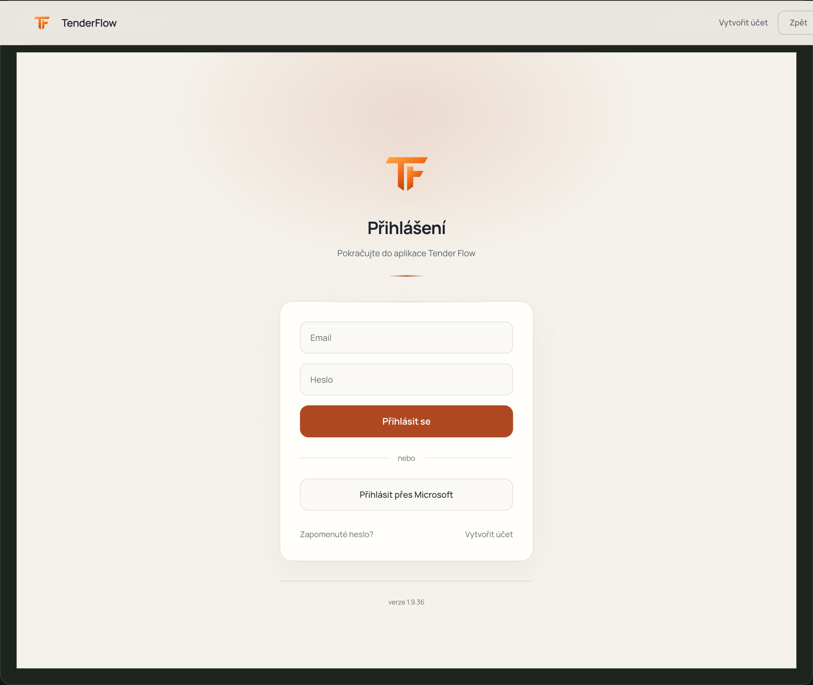

Pro nový účet použijte **Vytvořit účet** a dokončete registraci podle zobrazených polí. Zapomenuté heslo řešte odkazem na obnovu na přihlašovací stránce; pokračujte z doručené zprávy. Pokud účet používá dvoufázové ověření, zadejte aktuální kód svého autentizátoru. Osobní zabezpečení a připojená zařízení jsou vysvětlená v [Nastavení aplikace](#nastaveni-aplikace). Přihlášení přes Microsoft a propojení Microsoft služeb si ověřte v nastavení účtu.

## Organizace a předplatné

**K čemu slouží:** organizace vymezuje tým a jeho data. Dostupnost modulů navíc ovlivňuje nastavení funkcí a oprávnění uživatele.

### Členství a role v organizaci

V nastavení organizace zkontrolujte členství. Správa členů, žádostí o vstup a rolí je dostupná podle vaší role. Vlastník organizace řeší přijetí členů a předání vlastnictví.

**Příklad:** Anna a Petr patří do stejné organizace. Pro spolupráci na Javoru musí být nastavený i přístup ke konkrétní stavbě; členství v organizaci samo nevysvětluje všechna projektová oprávnění.

### Dostupnost funkcí

Pokud položku v menu nevidíte nebo je akce nepřístupná, zkontrolujte s administrátorem:

- zda je funkce povolená pro organizaci a účet;
- zda máte přístup k vybrané stavbě a právo ji upravovat;
- zda funkce vyžaduje desktop nebo připojenou integraci.

Příručka neuvádí pevnou tabulku tarifů: skutečný přístup určuje aktuální konfigurace služby. Pro nabídku předplatného použijte [aktuální web Tender Flow](/#ceny).

## Navigace v aplikaci

**K čemu slouží:** odlišit celofiremní agendu od práce na jedné stavbě. V aktuálním rozhraní jsou sekce stavby dostupné v boční navigaci.

1. Vyberte stavbu. Její název se zobrazí v přepínači v levém panelu.
2. Kliknutím na název otevřete výběr dalších staveb. Lze hledat podle názvu nebo lokality.
3. Pod vybranou stavbou otevřete příslušnou sekci.
4. **Smlouvy** rozbalují položky **Objednatel** a **Subdodavatel**. **Nastavení stavby** rozbaluje **Odkazy PD**, **Šablony** a **Složkomat**, pokud jsou dostupné.

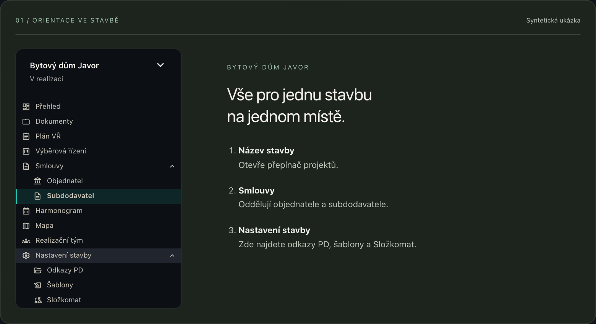

| Sekce stavby | Co zde vyřídíte |
| --- | --- |
| Přehled | Základní údaje, metriky a finance stavby |
| Dokumenty | Dokumentovou agendu a ceníky podle dostupných funkcí |
| Plán VŘ | Přípravu a termíny jednotlivých výběrových řízení |
| Výběrová řízení | Poptávky, dodavatele, nabídky a jejich stavy |
| Smlouvy → Objednatel / Subdodavatel | Smlouvy podle smluvní strany |
| Harmonogram | Časové souvislosti projektu |
| Mapa | Mapové zobrazení podle dostupnosti modulu |
| Realizační tým | Tým vybrané stavby |
| Nastavení stavby | Odkazy na dokumentaci, šablony a Složkomat |

**Na mobilu:** otevřete hlavní menu v horní liště. Po výběru sledujte název stavby, abyste nezadali údaj do jiného projektu.

**Častá chyba:** hledat Složkomat v obecném nastavení účtu. Patří do **Nastavení stavby → Složkomat**.

## Správa staveb

**K čemu slouží:** založit projekt, přehledně ho označit a určit jeho životní fázi.

1. Ve **Správě staveb** otevřete formulář pro novou stavbu.
2. Zadejte **Bytový dům Javor**, ukázkovou lokalitu a další požadované údaje.
3. Uložte a otevřete detail stavby. Ověřte název v boční navigaci.
4. V **Přehledu** průběžně doplňujte údaje a termíny podle formuláře.

**Příklad:** Javor se nejprve připravuje v soutěži, později se řeší realizace. Fázi stavby nezaměňujte se stavem jedné nabídky dodavatele; jde o jiné úrovně evidence.

### Sdílení a oprávnění

Sdílení stavby nastavujte podle role spolupracovníka. Před předáním práce ověřte, že kolega vidí potřebné sekce a smí provádět požadované změny. Členství v Realizačním týmu řídí přístup ke stavbě. Samotné vyplnění jména stavbyvedoucího v obecných informacích přístup neuděluje.

**Výsledek:** Anna pracuje na správné stavbě a Petr má ověřený přístup k úkolům, které skutečně potřebuje. Archivovanou stavbu nezaměňujte se smazanou.

### Portfolio, hledání a životní cyklus stavby

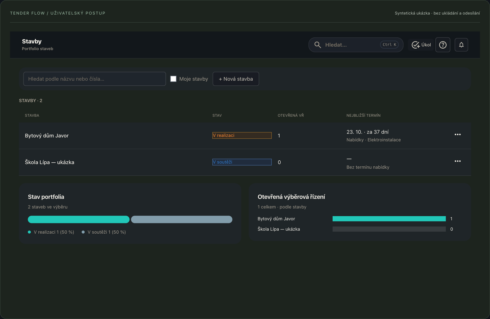

Vyhledejte název stavby a zkontrolujte filtr fáze. Novou stavbu založte přes tlačítko pro přidání, vyplňte název, lokalitu a fázi. Úpravy názvu a lokality provádějte u konkrétní stavby. Při převodu soutěže do realizace čtěte potvrzení klonování a následně otevřete vzniklou realizační stavbu. Archivaci používejte pro ukončenou práci; v archivu je stavba pouze ke čtení a oprávněný uživatel ji může obnovit. Před smazáním vždy ověřte název v potvrzení.

### Realizační tým

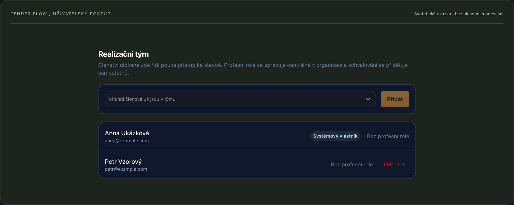

Vlastník stavby otevře **Realizační tým**, vybere člena organizace a přidá jej. Potom ověří jeho přítomnost v seznamu. Odebrání člena provádí tlačítkem u dané osoby. Toto členství řídí přístup ke stavbě; profesní role a schvalovací oprávnění se nastavují samostatně. Pouhé vyplnění jména stavbyvedoucího v přehledu přístup neuděluje.

## Dashboard

**K čemu slouží:** rychlá orientace v práci a finančních údajích. Rozlišujte souhrn napříč stavbami a **Přehled** uvnitř jedné stavby.

1. Před čtením metrik zkontrolujte vybranou stavbu nebo rozsah filtru.
2. Z přehledu přejděte do konkrétního VŘ či smlouvy a ověřte zdrojovou částku.
3. Před exportem zkontrolujte filtry a časové období, pokud je obrazovka nabízí.

**Příklad:** rozpočet Elektroinstalace je 1 500 000 Kč a vybraná nabídka 1 380 000 Kč. Rozdíl činí **120 000 Kč**, tedy **8 %** rozpočtu. Tato aritmetika neznamená automaticky konečnou úsporu stavby: zkontrolujte shodný rozsah, DPH a pozdější dodatky.

**Častá chyba:** porovnávat cenu včetně DPH s rozpočtem bez DPH nebo zaměnit celkovou smluvní cenu za uhrazenou částku.

### Přehled jedné stavby

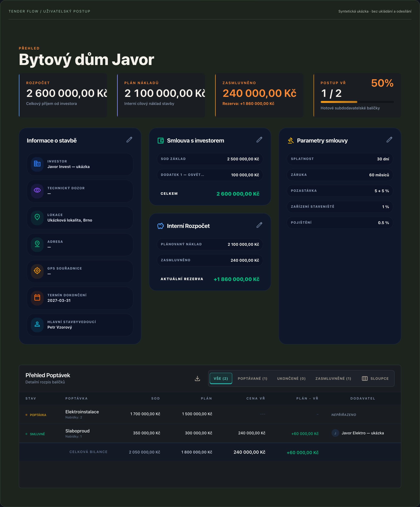

Ikonou tužky upravte příslušný blok, například informace o stavbě nebo interní rozpočet. Nezaměňujte investorskou cenu **2 600 000 Kč včetně dodatku** s interním nákladovým cílem **2 100 000 Kč**. V tabulce poptávek použijte filtr a výběr sloupců; otevřením poptávky pokračujte k jejím nabídkám. Exportujte až po nastavení požadovaného rozsahu.

### Souhrnné přehledy

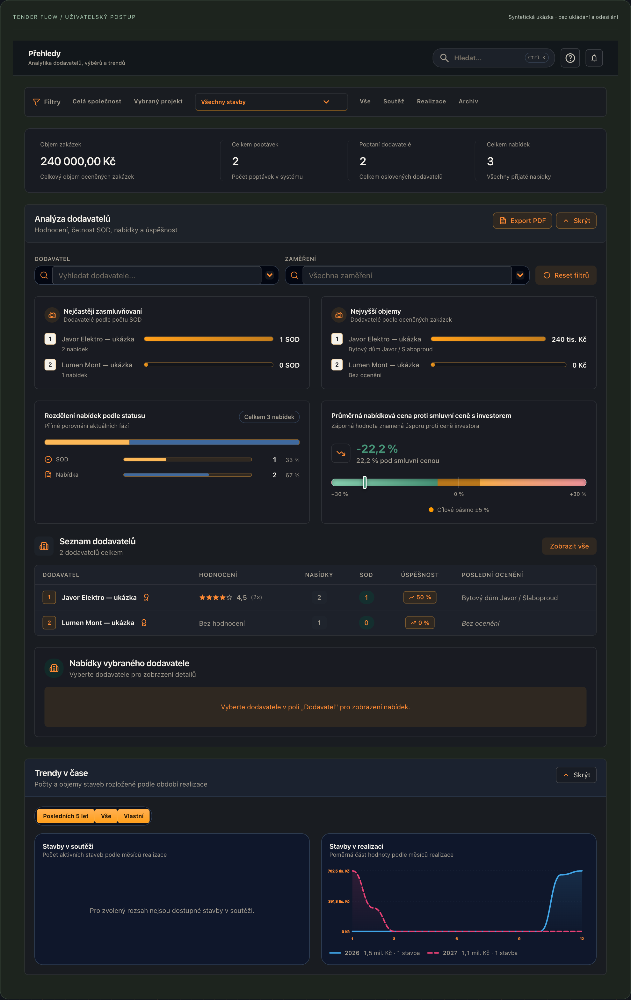

Otevřete **Přehledy**, zvolte rozsah a případnou konkrétní stavbu. Zapněte potřebné části přehledu, například dodavatele nebo rozpočtové odchylky. Pro hledání dodavatele použijte jeho název nebo specializaci. Po změně filtru znovu ověřte, ze kterých staveb součty vycházejí.

### Smluvní přehled

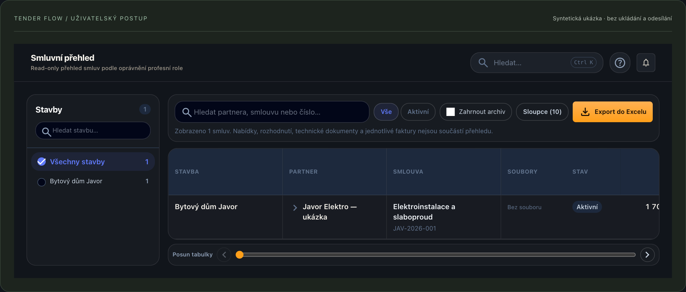

Vyberte stavby, případně stav smlouvy a hledaný název. Rozbalte smlouvu pro zobrazení dodatků. Nabídka sloupců určuje viditelné parametry; širokou tabulku posouvejte vodorovným ovladačem. Přehled slouží ke čtení a exportu; změnu smlouvy proveďte v její zdrojové stavbě.

## Subdodavatelé (Kontakty)

**K čemu slouží:** evidence firem, jejich specializací a konkrétních kontaktních osob.

1. V sekci **Subdodavatelé** založte firmu **Javor Elektro — ukázka**.
2. Přidejte Annu Ukázkovou a Petra Vzorového jako dvě samostatné kontaktní osoby.
3. Vyplňte jejich ukázkové e-maily. Stav dostupnosti firmy a specializace nastavte samostatně.
4. Při přidávání firmy do VŘ ověřte, že jde o správného dodavatele.

**Příklad:** Anna vyřizuje cenové nabídky, Petr montáž. Jedna firma tak má více osob a pro každou poptávku můžete potřebovat jiného příjemce.

**Výsledek:** v adresáři zůstává firma s kontakty; na kartě nabídky vyberete konkrétní osobu podle účelu zprávy. Podrobný postup a snímek jsou v kapitole [Příjemce poptávky](#prijemce-poptavky).

**Častá chyba:** zakládat stejnou firmu znovu kvůli další osobě. Nejprve zkontrolujte existující záznam a jeho seznam kontaktů.

### Hledání, výběr a úprava firmy

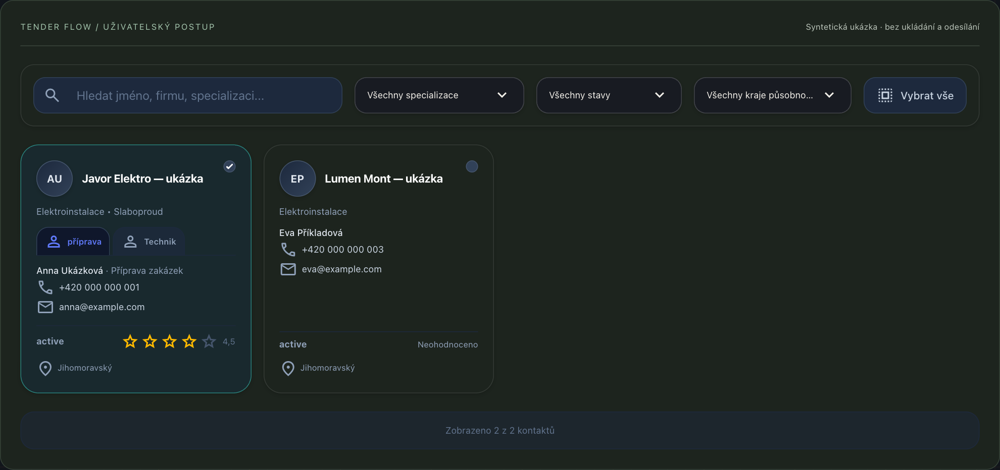

Zúžte adresář hledáním, specializací, stavem nebo krajem. Na kartě firmy přepínejte osoby jejich záložkami; zaškrtnutím označíte firmu pro navazující hromadnou akci. Hodnocení firmy je samostatný údaj, nenahrazuje stav nabídky ve VŘ.

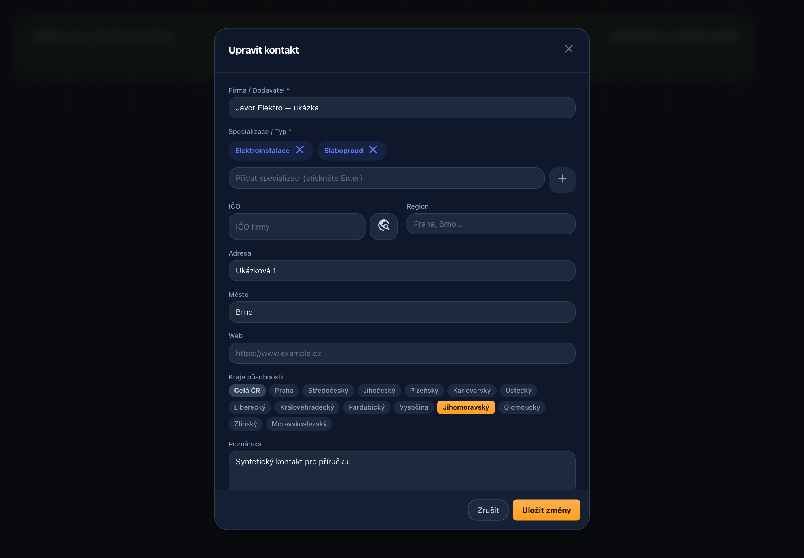

Ve formuláři doplňte alespoň název a specializaci. Níže pokračujte seznamem kontaktních osob, jejich rolí, e-mailů a telefonů. Ověření podle IČO používejte se skutečným platným IČO vlastní firmy; ukázková firma v příručce nemá identitu v rejstříku. Před uložením zkontrolujte nalezené údaje, regiony, poznámku a stav dostupnosti.

## Plán VŘ

**K čemu slouží:** připravit, co a kdy budete poptávat. Položka plánu a nabídka dodavatele nejsou totéž.

1. Ve stavbě Javor otevřete **Plán VŘ**.
2. Přidejte položku **Elektroinstalace** a nastavte požadované termíny.
3. Pro další část prací vytvořte samostatnou položku, například **Slaboproud**.
4. Použijte akci pro vytvoření navazujícího VŘ, pokud ho položka ještě nemá.
5. Otevřete **Výběrová řízení** a ověřte vzniklou poptávku.

**Příklad:** pro Elektroinstalaci plánujeme oslovení na 5. 10. 2026 a vyhodnocení do 23. 10. 2026. Dodavatelům zadáme stejné podklady i termín odpovědi, aby nabídky šly porovnat.

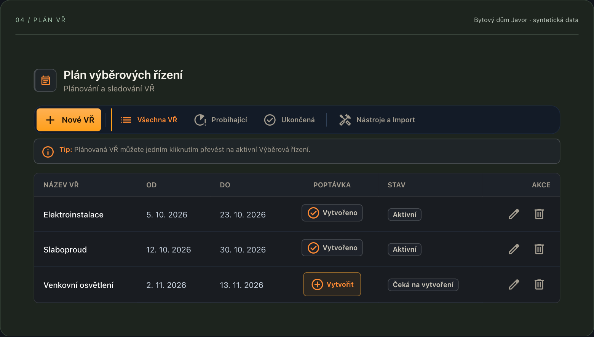

**Výsledek:** termín a předmět plánu navazují na skutečné VŘ. Po vytvoření navazujícího VŘ nepřidávejte stejné řízení ručně podruhé.

## Výběrová řízení

**K čemu slouží:** shromáždit nabídky dodavatelů ke konkrétní poptávce a sledovat jejich průběh.

### Přidání dodavatelů

1. Otevřete **Výběrová řízení** u Javoru a vyberte **Elektroinstalace**.
2. Otevřete výběr dodavatelů, označte ukázkové firmy a potvrďte **Přenést do pipeline**.
3. Vyčkejte na dokončení ukládání. Karty musí být vidět v příslušné poptávce.
4. Při hlášení částečného uložení opakujte pouze zbývající výběr. Uložené nabídky zachovejte.

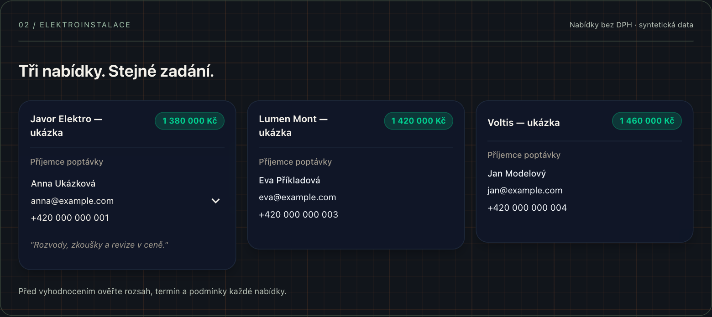

**Výsledek:** každá karta představuje jednu nabídku firmy v této poptávce. Stejná firma může být v jiném VŘ, ale opakovaný pokus o přidání do stejného VŘ nemá přepsat její původní cenu a stav.

### Příjemce poptávky

1. Na kartě dodavatele najděte **Příjemce poptávky**.
2. Pokud má firma více kontaktů, rozbalte výběr a zvolte Annu Ukázkovou.
3. Ověřte jméno, e-mail i telefon zobrazený na kartě.
4. Teprve poté použijte **Generovat poptávku**.

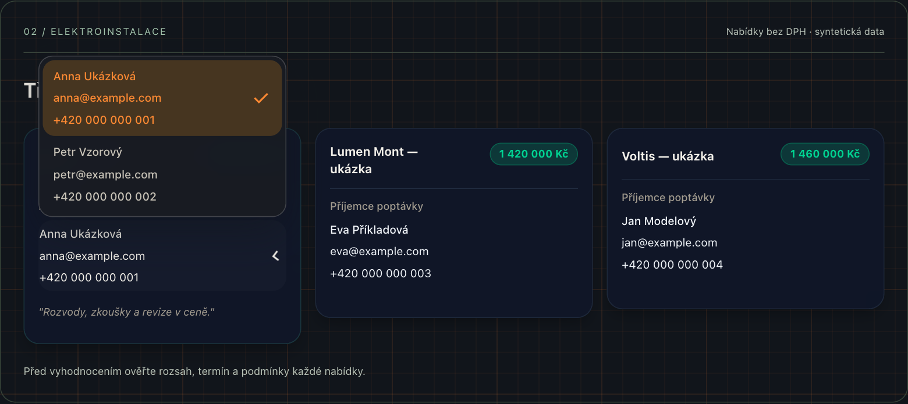

**Příklad:** koncept zahájený pro Annu používá adresu **anna@example.com**. Změna karty na Petra během přípravy konceptu už tento koncept nepřesměruje; projeví se až při dalším generování.

**Časté situace:** kontakt bez platného e-mailu nelze použít pro generování. Jediný kontakt se může zobrazovat bez rozbalovací nabídky. Pokud se volbu nepodaří zapamatovat, aplikace o tom informuje; před další zprávou příjemce znovu ověřte.

### Ceny, kola a vyhodnocení

Doplňte ceny do nabídky a pracujte s historií kol podle dostupných polí. Karty přesouvejte mezi stavy podle skutečného průběhu jednání. Samotný přesun karty není důkaz odeslání e-mailu ani podpisu smlouvy.

| Dodavatel | Nabídka bez DPH | Co ověřit před rozhodnutím |
| --- | --- | --- |
| Javor Elektro — ukázka | 1 380 000 Kč | Zahrnuté rozvody, zkoušky a revize |
| Lumen Mont — ukázka | 1 420 000 Kč | Termín montáže a platební podmínky |
| Voltis — ukázka | 1 460 000 Kč | Shodný výkaz výměr a záruka |

**Výsledek:** nejnižší ukázková cena je 1 380 000 Kč, ale vítěze určete až po porovnání stejného rozsahu a podmínek. Důvod rozhodnutí doplňte do příslušné poznámky.

### Tabulka a exporty

Pro souhrn přepněte na tabulkové zobrazení. Rozbalení VŘ ukáže jeho dodavatele. Před exportem **XLSX** nebo **PDF** zkontrolujte aktuální filtry; export slouží jako výstup pro daný okamžik a nenahrazuje živá data.

### Zadání a termíny poptávky

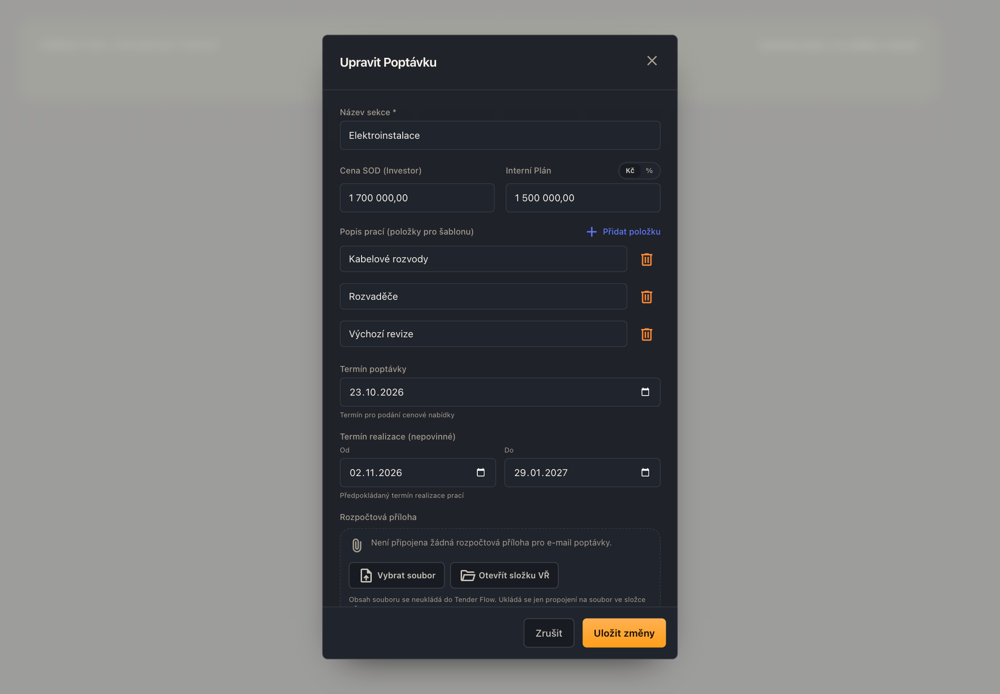

Přidejte poptávku nebo otevřete její úpravu. Zadejte název, investorský rozpočet a interní plán samostatně. Doplňte popis, jednotlivé práce, termín nabídky a termíny realizace. Přílohy rozpočtu vyberte podle možností Složkomatu a platformy. Po uložení ověřte termín a rozpočet na kartě VŘ.

### Nabídka a cenová kola

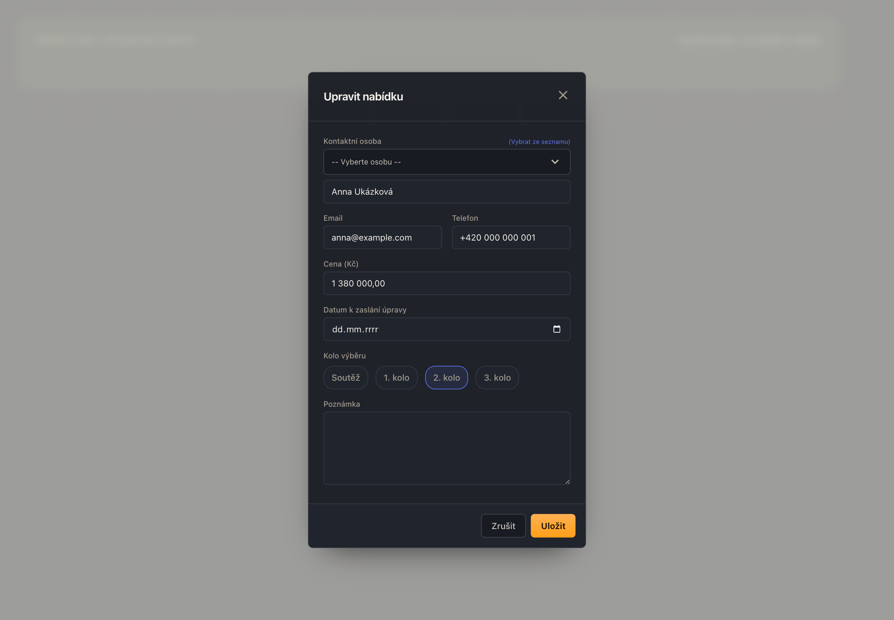

Otevřete úpravu nabídky, nejprve vyberte cenové kolo a potom zadejte cenu. V příkladu je první kolo **1 450 000 Kč**, druhé **1 380 000 Kč**. Po uložení zkontrolujte zvolené kolo na nabídce. Přesun karty do dalšího stavu vyjadřuje postup jednání; podepsanou smlouvu evidujte a propojte samostatně. Odmítnuté nabídky odlište od těch, které se stále posuzují.

### Tabulkový pohled a export

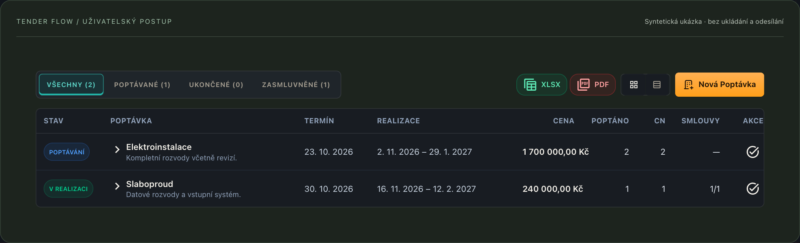

Přepněte přehled VŘ do tabulky. Rozbalte řádek pro nabídky, přizpůsobte šířku a viditelnost sloupců a použijte filtr stavu. Odkaz na smlouvu otevře propojený dokumentový vztah. Export do XLSX nebo PDF vytvářejte nad zkontrolovaným výběrem a ověřte stažený soubor.

## Hromadný e-mail subdodavatelům

**K čemu slouží:** připravit oslovení více dodavatelů se stejným zadáním.

1. Nejprve ověřte příjemce na jednotlivých kartách.
2. Spusťte hromadnou akci a přečtěte rekapitulaci adresátů.
3. Zkontrolujte předmět, zadání, termín a dokumentaci v připraveném konceptu.
4. Samotné odeslání dokončete ve svém e-mailovém klientu.

**Příklad:** pro Javor oslovujete tři firmy kvůli Elektroinstalaci. Rekapitulace musí obsahovat správnou osobu za každou firmu. Pozdější změna kontaktu na kartě nemění již zahájenou přípravu konceptu.

**Častá chyba:** předpokládat, že otevřením konceptu už byla poptávka odeslána. Odeslání ověřte ve své poště. Syntetické příklady z této příručky neodesílejte.

### Kontrola adresátů před konceptem

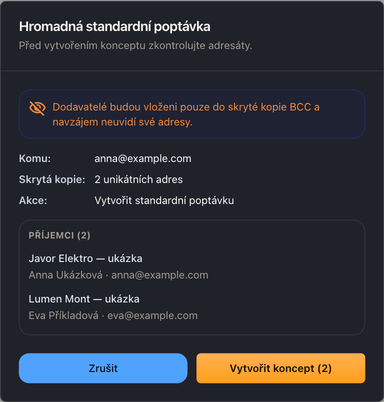

Vyberte druh zprávy: standardní poptávku, materiálovou poptávku, doplnění informací nebo poděkování nevybraným. Každá akce používá odpovídající skupinu nabídek. V potvrzení zkontrolujte počet unikátních adres a seznam příjemců; chybějící či neplatné adresy nejprve opravte na nabídce. Dvě nabídky se stejnou adresou nemají znamenat dva stejné adresáty. **Vytvořit koncept** připraví zprávu, nikoli potvrzení jejího odeslání.

## Smlouvy

**K čemu slouží:** sledovat smluvní vztahy, ceny, dodatky, čerpání a návaznost na výběrová řízení.

1. V boční navigaci rozbalte **Smlouvy** a vyberte **Objednatel** nebo **Subdodavatel**.
2. Otevřete správnou smlouvu nebo založte novou. Ověřte smluvní stranu, číslo, měnu a základní cenu.
3. V detailu doplňte údaje a dokumenty podle jednotlivých sekcí.
4. Faktury, dodatky a úhrady evidujte do příslušné agendy; každá představuje jiný údaj.

### Jedna smlouva pro více VŘ

**Příklad:** smlouva **JAV-2026-001** pokrývá Elektroinstalaci a Slaboproud na stejné stavbě. Cena celé smlouvy je 1 620 000 Kč bez DPH: 1 380 000 Kč za Elektroinstalaci a 240 000 Kč za Slaboproud. Rozpad je vysvětlením příkladu; aplikace cenu automaticky nerozděluje mezi VŘ.

1. V detailu smlouvy najděte seznam **Výběrová řízení**.
2. Ve výběru dalšího VŘ zvolte volnou poptávku a nabídku dodavatele.
3. Potvrďte **Propojit VŘ**.
4. Zkontrolujte obě vazby v seznamu. Kliknutím na položku přejdete na odpovídající nabídku.

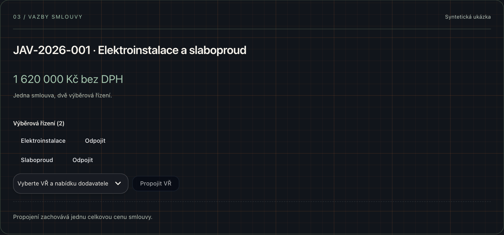

**Pravidlo:** jedna smlouva může pokrývat více VŘ stejné stavby. Jedno VŘ může mít nejvýše jednu smlouvu. Obsazené VŘ se nenabízí k dalšímu propojení.

### Odpojení VŘ od smlouvy

U příslušné vazby použijte **Odpojit** a přečtěte potvrzení. Potvrzení odstraní pouze vybranou vazbu; smlouva, její dokumenty a ostatní propojení zůstávají.

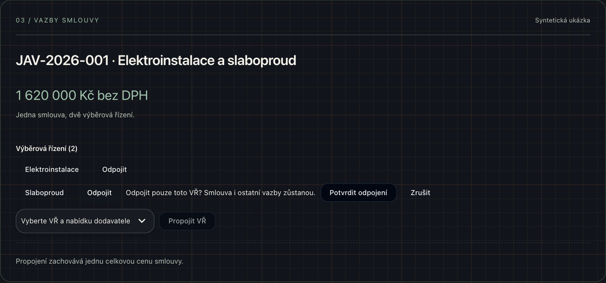

**Častá chyba:** sečíst plnou cenu jedné smlouvy za každé propojené VŘ. Ukázková smlouva zůstává jedním závazkem 1 620 000 Kč, nikoli dvěma závazky po této částce.

### Smlouva objednatele

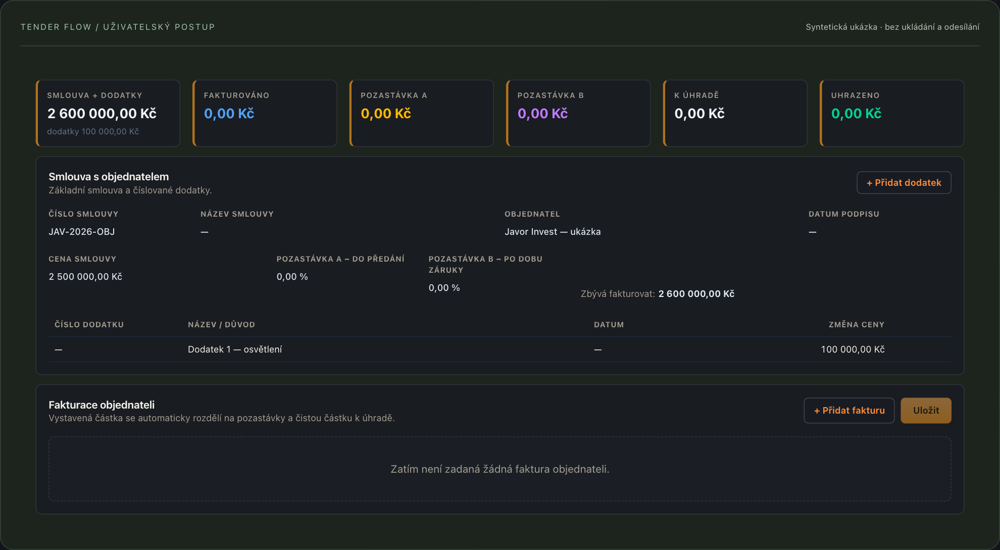

V části **Objednatel** vyplňte zákazníka, číslo smlouvy, základní cenu a další smluvní údaje. Dodatky přidávejte samostatně. V našem příkladu **2 500 000 + 100 000 = 2 600 000 Kč**. Ve fakturaci evidujte číslo, období, vystavení, splatnost, částku, stav a případné pozastávky. Úhradu zaznamenejte až podle skutečného stavu.

### Založení a úprava subdodavatelské smlouvy

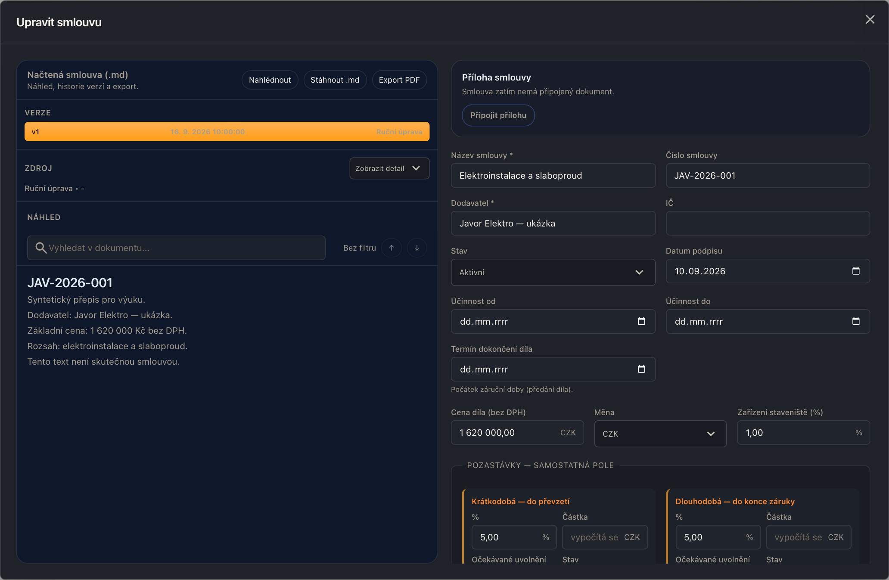

Vyplňte partnera, číslo a název smlouvy, měnu, základní cenu, platnost, splatnost a záruku. Uložení souboru, načtení údajů pomocí OCR a potvrzení údajů jsou odlišné kroky. Výsledek OCR porovnejte se smlouvou, zejména cenu, data a procenta; automaticky načtený údaj nemusí být správný.

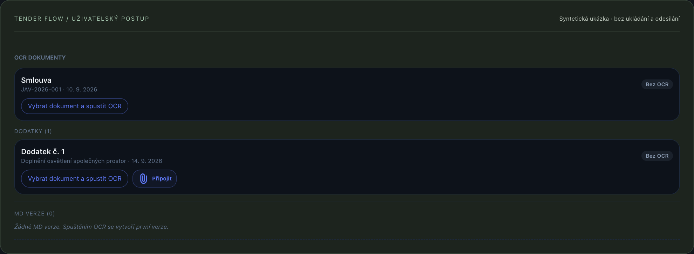

Nahrajte příslušný dokument k odpovídající smlouvě nebo dodatku. Otevřete uložený dokument a ověřte správnou verzi. Pokud pracujete s Markdown přepisem, zkontrolujte text před uložením nebo exportem a rozlišujte přepis od původního souboru. Snímek ukazuje ovládání; syntetické dokumenty nebyly odesílány k OCR.

### Dodatky, čerpání a faktury

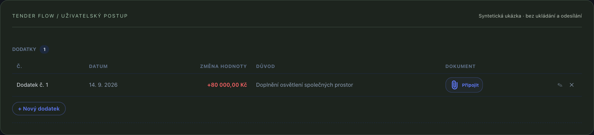

Přidejte dodatek s datem, změnou ceny, případnou změnou termínu a důvodem. V příkladu se cena změní z **1 620 000 na 1 700 000 Kč**. Dodatek upravujte přes jeho vlastní řádek; nemažte původní základní cenu jen kvůli nové celkové částce.

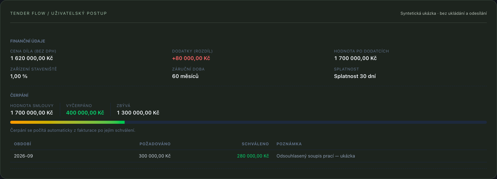

Porovnejte nárokované a schválené čerpání za stejné období. Příklad rozlišuje požadavek **300 000 Kč** a schválení **280 000 Kč**. Schválené čerpání, vystavená faktura a zaplacená částka nejsou zaměnitelné.

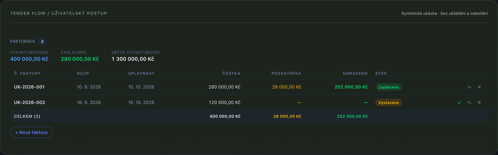

Přidejte fakturu, vyplňte její číslo, částku, měnu a data. Při úpravě otevřete správný řádek. Zaplacení označte až po ověření úhrady; zkontrolujte součet zaplacených faktur a zbytek k fakturaci. Smazání vyžaduje kontrolu konkrétního záznamu.

### Pozastávky a záruka

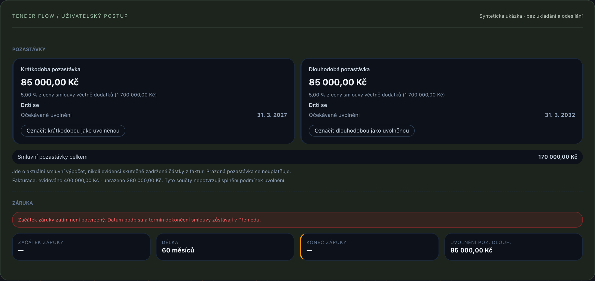

Při sazbě **5 % + 5 %** z ceny včetně dodatků **1 700 000 Kč** vychází každá pozastávka na **85 000 Kč**. Jde o smluvní výpočet, nikoli doklad skutečně zadržené částky. Uvolnění potvrďte až po splnění podmínek smlouvy a vyplňte skutečné datum. Tato akce neprovádí platbu. Počátek záruky potvrzujte samostatně; datum dokončení samo nepotvrzuje předání ani spuštění záruky.

## Harmonogram

**K čemu slouží:** zobrazit termíny v časových souvislostech a odhalit návaznosti, které při pohledu na seznam uniknou.

1. Otevřete **Harmonogram** vybrané stavby.
2. Nastavte vhodné měřítko, například měsíc nebo týden.
3. Zkontrolujte termíny proti Plánu VŘ a skutečně dohodnutému nástupu dodavatele.
4. Chybějící nebo neaktuální údaje opravte v příslušné zdrojové agendě.

**Příklad:** vyhodnocení Elektroinstalace plánujete do 23. 10., montáž od 2. 11. 2026. Před montáží musí být prostor pro dojednání smlouvy a předání podkladů.

**Výsledek:** termíny odpovídají reálnému postupu. Barevný pruh sám nepotvrzuje připravenost dodavatele.

### Čtení a úprava časového plánu

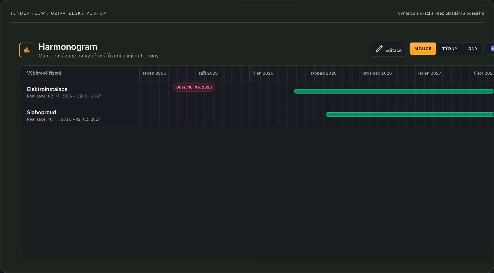

Přepněte měsíční nebo týdenní měřítko a určete, zda pracujete s VŘ nebo realizací. Přes **Editace** otevřete příslušný řádek a upravte jeho data. Před uložením zkontrolujte začátek i konec. Export nabízí PDF a varianty Excelu; u exportu s časovou osou ověřte celé období a čitelnost. Ukázková montáž Elektroinstalace začíná **2. 11. 2026**.

## Mapa stavby a dodavatelů

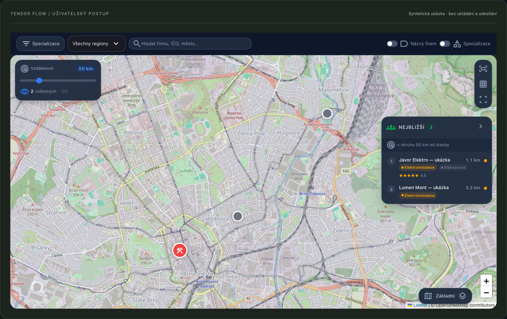

Otevřete **Mapa** ve vybrané stavbě. Ověřte polohu stavby, nastavte poloměr a filtr specializace, kraje nebo názvu firmy. Vyberte značku nebo firmu v seznamu pro detail kontaktu. Podle dostupných funkcí můžete zobrazit trasu nebo přidat firmu do VŘ; před přidáním ověřte vybranou poptávku. Vzdálenost vzdušnou čarou není dojezdová vzdálenost. Polohy firem na snímku jsou smyšlené, pro ukázku nebyla volána geokódovací ani směrovací služba.

## Dokumenty a šablony

**K čemu slouží:** zpřístupnit správnou dokumentaci a používat opakovaně stejné zadání poptávek.

1. V **Nastavení stavby → Odkazy PD** uložte odkazy na dokumentaci pro Javor.
2. V **Šablonách** připravte texty pro odpovídající druh zprávy.
3. Při generování ověřte vyplněné údaje a odkazy v náhledu.
4. Před sdílením ověřte přístup příjemce k dokumentům v úložišti.

**Příklad zadání:** „Žádáme o nabídku elektroinstalace pro Bytový dům Javor podle přiloženého výkazu. Nabídku a výluky zašlete do 16. 10. 2026.“ Konkrétní termín a rozsah musí odpovídat danému VŘ.

**Častá chyba:** odkaz funguje vám, ale subdodavatel k němu nemá oprávnění. Přístup v cloudovém úložišti se ověřuje samostatně.

### Odkazy PD a ceníky

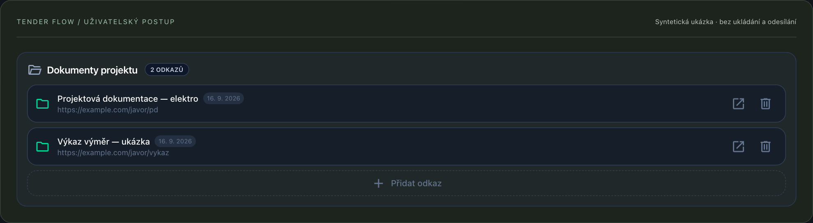

Přidejte srozumitelný název, odkaz či podporovanou cestu a datum dokumentace. Pro aktualizaci použijte úpravu příslušného řádku. Před odstraněním rozlište odkaz v aplikaci a skutečný soubor v úložišti. Web u místní cesty nabízí kopírování; desktop může otevřít dostupné umístění.

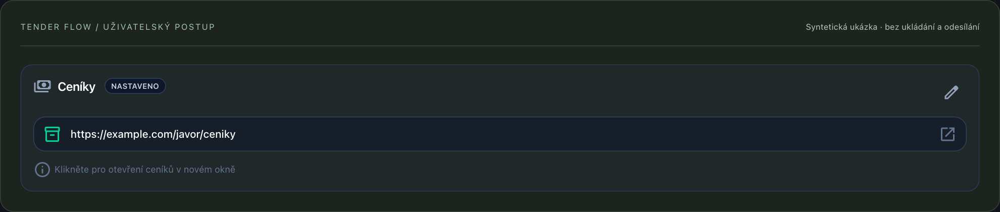

V dokumentech nastavte odkaz na aktuální ceníky nebo využijte příslušnou složku připojeného Složkomatu. Otevřením ověřte, že jde o správnou verzi podkladů.

### Volba a tvorba e-mailové šablony

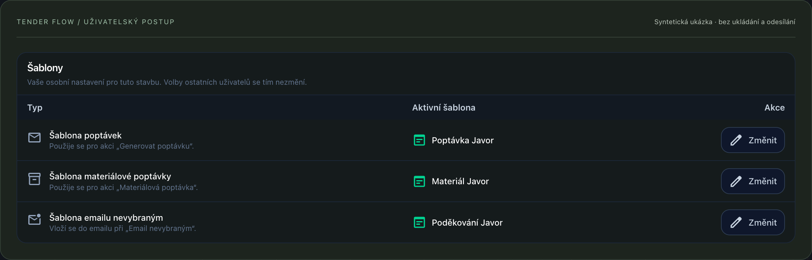

U odpovídajícího druhu zprávy vyberte nebo změňte šablonu. Tato volba je osobní pro danou stavbu; nezaměňujte ji s nastavením všech kolegů.

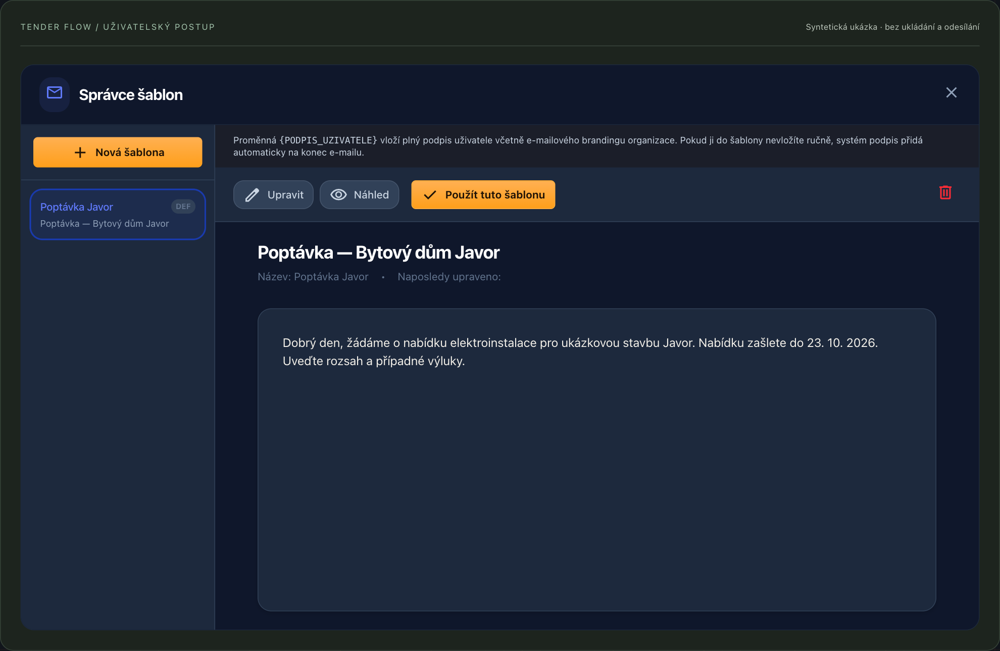

Ve správci založte šablonu nebo upravte existující. Zkontrolujte název, předmět, obsah a nabízené proměnné. Před použitím zobrazte náhled, ověřte doplněné údaje stavby a vyberte šablonu pro požadovaný druh zprávy.

## Složkomat

**K čemu slouží:** propojit stavbu s dokumentovým úložištěm a spravovat její složkovou strukturu. Ve starších materiálech a některých technických označeních se objevuje název **DocHub**.

1. Vyberte Javor a otevřete **Nastavení stavby → Složkomat**.
2. Zvolte dostupný způsob připojení. Lokální či síťová cesta vyžaduje odpovídající možnosti desktop aplikace.
3. Ověřte hlavní složku projektu a navrženou strukturu, teprve potom potvrďte akci.
4. Otevřete cílovou složku a zkontrolujte výsledek.

**Příklad:** ukázková struktura oddělí podklady pro Elektroinstalaci a Slaboproud, aby dodavatelé nedostali cizí zadání. U nové realizační stavby ověřte její vlastní realizační složku.

**Oprávnění:** změnu globálního napojení a struktury provádí vlastník projektu. Sdílený uživatel nemusí mít tuto možnost. Online odkaz musí odpovídat podporovanému úložišti; pouhé uložení odkazu není totéž jako aktivní synchronizace.

**Když složka nefunguje:** ověřte vybranou stavbu, připojený účet, dostupnost disku a oprávnění k cílovému umístění. Po změně projektu nepracujte s odkazem patřícím předchozí stavbě.

### Úložiště a struktura

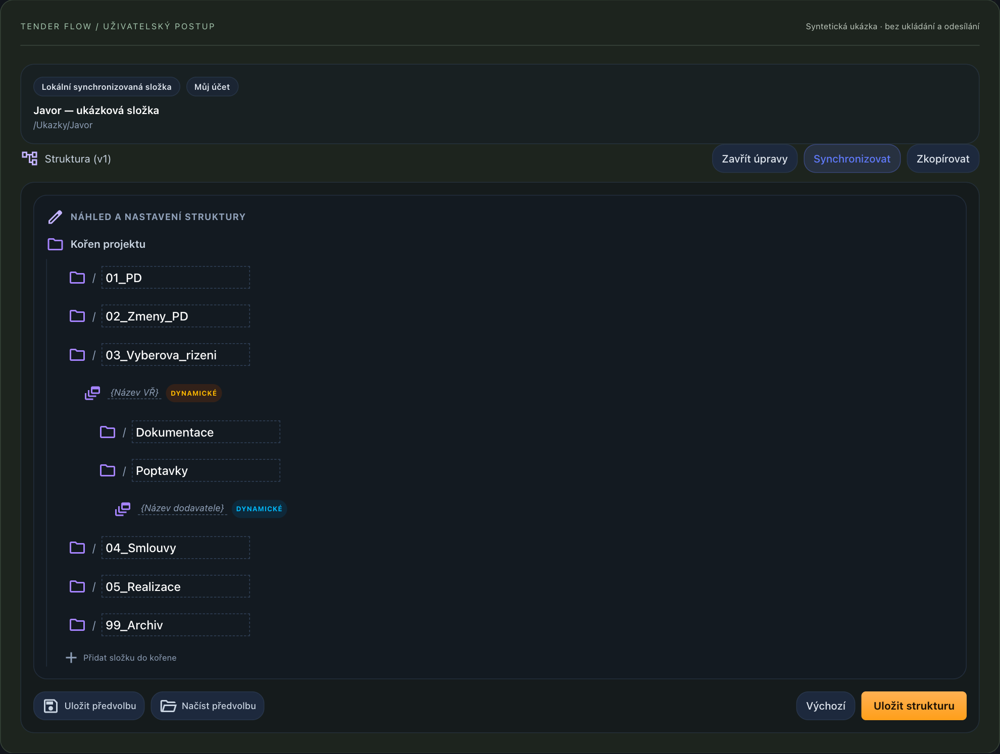

Nejprve nastavte poskytovatele a kořenové umístění. U sdílené stavby vybírejte vlastní místní kopii synchronizované složky. Otevřete strukturu, zkontrolujte pořadí a zapnuté části a teprve potom spusťte vytvoření či doplnění složek. Zachovejte potřebné úrovně **VŘ → dodavatel**. Po běhu přečtěte výsledek a historii; ověřte skutečný obsah úložiště. Zapnutí automatického vytváření nenahrazuje první kontrolu cílové cesty.

## Úkoly

**K čemu slouží:** osobní evidence práce, podúkolů a připomínek.

1. Otevřete agendu úkolů a vytvořte úkol **Zkontrolovat nabídku Javor Elektro**.
2. Nastavte termín podle potřeby a doplňte podúkoly: rozsah, cena, revize a nástup.
3. Po kontrole úkol dokončete. Změnu cen a stavů nabídky proveďte samostatně v příslušném VŘ.

**Příklad:** dokončený osobní úkol potvrzuje vaši kontrolu, sám o sobě nepodepisuje smlouvu ani neodesílá e-mail. U externích integrací ověřujte stav připojení přímo v aplikaci.

### Seznam, kalendář a projekty úkolů

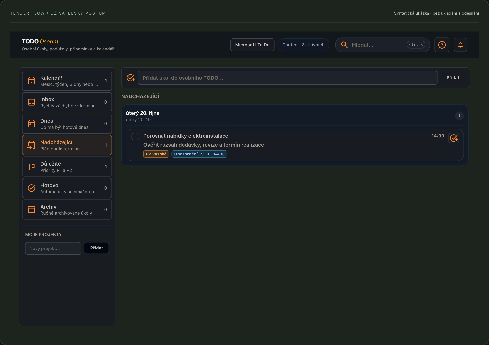

Nový úkol rychle založte v Inboxu a následně doplňte detail. Pohledy **Dnes**, **Nadcházející** a **Důležité** vybírají úkoly podle termínu a priority. V kalendáři přepínejte měsíc, týden, tři dny nebo den; při přesunu úkolu zkontrolujte nový termín. Osobní projekty úkolů jsou jiná evidence než stavební projekty. Dokončené a ručně archivované úkoly mají samostatné pohledy; rozhraní u Hotovo upozorňuje na automatické mazání po 14 dnech.

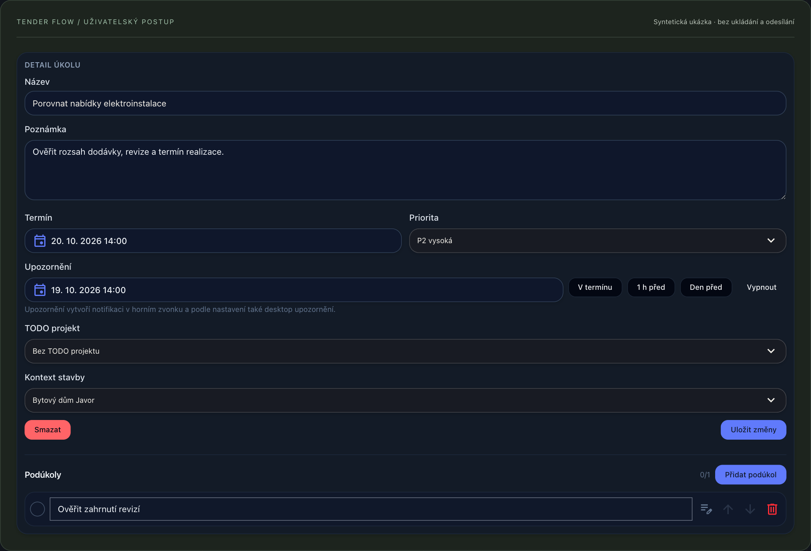

U úkolu **Porovnat nabídky elektroinstalace** nastavte termín, připomínku a prioritu. Přiřaďte stavbu Javor a přidejte podúkol **Ověřit zahrnutí revizí**. Uložte změny a zkontrolujte detail. Dokončení podúkolu a hlavního úkolu sledujte odděleně. Microsoft To Do připojte v nastavení Microsoft účtu; případnou chybu synchronizace řešte podle zobrazeného stavu.

## Nástroje

Dostupné nástroje vyhledejte v navigaci aplikace. Následující příklady použijte nejprve na kopii vstupních souborů.

### Excel nástroje

| Nástroj | Úkol | Co zkontrolovat ve výsledku |
| --- | --- | --- |
| Excel – odemčení | Připravit oprávněně používaný sešit pro úpravy | Otevření souboru, listy a zachování dat |
| Excel Spojení listů | Spojit podklady z více listů | Počet listů/řádků, pořadí a součty |
| Excel Indexace VŘ | Doplnit oddíly a popisy podle indexu | Mapování vstupních sloupců a nepřiřazené kódy |

**Příklad:** nejprve vyzkoušejte rozpočet se třemi řádky a kódy E-001, E-002 a E-003. V indexu připravte odpovídající popisy a po zpracování porovnejte všechny tři výsledky. Výstup nepoužívejte bez kontroly součtů a vzorců.

Webová a desktopová varianta mohou mít odlišné způsoby zpracování. Dostupnost a případné požadavky sledujte v konkrétním nástroji; nepočítejte s tím, že celá aplikace pracuje offline.

### Import a synchronizace kontaktů

Připravte malý vzorek v podporovaném formátu, ověřte mapování polí a výsledek importu. Teprve potom pokračujte celým adresářem. U synchronizace z URL ověřte správný zdroj a oprávnění k jeho použití.

**Příklad:** dva řádky stejné ukázkové firmy mohou představovat dvě osoby. Po importu zkontrolujte firmu, kontakty, specializace a případné duplicity. Nespoléhejte na pořadí sloupců bez ověření v importním rozhraní.

### Záloha a obnova dat

V **Záloze a obnově** vyberte požadovaný rozsah podle své role. Rozlišujte export kontaktů, uživatelskou zálohu a organizační zálohu. Ve webu se záloha stahuje jako soubor; desktop nabízí i lokální zálohy.

1. Vytvořte aktuální zálohu a ověřte, kde je soubor uložen.
2. Před obnovou přečtěte náhled, rozsah a počty záznamů.
3. Zkontrolujte organizaci a vlastníka dat. Obnovu potvrďte jen pro zamýšlený rozsah.
4. Po dokončení ověřte stavby, kontakty a vazby smluv.

**Pozor:** obnova může měnit existující data. Vyzkoušení provádějte v určeném testovacím prostředí. Stažený nešifrovaný JSON chraňte jako firemní data; u šifrované desktopové zálohy ověřte dostupnost klíče před změnou počítače nebo systému.

### Obrazový postup pro nástroje

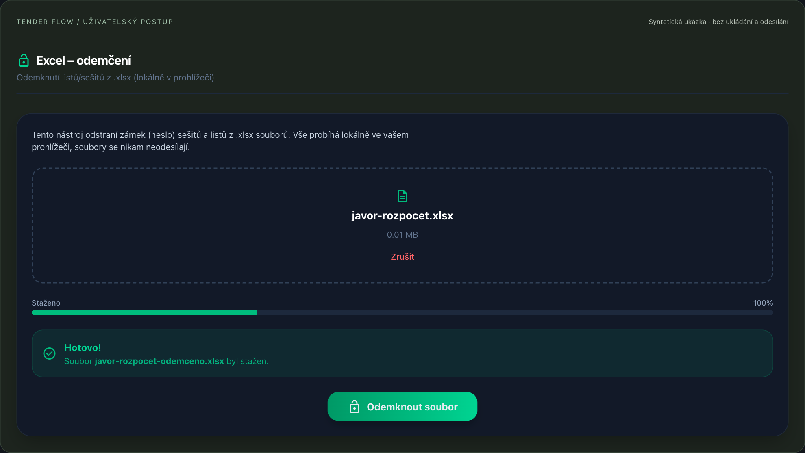

Vyberte kopii souboru XLSX, spusťte odemčení a otevřete stažený výsledek. Zkontrolujte možnost upravit list a zachování vzorců. Odstranění ochrany listu neznamená prolomení šifrování souboru chráněného heslem pro otevření.

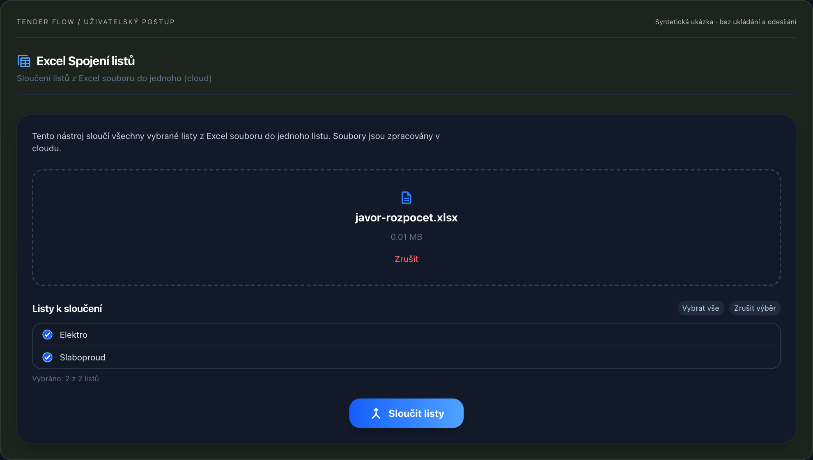

Vyberte XLSX, po analýze označte potřebné listy a spusťte spojení. Výsledný soubor ověřte počtem řádků, pořadím a součty. Příklad tvoří dva listy se dvěma a jedním položkovým řádkem; ve výstupu hledejte všechny tři položky. Způsob zacházení s hlavičkami ověřte podle konkrétního sešitu.

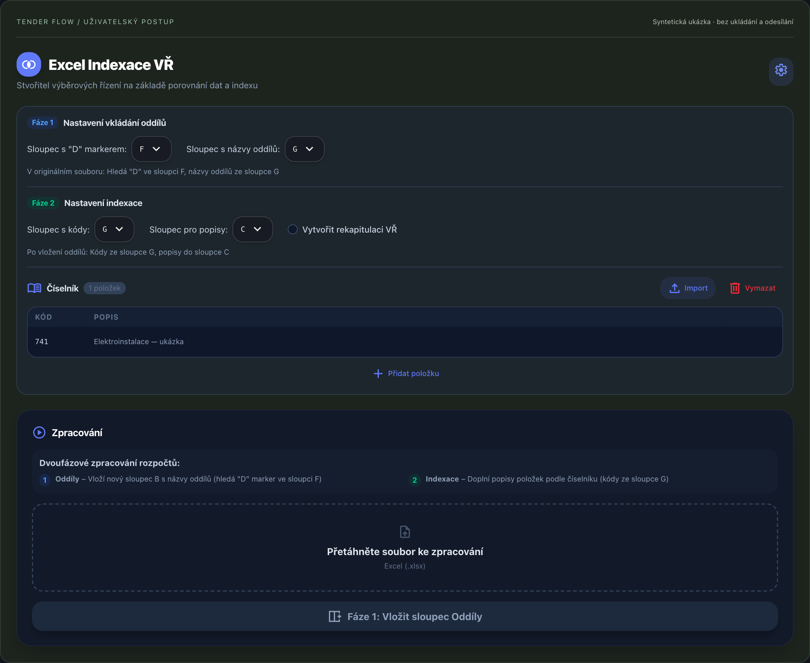

V první fázi určete sloupec značky oddílu a jeho názvu. Po vložení sloupce se původní pozice posunou; ve druhé fázi znovu ověřte sloupec kódu a cílového popisu. Výchozí nastavení je **F/G před vložením** a **G/C po vložení**. Připravte indexy, zpracujte vzorek a zkontrolujte nepřiřazené položky. Doplnění popisů podle kódů je součást tohoto nástroje.

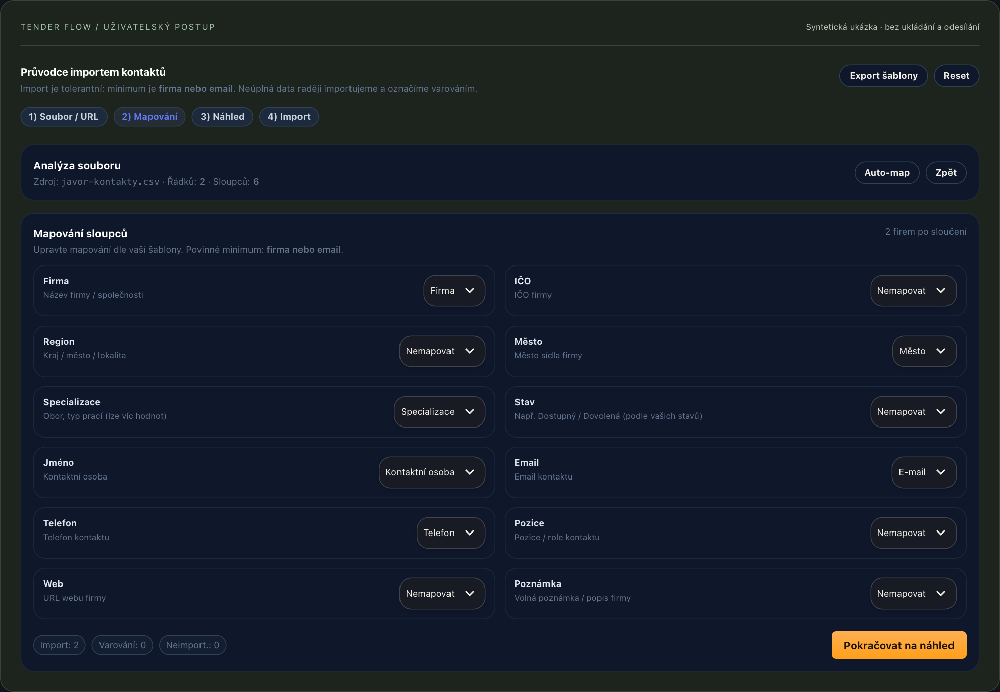

Vyberte podporovaný soubor nebo povolený zdroj URL. V dalším kroku přiřaďte sloupce k polím Tender Flow, zobrazte náhled a opravte chyby názvů, specializací a kontaktů. Import potvrďte až po kontrole náhledu. Ve výsledku odlište importované řádky, varování a neimportované řádky; opravte příčinu před opakováním.

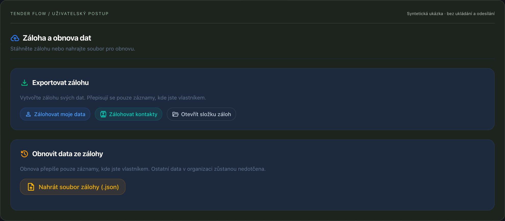

Běžný uživatel vybírá vlastní dostupný rozsah exportu. Soubor zálohy bezpečně uložte. Pro obnovu nejprve načtěte soubor a porovnejte náhled i počty záznamů. Organizační zálohy a správa ostatních uživatelů jsou součást odložené administrátorské příručky.

## Tender Flow Desktop

**K čemu slouží:** rozšířit práci o nativní možnosti operačního systému, především lokální soubory a desktopové integrace.

### Instalace a aktualizace

Použijte oficiální instalační soubor pro svůj systém. Na macOS přesuňte aplikaci z DMG do Applications; ve Windows projděte instalátorem. Pro aktualizaci sledujte nabídku a stav přímo v aplikaci. Pokud je vyžadované ruční stažení, použijte nabídnutý oficiální postup.

**Příklad:** po aktualizaci porovnejte verzi aplikace s poznámkami vydání. Tato příručka popisuje v1.9.36; u jiné verze se umístění nebo dostupnost funkcí může lišit.

### Biometrické přihlášení

Pokud zařízení a aplikace nabízejí biometriku, nejprve se přihlaste běžným způsobem a nastavte ji podle zobrazené nabídky. Biometrie nenahrazuje oprávnění k organizaci ani ke stavbě. Při problému použijte standardní přihlášení.

### Lokální soubory a zálohy

Lokální cesty jsou vázané na daný počítač a jeho oprávnění. Sdílený kolega nemusí mít stejný disk nebo cestu. U Složkomatu i záloh ověřte cílové umístění, čitelnost a skutečně uložený výsledek.

**Častá chyba:** předpokládat, že lokální soubor je automaticky dostupný všem kolegům nebo že cloudová data zůstanou plně dostupná bez internetu.

### Biometrika na podporovaném zařízení

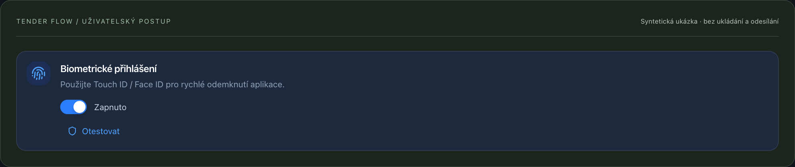

V profilu otevřete biometrické přihlášení. Při zapnutí dokončete skutečnou výzvu operačního systému a otestujte následující přihlášení. Snímek ukazuje pouze nastavení aplikace se syntetickým stavem; čtečka, systémový dialog a uložení přihlašovacích údajů se v dokumentačním náhledu nespouštějí. Aktualizace najdete v [Profilu a vzhledu](#profil-a-vzhled); místní složky vysvětluje [Složkomat](#slozkomat).

## Nastavení aplikace

**K čemu slouží:** osobní preference a nastavení účtu. Nezaměňujte je s **Nastavením stavby**.

- **Profil:** zkontrolujte osobní údaje a dostupná nastavení přihlášení.
- **Vzhled:** vyberte podporovaný motiv. Snímky v příručce používají tmavý vzhled; ovládací prvky mohou mít u vás jiné barvy.
- **Statusy kontaktů:** použijte jasně pojmenované stavy odpovídající práci týmu.
- **Organizace:** zkontrolujte členství a dostupné možnosti správy.

**Příklad:** barva statusu „Preferovaný“ je pomůcka pro orientaci. Neznamená automaticky vítěze VŘ ani podepsanou smlouvu.

### Profil a vzhled

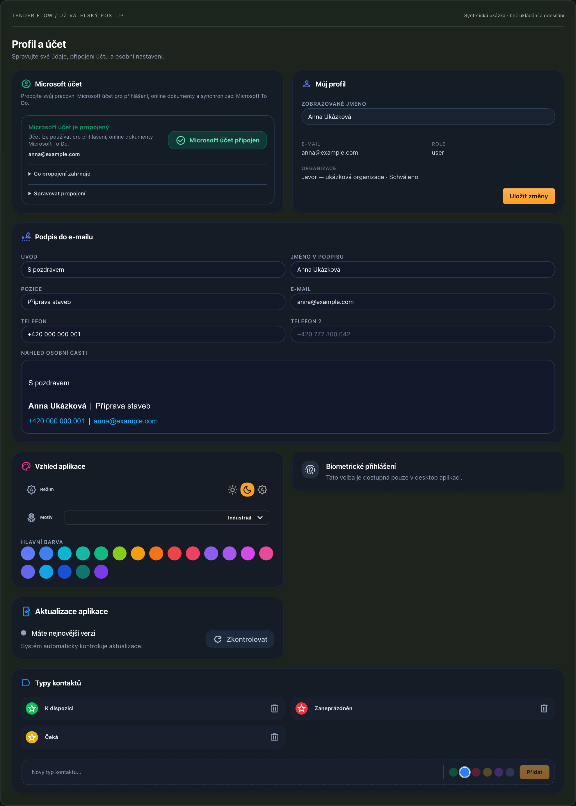

Upravte zobrazované jméno a pracovní podpis a uložte změny. V podpisu ověřte vlastní adresu a telefon. Vyberte vzhled aplikace, světlý či tmavý režim a nabízenou akcentní barvu. V seznamu statusů kontaktů přidávejte jednoznačné názvy a barvy; před odstraněním ověřte dopad na používané kontakty. V sekci aktualizací spusťte kontrolu a řiďte se jejím skutečným výsledkem; stav na syntetickém snímku není potvrzením aktuálnosti vaší instalace.

### Notifikace

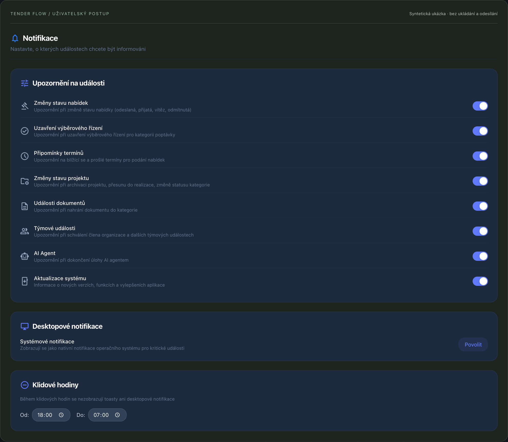

Zapněte potřebné kategorie, například změny nabídek a připomínky termínů. Pro systémová oznámení musí být povolené i oprávnění prohlížeče nebo zařízení. Klidové hodiny nastavte podle svého pracovního režimu. Zvonkem v záhlaví otevřete doručená oznámení, přejděte k souvisejícímu záznamu a označte přečtené položky.

### Zabezpečení a zařízení

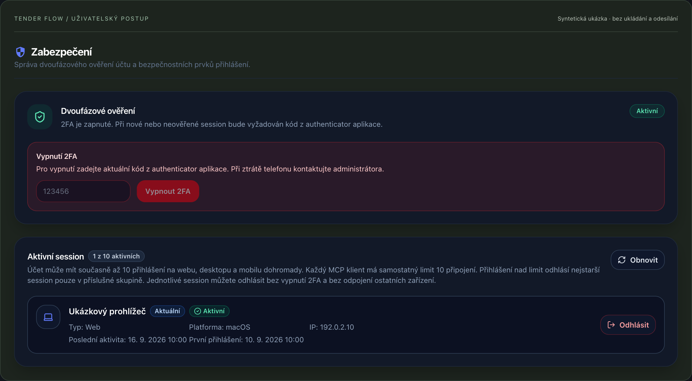

Při zapnutí dvoufázového ověření dokončete párování autentizátoru a ověřte kód. QR kód, tajný klíč ani obnovovací údaje nesdílejte. V seznamu zařízení porovnejte název a poslední aktivitu; neznámou relaci odvolejte. Odvolání aktuální relace může vyžadovat nové přihlášení. Obrázek nezobrazuje žádný skutečný klíč ani relaci.

### Microsoft účet

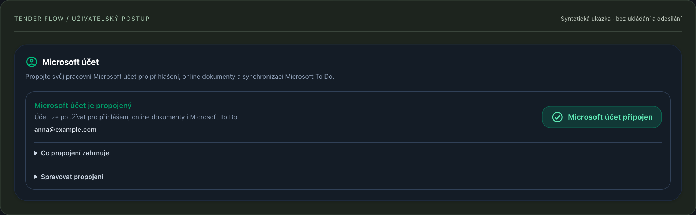

Spusťte propojení, v přihlašovacím okně ověřte správný pracovní účet a požadovaný přístup. Po návratu zkontrolujte stav připojení a synchronizace. Při odpojení počítejte s ukončením příslušné integrace; již evidované úkoly posuzujte podle aktuálního stavu aplikace.

### AI a MCP přístupy

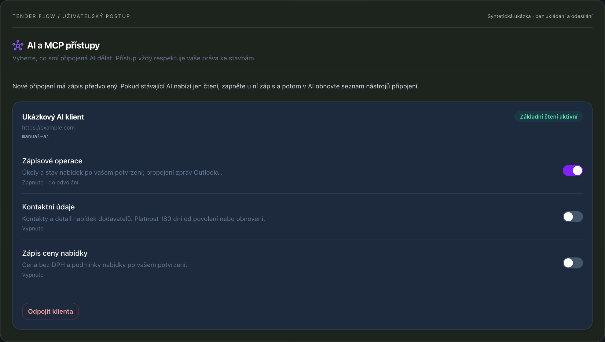

Vyberte připojeného klienta a zkontrolujte povolené druhy operací. Přístup ke kontaktům a dalším citlivým akcím zapínejte jen pro zamýšlený účel. Po změně může být nutné v AI obnovit seznam nástrojů. Odpojení potvrďte u správného klienta. Povolení MCP nerozšiřuje vaše vlastní oprávnění ke stavbám.

## Administrace systému

Administrace systému a správa organizace nejsou součástí tohoto obrazového rozšíření. Podrobná administrátorská příručka bude doplněna samostatně. Běžné uživatelské nastavení účtu a přístup vlastníka k jeho stavbě zůstávají vysvětlené výše.

## Časté otázky

### Nevidím stavbu nebo funkci

Ověřte účet, organizaci, sdílení stavby a povolené moduly. Pro lokální souborové operace může být potřebná desktopová aplikace. Požádejte vlastníka nebo správce o kontrolu konkrétního oprávnění.

### Neotevře se e-mailový klient

Zkontrolujte přiřazenou aplikaci pro e-mailové odkazy v systému a oprávnění prohlížeče otevřít externí aplikaci. Otevření konceptu není odeslání. Neopakujte skutečné odeslání bez kontroly odeslané pošty.

### Proč se nenabízí VŘ k propojení se smlouvou?

Zkontrolujte, zda patří stejné stavbě a už není propojené s jinou smlouvou. Jedno VŘ může mít nejvýše jednu smlouvu. Potřebné opravy vazeb provádějte až po ověření existující smlouvy.

### Co když potřebuji větší obrázek?

Klikněte na snímek. Zvětšený náhled zavřete tlačítkem **Zavřít** nebo klávesou **Escape**. Bez JavaScriptu se otevře přímo soubor obrázku. Tlačítkem **Tisk / PDF** můžete vytisknout příručku nebo ji uložit přes tiskový dialog prohlížeče; tisk obsahuje všechny kapitoly i při zapnutém hledání.

### Jak popsat chybu podpoře?

Uveďte verzi aplikace, web či desktop, obrazovku, přesný postup a znění chyby. Přiložte pouze snímek očištěný od osobních a firemních dat. Nezasílejte hesla nebo tokeny. U problému s ukládáním nejprve ověřte, zda změna už neproběhla.

## Co je v příručce nové

Vydání příručky ze **16. 9. 2026**, ověřené proti **v1.9.36**, sjednocuje vzhled s landing page, popisuje aktuální boční navigaci a používá navazující příklad Javor. Obsahuje volbu příjemce poptávky, více VŘ pod jednou smlouvou, Složkomat a rozdíly mezi webem a desktopem.

Historické odkazy na kapitoly zůstávají zachované. Tato kapitola je přehledem změn příručky; dostupnost funkcí v jiných verzích ověřujte v poznámkách ke konkrétnímu vydání aplikace.

## ⚖️ Právní dokumenty

Níže je uvedeno plné znění základních právních dokumentů služby Tender Flow. Dokumenty jsou dostupné také samostatně na webu:

- [Podmínky užívání](https://www.tenderflow.cz/terms)
- [Zásady ochrany osobních údajů](https://www.tenderflow.cz/privacy)
- [Zásady používání cookies](https://www.tenderflow.cz/cookies)
- [Zpracovatelská doložka (DPA)](https://www.tenderflow.cz/dpa)
- [Provozovatel a kontaktní údaje](https://www.tenderflow.cz/imprint)

### Podmínky užívání

Tyto podmínky upravují přístup ke službě Tender Flow, její používání a základní pravidla smluvního vztahu mezi provozovatelem a uživatelem.

#### 1. Provozovatel

Provozovatelem služby je Martin Kalkuš, IČO: 74907026. Kontaktní e-mail: martinkalkus [zavináč] icloud [tečka] com.

#### 2. Vymezení služby a smluvního vztahu

Tender Flow je softwarová služba poskytovaná formou SaaS, dostupná zejména jako webová a případně desktopová aplikace. Služba slouží především ke správě výběrových řízení, projektových podkladů, dokumentů, nabídek, interní spolupráce a souvisejících procesů.

Smluvní vztah vzniká okamžikem registrace, objednání placeného tarifu nebo jiným způsobem, kterým uživatel začne službu oprávněně používat. Tyto podmínky se vztahují na každého uživatele služby, včetně osob, které přistupují do účtu jménem firmy nebo jiné organizace.

Služba může být využívána jak podnikateli a právnickými osobami (`B2B`), tak spotřebiteli (`B2C`). Pokud je uživatel spotřebitelem, použijí se vedle těchto podmínek také kogentní ustanovení právních předpisů na ochranu spotřebitele; tato práva nelze těmito podmínkami vyloučit ani omezit.

#### 3. Registrace, účet a přístupové údaje

Registrací uživatel potvrzuje, že poskytované údaje jsou pravdivé a aktuální. Uživatel odpovídá za to, že k účtu budou přistupovat pouze oprávněné osoby, a že rozsah jejich oprávnění odpovídá jejich roli.

Uživatel je povinen chránit přihlašovací údaje, používat dostatečně bezpečné heslo a bez zbytečného odkladu oznámit podezření na neoprávněný přístup, zneužití účtu nebo bezpečnostní incident.

#### 4. Tarify, cena a platební podmínky

Rozsah funkcí se může lišit podle zvoleného tarifu, individuální nabídky nebo aktuálně dostupných modulů. Aktuální ceny jsou uvedeny na webu, v aplikaci nebo v individuální nabídce schválené uživatelem.

Není-li výslovně uvedeno jinak, jsou ceny uváděny bez DPH. Uživatel souhlasí s tím, že služba může být účtována opakovaně po sjednaných fakturačních obdobích, případně na základě vystavené faktury nebo objednávky.

#### 5. Uživatelská data a odpovědnost uživatele

Uživatel nese odpovědnost za obsah dat, která do služby vloží, zpřístupní nebo prostřednictvím služby zpracovává. Uživatel je dále odpovědný za to, že má k těmto datům potřebná oprávnění a že jejich použití neporušuje právní předpisy ani práva třetích osob.

Provozovatel neprovádí průběžnou obsahovou kontrolu uživatelských dat. Je však oprávněn přijmout přiměřená opatření, pokud je to nutné z důvodu bezpečnosti služby, splnění právní povinnosti nebo ochrany vlastních práv.

#### 6. Zakázané užití služby

Uživatel nesmí službu používat způsobem, který by ohrožoval její bezpečnost, dostupnost nebo integritu, obcházel technická omezení, narušoval práva třetích osob nebo byl v rozporu s právními předpisy.

- šířit prostřednictvím služby škodlivý kód nebo nevyžádaný obsah,
- pokoušet se o neoprávněný přístup k účtům, datům nebo infrastruktuře,
- zpřístupňovat službu třetím osobám mimo sjednaný rozsah oprávnění,
- používat službu k porušování mlčenlivosti, autorských práv nebo GDPR.

#### 7. Dostupnost, údržba a změny služby

Provozovatel usiluje o vysokou dostupnost služby. V rámci údržby může dojít k dočasnému omezení dostupnosti. Provozovatel je oprávněn službu průběžně měnit, rozvíjet, aktualizovat nebo upravovat její jednotlivé funkce, pokud tím podstatně nesnižuje sjednanou hodnotu služby bez rozumného důvodu.

Pokud to bude možné, budou plánované odstávky nebo významné změny komunikovány předem vhodným způsobem, zejména v aplikaci nebo e-mailem.

#### 8. Duševní vlastnictví

Služba, její obsah a software jsou chráněny právními předpisy o duševním vlastnictví. Uživatel získává nevýhradní licenci k užívání služby v rozsahu nezbytném pro její využití v rámci sjednaného tarifu. Bez předchozího písemného souhlasu provozovatele není dovoleno službu ani její části kopírovat, upravovat, distribuovat, zpřístupňovat třetím osobám ani používat k tvorbě odvozených řešení.

#### 9. Ochrana osobních údajů a důvěrnost

Zpracování osobních údajů se řídí samostatným dokumentem „Zásady ochrany osobních údajů". V rozsahu, ve kterém uživatel do služby ukládá osobní údaje třetích osob, odpovídá za zákonnost takového zpracování a za splnění svých informačních povinností.

Provozovatel přijímá přiměřená technická a organizační opatření k ochraně dat a zpracovává pouze nezbytné provozní, bezpečnostní a incidentní záznamy potřebné pro provoz, obranu systému a řešení chyb.

#### 10. Odpovědnost a omezení záruk

Služba je poskytována v podobě, v jaké je průběžně nabízena. Provozovatel neodpovídá za škodu vzniklou v důsledku nesprávného použití služby, nedostatečného zabezpečení účtu ze strany uživatele, vad vstupních dat, výpadků služeb třetích stran nebo okolností, které nemohl přiměřeně ovlivnit.

Uživatel bere na vědomí, že služba nepředstavuje právní, daňové ani účetní poradenství a že za finální kontrolu dokumentů, termínů, obchodních podmínek a souladu s právními předpisy odpovídá vždy uživatel.

#### 11. Doba trvání, pozastavení a ukončení

Smluvní vztah trvá po dobu aktivního účtu nebo aktivního tarifu, nebylo-li mezi stranami dohodnuto jinak. Uživatel může službu přestat používat nebo tarif ukončit způsobem dostupným v aplikaci, e-mailem nebo jiným sjednaným postupem.

Provozovatel může přístup dočasně omezit nebo smluvní vztah ukončit, pokud uživatel podstatně porušuje tyto podmínky, používá službu v rozporu s právními předpisy nebo ohrožuje bezpečnost a stabilitu systému.

Po ukončení smluvního vztahu jsou osobní údaje a další uživatelská data uchovávány pouze po dobu nezbytně nutnou pro splnění právní povinnosti, ochranu právních nároků, zajištění bezpečnosti nebo dokončení technických procesů, jako je rotace záloh. V ostatním rozsahu jsou data bez zbytečného odkladu mazána nebo anonymizována.

#### 12. Reklamace, podpora a komunikace

Uživatel může své dotazy, technické požadavky, reklamace nebo žádosti týkající se účtu uplatnit prostřednictvím kontaktního e-mailu uvedeného v těchto podmínkách. Provozovatel vyřídí požadavek bez zbytečného odkladu, zpravidla podle jeho povahy a složitosti.

Je-li uživatel spotřebitelem, může se v případě spotřebitelského sporu obrátit také na Českou obchodní inspekci jako subjekt mimosoudního řešení spotřebitelských sporů. Tím není dotčeno jeho právo obrátit se na soud.

#### 13. Změny podmínek a závěrečná ustanovení

Tyto podmínky jsou účinné od data uvedeného výše. Provozovatel si vyhrazuje právo podmínky v přiměřeném rozsahu měnit; o podstatných změnách bude uživatel informován prostřednictvím aplikace nebo e-mailem.

Pokud některé ustanovení těchto podmínek bude neplatné nebo nevymahatelné, nemá to vliv na platnost ostatních ustanovení. Právní vztahy se řídí právním řádem České republiky.

Oficiální online verze: [Podmínky užívání služby Tender Flow](https://www.tenderflow.cz/terms)

### Zásady ochrany osobních údajů

Tento dokument popisuje, jak v rámci služby Tender Flow zpracováváme osobní údaje, z jakých důvodů tak činíme a jaká práva mohou subjekty údajů uplatnit.

#### 1. Správce

Správcem osobních údajů je Martin Kalkuš, IČO: 74907026. Kontaktní e-mail: martinkalkus [zavináč] icloud [tečka] com.

#### 2. Role při zpracování osobních údajů

Ve vztahu k údajům o zákaznících, uživatelích účtů, fakturaci, komunikaci a provozu služby vystupujeme zpravidla jako správce osobních údajů. V rozsahu, ve kterém uživatel do služby ukládá osobní údaje třetích osob v rámci vlastních procesů, může provozovatel vystupovat také jako zpracovatel pro daného uživatele.

Postavení stran se vždy posuzuje podle konkrétního účelu zpracování a role, ve které jsou údaje do služby vloženy nebo prostřednictvím služby spravovány.

Tyto zásady se použijí jak na vztahy s podnikateli a organizacemi, tak na vztahy se spotřebiteli. Rozsah zpracování se může lišit podle typu účtu, objednané služby a role konkrétní osoby v systému.

Pokud provozovatel při poskytování služby zpracovává osobní údaje pro zákazníka jako jeho zpracovatel, řídí se tento vztah také samostatnou zpracovatelskou doložkou dostupnou v dokumentu „DPA".

#### 3. Kategorie zpracovávaných údajů

Můžeme zpracovávat zejména identifikační a kontaktní údaje, údaje o uživatelském účtu, přihlašování a oprávněních, fakturační a platební údaje, údaje o komunikaci se zákaznickou podporou a technické údaje o používání služby.

- jméno, příjmení, e-mail, telefon a firma,
- údaje spojené s registrací, přístupem a rolí v účtu,
- obsah požadavků na podporu a související komunikaci,
- fakturační údaje a informace o tarifu,
- technické a provozní logy, IP adresa, zařízení a časové údaje.

#### 4. Účely a právní základy zpracování

Osobní údaje zpracováváme pouze v rozsahu, který je nezbytný pro konkrétní účel a odpovídající právní titul.

- plnění smlouvy a poskytování služby, včetně správy účtu a podpory,
- plnění právních povinností, zejména v oblasti účetnictví a daní,
- oprávněný zájem na zabezpečení služby, prevenci zneužití a řešení incidentů,
- oprávněný zájem na základní provozní analytice a zlepšování stability,
- oprávněný zájem na evidenci a správě pracovních B2B kontaktů dodavatelů a subdodavatelů pro poptávky, tendry a realizaci zakázek, případně pokyn zákazníka, pokud jsou tyto údaje do služby vloženy zákazníkem v rámci jeho vlastních procesů,
- souhlas, pokud je vyžadován pro konkrétní typ zpracování nebo cookies.

#### 5. Zdroje osobních údajů

Osobní údaje získáváme především přímo od subjektu údajů při registraci, objednávce, komunikaci s podporou nebo používání služby. V omezeném rozsahu mohou být údaje do systému vloženy také oprávněným uživatelem, například při správě týmu, kontaktů nebo projektových dat.

U pracovních kontaktů dodavatelů a subdodavatelů mohou být zdrojem také veřejně dostupné firemní weby, profesní prezentace nebo přímá obchodní komunikace. Takové údaje používáme pouze v rozsahu přiměřeném legitimnímu obchodnímu a provoznímu účelu a neslouží k plošnému marketingovému profilování.

#### 6. Příjemci a zpracovatelé

Osobní údaje mohou být zpřístupněny poskytovatelům cloudové infrastruktury, hostingu, databází, analytických nástrojů, platebních služeb, účetních nebo právních služeb a dalším zpracovatelům, pokud je to nezbytné pro provoz služby nebo splnění zákonných povinností.

Se zpracovateli spolupracujeme pouze v nezbytném rozsahu a usilujeme o to, aby byli vázáni odpovídajícími smluvními a bezpečnostními závazky.

#### 7. Předávání do třetích zemí

Pokud dochází k předávání údajů mimo EHP, děje se tak v souladu s platnými právními předpisy a při použití odpovídajících záruk, například standardních smluvních doložek nebo jiného zákonného mechanismu.

#### 8. Doba uchování

Osobní údaje uchováváme pouze po dobu nezbytnou pro naplnění konkrétního účelu zpracování. Jakmile účel odpadne, údaje mažeme, anonymizujeme nebo dále uchováváme jen tehdy, pokud to vyžaduje právní předpis nebo je to nezbytné pro ochranu právních nároků.

- údaje účtu a smluvní komunikace po dobu trvání účtu a jen po nezbytně nutnou dobu po jeho ukončení,
- fakturační, účetní a daňové údaje pouze po minimální dobu vyžadovanou právními předpisy,
- provozní, bezpečnostní a incidentní logy pouze po krátkou dobu nutnou k zabezpečení, prevenci zneužití a diagnostice.

Nestanovujeme delší obecné retenční lhůty, než jaké jsou nezbytné pro daný účel. Pokud právní předpis ukládá minimální dobu uchování, uchováváme údaje pouze po tuto minimální dobu, ledaže je v konkrétním případě nutné delší uchování za účelem obrany nebo uplatnění právních nároků.

#### 9. Zabezpečení a minimalizace

Přijímáme přiměřená technická a organizační opatření na ochranu osobních údajů před neoprávněným přístupem, ztrátou, změnou nebo zneužitím. Rozsah zpracování se snažíme omezovat na údaje, které jsou skutečně potřebné pro konkrétní účel.

U databází kontaktů dodavatelů a subdodavatelů preferujeme pracovní B2B údaje, například jméno, pracovní e-mail, pracovní telefon, společnost a pracovní zařazení. Soukromé kontaktní údaje nebo citlivé kategorie údajů do tohoto workflow nepatří, pokud k tomu není zvláštní zákonný důvod.

#### 10. Práva subjektů údajů

Uživatelé mají právo na přístup, opravu, výmaz, omezení zpracování, přenositelnost a vznést námitku. Pokud je zpracování založeno na souhlasu, lze tento souhlas kdykoli odvolat, aniž je tím dotčena zákonnost předchozího zpracování.

Žádost je možné zaslat na adresu martinkalkus [zavináč] icloud [tečka] com. Subjekt údajů má současně právo podat stížnost u Úřadu pro ochranu osobních údajů.

#### 11. Cookies, logy a provozní analytika

V rámci provozu webu a aplikace můžeme používat cookies a podobné technologie. Podrobnosti o jejich kategoriích, účelu a správě jsou uvedeny v samostatném dokumentu „Zásady používání cookies".

Za účelem zabezpečení, prevence zneužití, diagnostiky a zajištění stability zpracováváme také nezbytné technické a incidentní logy. Tyto záznamy neslouží k obsahové kontrole uživatelských dat.

U přihlášených uživatelů dále vedeme agregované denní provozní statistiky: aktivní čas pouze při viditelném a ovládaném okně, souhrnné počty relací a změn, objem přenesených dat a čas poslední aktivity. Neukládáme jednotlivé heartbeat události, obsah práce ani jednotlivé vstupy uživatele. Tyto údaje slouží ke správě a kapacitnímu vyhodnocení poskytované B2B služby a uchovávají se nejvýše 365 dní.

#### 12. Změny těchto zásad

Tyto zásady můžeme průběžně aktualizovat, zejména při změně služby, právních požadavků nebo používaných technologií. Aktuální verze je vždy zveřejněna na této stránce s datem poslední aktualizace.

Oficiální online verze: [Zásady ochrany osobních údajů](https://www.tenderflow.cz/privacy)

### Zásady používání cookies

Tyto zásady vysvětlují, jaké cookies a podobné technologie můžeme používat na webu a v souvisejících částech služby Tender Flow.

#### 1. Co jsou cookies

Cookies jsou malé textové soubory, které web ukládá do zařízení uživatele. Podobné technologie mohou zahrnovat také lokální úložiště, identifikátory relace nebo technické značky používané k zajištění funkčnosti, bezpečnosti a měření provozu služby.

#### 2. Jaké kategorie cookies můžeme používat

Rozsah používaných cookies se může v čase měnit podle funkcí webu a aplikace. Typicky mohou být používány tyto kategorie:

- nezbytné cookies pro přihlášení, zabezpečení a správné fungování služby,
- funkční cookies pro zapamatování voleb a preferencí uživatele,
- analytické cookies a podobné lokální identifikátory pro měření návštěvnosti, využití funkcí, výkonu a stability, které zapínáme až po souhlasu.

#### 3. Právní základ používání cookies

Nezbytné cookies používáme na základě našeho oprávněného zájmu na bezpečném a funkčním provozu služby. Ostatní cookies používáme pouze tehdy, pokud to vyžadují právní předpisy a pokud k tomu byl udělen odpovídající souhlas.

Nepovinné analytické cookies a detailnější produktová analytika zůstávají blokované až do udělení souhlasu přes cookie lištu. Agregované provozní měření přihlášené aplikace je však nezbytnou součástí poskytované služby a probíhá u všech přihlášených uživatelů. Eviduje aktivní čas při viditelném a ovládaném okně, souhrnné počty relací a změn a objem přenesených dat. Neobsahuje obsah práce ani jednotlivé vstupy uživatele a denní agregace uchováváme nejvýše 365 dní.

#### 4. Cookies třetích stran

Některé cookies mohou být nastavovány nebo vyhodnocovány také externími poskytovateli, například v souvislosti s hostingem, analytikou nebo technickou podporou. Tito poskytovatelé mohou vystupovat jako samostatní správci nebo zpracovatelé podle povahy konkrétní služby.

#### 5. Jak lze cookies spravovat

Uživatel může své preference upravit prostřednictvím cookie lišty, pokud je na webu zobrazena, a dále v nastavení svého prohlížeče. Omezení nebo blokace některých cookies může ovlivnit funkčnost, pohodlí používání nebo dostupnost některých částí služby.

#### 6. Kontakt a změny těchto zásad

V případě dotazů k používání cookies nás kontaktujte na adrese martinkalkus [zavináč] icloud [tečka] com. Tyto zásady můžeme průběžně aktualizovat a aktuální verze je vždy zveřejněna na této stránce.

Oficiální online verze: [Zásady používání cookies](https://www.tenderflow.cz/cookies)

### Zpracovatelská doložka (DPA)

Tento dokument upravuje podmínky zpracování osobních údajů, pokud Tender Flow vystupuje vůči zákazníkovi jako zpracovatel.

#### 1. Co je DPA

DPA je zkratka pro `Data Processing Agreement`, tedy smlouvu nebo doložku o zpracování osobních údajů. Upravuje situace, kdy zákazník jako správce osobních údajů využívá Tender Flow a provozovatel služby pro něj osobní údaje technicky zpracovává jako zpracovatel.

#### 2. Smluvní strany a role

Zákazník je ve vztahu k osobním údajům vloženým do služby zpravidla správcem osobních údajů. Provozovatel Tender Flow je v tomto rozsahu zpracovatelem, pokud zpracovává osobní údaje jménem zákazníka a podle jeho pokynů.

Tato doložka se použije zejména pro `B2B` zákazníky a pro všechny případy, kdy zákazník ve službě eviduje osobní údaje svých zaměstnanců, kontaktních osob, dodavatelů, subdodavatelů nebo jiných fyzických osob.

#### 3. Předmět a účel zpracování

Předmětem zpracování jsou osobní údaje, které zákazník do služby vloží, importuje nebo jinak zpřístupní při používání Tender Flow. Účelem zpracování je umožnit poskytování služby, správu účtu, ukládání a organizaci dat, spolupráci uživatelů, technickou podporu, zabezpečení a související provozní činnosti.

#### 4. Kategorie údajů a subjektů údajů

Rozsah zpracovávaných osobních údajů určuje zákazník. Může jít zejména o identifikační a kontaktní údaje, pracovní nebo obchodní zařazení, údaje obsažené v projektových podkladech a komunikaci a další údaje, které zákazník do služby vloží.

Subjekty údajů mohou být zejména zaměstnanci zákazníka, členové týmu, kontaktní osoby obchodních partnerů, dodavatelé, subdodavatelé nebo jiné fyzické osoby související s projekty a výběrovými řízeními.

#### 5. Pokyny správce

Provozovatel zpracovává osobní údaje pouze na základě pokynů zákazníka, které vyplývají zejména ze smlouvy, nastavení služby, funkcionality aplikace a této doložky, ledaže je zpracování vyžadováno právním předpisem.

#### 6. Povinnosti provozovatele jako zpracovatele

- zpracovávat osobní údaje pouze v rozsahu nutném pro poskytování služby,
- zajistit důvěrnost osob oprávněných s údaji nakládat,
- přijímat přiměřená technická a organizační bezpečnostní opatření,
- pomoci zákazníkovi v přiměřeném rozsahu při plnění práv subjektů údajů, pokud to povaha služby umožňuje,
- oznámit zákazníkovi bez zbytečného odkladu zjištěné porušení zabezpečení osobních údajů, pokud se týká údajů zpracovávaných podle této doložky.

#### 7. Subzpracovatelé

Zákazník bere na vědomí, že provozovatel může pro poskytování služby využívat subzpracovatele, zejména poskytovatele hostingu, cloudové infrastruktury, databází, podpůrných technologií a souvisejících technických služeb.

Provozovatel odpovídá za to, že subzpracovatelé budou vázáni odpovídající smluvní povinností chránit osobní údaje alespoň v rozsahu srovnatelném s touto doložkou.

#### 8. Předávání do třetích zemí

Pokud by v souvislosti s poskytováním služby docházelo k předání osobních údajů mimo Evropský hospodářský prostor, zajistí provozovatel odpovídající právní mechanismus, například standardní smluvní doložky nebo jinou přípustnou záruku podle GDPR.

#### 9. Doba zpracování a výmaz

Osobní údaje jsou zpracovávány po dobu trvání smluvního vztahu se zákazníkem a po jeho ukončení pouze po dobu nezbytně nutnou k dokončení technických procesů, splnění právní povinnosti, ochraně právních nároků nebo zajištění bezpečnosti.

Po odpadnutí účelu zpracování provozovatel údaje vymaže, anonymizuje nebo je dále uchová jen v minimálním rozsahu a po minimální dobu vyžadovanou právním předpisem. Totéž platí pro technické logy a zálohy, které jsou drženy pouze po nezbytně nutnou dobu odpovídající provozu a zabezpečení služby.

#### 10. Součinnost a audity

Provozovatel poskytne zákazníkovi na přiměřenou žádost součinnost potřebnou k doložení souladu s touto doložkou, pokud je taková součinnost rozumná, přiměřená a neohrožuje bezpečnost služby, důvěrnost ostatních zákazníků ani obchodní tajemství provozovatele.

#### 11. Odpovědnost zákazníka jako správce

Zákazník odpovídá za zákonnost zpracování osobních údajů, které do služby vloží, za existenci právního titulu, splnění informačních povinností vůči subjektům údajů a za to, že jeho pokyny vůči provozovateli jsou v souladu s právními předpisy.

#### 12. Závěrečná ustanovení

Tato zpracovatelská doložka tvoří součást smluvního rámce mezi zákazníkem a provozovatelem v rozsahu, v jakém provozovatel vystupuje jako zpracovatel. V případě rozporu mezi touto doložkou a kogentními právními předpisy mají přednost právní předpisy.

Oficiální online verze: [Zpracovatelská doložka (DPA)](https://www.tenderflow.cz/dpa)

### Provozovatel a kontaktní údaje

Základní identifikační a kontaktní údaje provozovatele služby.

Martin Kalkuš  
Fyzická osoba podnikající (OSVČ)  
IČO: 74907026

Kontaktní e-mail: martinkalkus [zavináč] icloud [tečka] com

Odpovědná osoba: Martin Kalkuš

Oficiální online verze: [Provozovatel a kontaktní údaje](https://www.tenderflow.cz/imprint)

---

## Licence, práva a ochrana dat

Aplikace Tender Flow je chráněna autorským právem a souvisejícími předpisy. Uživatel získává nevýhradní licenci k používání aplikace pouze v rozsahu potřebném pro její řádné užívání v rámci sjednaného tarifu.

Bez předchozího výslovného písemného souhlasu vlastníka není dovoleno aplikaci ani její části:

- upravovat, kopírovat nebo jinak zpracovávat,
- distribuovat třetím osobám,
- poskytovat jako součást jiných produktů nebo služeb,
- využívat ke komerčním účelům nad rámec udělené licence.

Veškerá autorská, majetková a další práva k dalšímu vývoji, úpravám, rozšiřování, distribuci a monetizaci aplikace Tender Flow jsou vyhrazena vlastníkovi.

Provozovatel neprovádí obsahovou kontrolu uživatelských dat ani jejich zpřístupňování třetím osobám bez právního důvodu. Pro zajištění stability, bezpečnosti a funkčnosti aplikace se zpracovávají pouze nezbytné technické provozní a incident logy určené k diagnostice a řešení chyb.

Podrobnosti ke zpracování osobních údajů a dalším právním podmínkám jsou uvedeny v dokumentech výše.

**Autor a vlastník:** Martin Kalkuš (martinkalkus82@gmail.com), provozovatel služby `tenderflow.cz`.

© 2025 Martin Kalkuš. Všechna práva vyhrazena.

---
